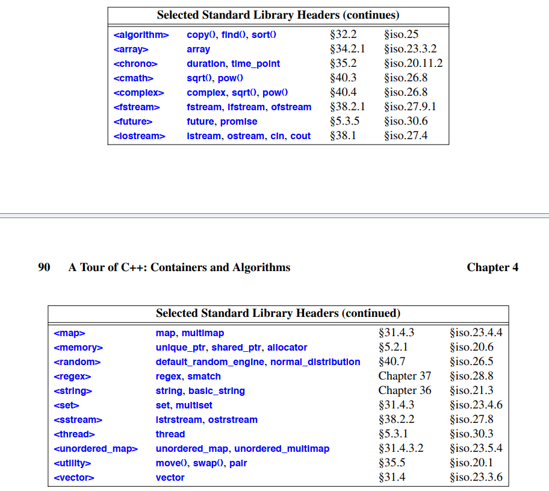

## Libraries
البته هیچ برنامه قابل توجهی تنها با یک زبان برنامه‌نویسی ساده نوشته نمی‌شود. ابتدا مجموعه‌ای از کتابخانه‌ها توسعه داده می‌شوند. این کتابخانه‌ها سپس پایه‌ای برای کارهای بعدی شکل می‌دهند. بیشتر برنامه‌ها در زبان ساده نوشتن آن‌ها خسته‌کننده است، در حالی که تقریباً هر وظیفه‌ای با استفاده از کتابخانه‌های خوب می‌تواند ساده شود. ادامه‌ای بر فصل‌های ۲ و ۳، این فصل و فصل بعدی یک تور سریع از امکانات کلیدی کتابخانه استاندارد ارائه می‌دهند. فرض می‌کنم که قبلاً برنامه‌نویسی کرده‌اید. اگر نه، لطفاً قبل از ادامه مطالعه، یک کتاب درسی مانند "Programming: Principles and Practice Using C++" [Stroustrup, 2009] را در نظر بگیرید. حتی اگر قبلاً برنامه‌نویسی کرده باشید، کتابخانه‌هایی که استفاده کرده‌اید یا برنامه‌هایی که نوشته‌اید ممکن است بسیار متفاوت از سبک C++ ارائه شده در اینجا باشند. اگر این "تور رعد و برق" برایتان گیج‌کننده است، ممکن است به ارائه زبان سیستماتیک‌تر و پایین به بالا که از فصل ۶ شروع می‌شود، بروید. به طور مشابه، توضیح سیستماتیک‌تری از کتابخانه استاندارد از فصل ۳۰ آغاز می‌شود. من به طور بسیار مختصر انواع مفید کتابخانه استاندارد، مانند string، ostream، vector، map (این فصل)، unique_ptr، thread، regex و complex (فصل ۵)، و همچنین رایج‌ترین روش‌های استفاده از آن‌ها را معرفی می‌کنم. انجام این کار به من اجازه می‌دهد تا مثال‌های بهتری در فصل‌های بعدی ارائه دهم. همانند فصل‌های ۲ و ۳، به شدت توصیه می‌شود که از درک ناقص جزئیات حواس‌پرت یا دلسرد نشوید. هدف از این فصل این است که به شما طعمی از آنچه در پیش رو دارید بدهد و درک پایه‌ای از مفیدترین امکانات کتابخانه را منتقل کند.
تعیین استاندارد کتابخانه تقریباً دو سوم استاندارد ISO C++ را تشکیل می‌دهد. آن را کاوش کنید و به جای گزینه‌های خانگی، ترجیحاً از آن استفاده کنید. اگرچه طراحی آن بسیار مورد توجه قرار گرفته است، اما پیاده‌سازی‌های آن هنوز بیشتر و تلاش زیادی برای نگهداری و گسترش آن خواهد شد.
امکانات کتابخانه استاندارد توصیف شده در این کتاب بخشی از هر پیاده‌سازی کامل C++ هستند. علاوه بر اجزای کتابخانه استاندارد، بیشتر پیاده‌سازی‌ها سیستم‌های "رابط کاربری گرافیکی" (GUIs)، رابط‌های وب، رابط‌های پایگاه داده و غیره را ارائه می‌دهند. به طور مشابه، بیشتر محیط‌های توسعه نرم‌افزار "کتابخانه‌های پایه" برای محیط‌های توسعه و/یا اجرای "استاندارد" شرکتی یا صنعتی ارائه می‌دهند. در اینجا، چنین سیستم‌ها و کتابخانه‌ها را توصیف نمی‌کنم. قصد این است که توضیحی خودکفا از C++ همانطور که توسط استاندارد تعریف شده است ارائه دهم و مثال‌ها را قابل حمل نگه دارم، مگر در مواردی که به طور خاص ذکر شده باشد. به طور طبیعی، برنامه‌نویس تشویق می‌شود که امکانات گسترده‌تری که در بیشتر سیستم‌ها در دسترس هستند را کاوش کند.

## The Standard-library Headers and Namespace

هر قابلیّت موجود در کتابخانهٔ استاندارد از طریق یک سرآیند (header) استاندارد ارائه می‌شود. برای مثال:  
```cpp
#include <string>
#include <list>
```
این کار، امکانات استاندارد رشته (string) و لیست (list) را در دسترس قرار می‌دهد. کتابخانهٔ استاندارد در یک فضای نام (namespace) به نام `std` تعریف شده است (§2.4.2, §14.3.1). برای استفاده از امکانات کتابخانهٔ استاندارد، می‌توان از پیشوند `std::` استفاده کرد:
```cpp
std::string s {"Four legs Good; two legs Baaad!"};
std::list<std::string> slogans {"War is peace", "Freedom is Slavery", "Ignorance is Strength"};
```
برای ساده‌تر شدن مثال‌ها، من به‌ندرت به‌صورت صریح از پیشوند `std::` استفاده می‌کنم. همچنین همیشه تمام سرآیندهای لازم را به‌صورت صریح `#include` نمی‌کنم. برای کامپایل و اجرای قطعه‌کدهای اینجا، باید سرآیندهای لازم (همان‌طور که در §4.4.5، §4.5.5، و §30.2 فهرست شده‌اند) را `#include` کنید و نام‌هایی را که اعلام می‌کنند، در دسترس قرار دهید. برای مثال:
```cpp
#include <string>    // امکانات استاندارد رشته را در دسترس قرار می‌دهد
using namespace std; // نام‌های std را بدون نیاز به پیشوند std:: قابل استفاده می‌کند

string s {"C++ is a general−purpose programming language"}; // درست: string همان std::string است
```
به‌طور کلّی، کار پسندیده‌ای نیست که تمام نام‌های یک فضای نام را وارد فضای نام سراسری کنید. امّا در این کتاب، من تقریباً فقط از کتابخانهٔ استاندارد استفاده می‌کنم و دانستن آنچه این کتابخانه ارائه می‌دهد، مفید است. بنابراین نه برای هر استفاده از نام‌های کتابخانهٔ استاندارد، پیشوند `std::` را به‌کار می‌برم و نه در هر مثال، سرآیندهای لازم را `#include` می‌کنم؛ فرض کنید که این کار انجام شده است.

در اینجا گزیده‌ای از سرآیندهای کتابخانهٔ استاندارد ارائه شده است که همگی اعلان‌های خود را در فضای نام `std` قرار می‌دهند:



## Strings
کتابخانهٔ استاندارد یک نوع `string` برای تکمیل رشته‌های درون برنامه (string literals) فراهم می‌کند. نوع `string` مجموعه‌ای از عملیات مفید روی رشته‌ها، نظیر الحاق (concatenation)، را ارائه می‌دهد. برای مثال:
```cpp
string compose(const string& name, const string& domain)
{
    return name + '@' + domain;
}
auto addr = compose("dmr","bell−labs.com");
```
در اینجا، متغیر `addr` با توالی کاراکترهای `dmr@bell−labs.com` مقداردهی می‌شود. «جمع‌زدن» رشته‌ها به معنی الحاق آن‌ها است. شما می‌توانید یک رشته، یک رشتهٔ درون‌برنامه‌ای (string literal)، یک رشته به سبک C (C-style string)، یا حتی یک کاراکتر را به رشته الحاق کنید. نوع `string` در کتابخانهٔ استاندارد دارای سازندهٔ انتقالی (move constructor) است؛ بنابراین برگرداندن رشته‌های حتی بزرگ به‌صورت مقداری نیز کارآمد است (§3.3.2).

در بسیاری از کاربردها، رایج‌ترین شکل الحاق، افزودن چیزی به انتهای یک رشته است. این کار به‌طور مستقیم توسط عملگر `+=` پشتیبانی می‌شود. برای مثال:
```cpp
void m2(string& s1, string& s2)
{
    s1 = s1 + '\n'; // الحاق یک خط جدید به انتهای s1
    s2 += '\n';     // الحاق یک خط جدید به انتهای s2
}
```
این دو روش از نظر معنایی معادل هستند، اما من روش دوم را ترجیح می‌دهم زیرا صراحت بیشتری در مورد کاری که انجام می‌دهد دارد، مختصرتر است و احتمالاً کارایی بیشتری هم دارد.

یک `string` قابل تغییر است. علاوه بر عملگرهای `=` و `+=`، قابلیت استفاده از عملگر دسترسی به اندیس ( `[]` ) و عملیات روی زیررشته (substring) نیز وجود دارد. نوع `string` کتابخانهٔ استاندارد در فصل ۳۶ توصیف شده است. از میان قابلیت‌های مفید آن می‌توان به توانایی پردازش زیررشته‌ها اشاره کرد. برای مثال:
```cpp
string name = "Niels Stroustrup";
void m3()
{
    string s = name.substr(6,10);   // s = "Stroustr up"
    name.replace(0,5,"nicholas");   // حال name = "nicholas Stroustrup"
    name[0] = toupper(name[0]);     // حال name = "Nicholas Stroustrup"
}
```
تابع `substr()`، یک رشته بازمی‌گرداند که کپی زیررشته‌ای از رشتهٔ اصلی است؛ محدودهٔ این زیررشته توسط آرگومان‌های تابع مشخص می‌شود. آرگومان نخست یک شاخص (اندیس) در رشته است و آرگومان دوم طول زیررشتهٔ موردنظر است. از آنجا که شمارش اندیس‌ها از صفر آغاز می‌شود، مقدار متغیر `s` برابر با `"Stroustrup"` خواهد بود.

تابع `replace()` یک زیررشته را با مقدار جدید جایگزین می‌کند. در این مثال، زیررشته‌ای که از اندیس صفر و به طول ۵ است، `"Niels"` می‌باشد که با `"nicholas"` جایگزین می‌شود. در پایان، کاراکتر ابتدایی (`n`) را با همتای بزرگ آن (`N`) جایگزین می‌کنم. به‌این‌ترتیب، مقدار نهایی `name` برابر `"Nicholas Stroustrup"` خواهد بود. توجه کنید که طول رشتهٔ جایگزین می‌تواند با طول زیررشتهٔ اصلی یکی نباشد.

به‌طور طبیعی، رشته‌ها را می‌توان با یکدیگر و همچنین با رشته‌های درون‌برنامه‌ای مقایسه کرد. برای مثال:
```cpp
string incantation;
void respond(const string& answer)
{
    if (answer == incantation) {
        // perform magic
    }
    else if (answer == "yes") {
        // ...
    }
    // ...
}
```
کتابخانهٔ `string` در فصل ۳۶ توصیف شده است. متداول‌ترین روش‌های پیاده‌سازی `string` در مثال String (§19.3) ارائه شده است.

## Stream I/O
کتابخانهٔ استاندارد ورودی و خروجی کاراکتری قالب‌بندی‌شده را از طریق کتابخانهٔ `iostream` فراهم می‌کند.

عملیات ورودی دارای نوع (typed) هستند و قابل توسعه برای پشتیبانی از انواع تعریف‌شده توسط کاربر می‌باشند. این بخش یک معرفی بسیار کوتاه به استفاده از `iostream`ها است؛ فصل ۳۸ توضیح کاملی از امکانات کتابخانهٔ `iostream` ارائه می‌دهد.

اشکال دیگر تعامل کاربر، مانند ورودی و خروجی گرافیکی، از طریق کتابخانه‌هایی مدیریت می‌شوند که بخشی از استاندارد ISO نیستند و بنابراین در اینجا توضیح داده نمی‌شوند.

## Output
کتابخانهٔ جریان ورودی/خروجی (I/O stream) خروجی را برای هر نوع داخلی (built-in type) تعریف می‌کند. علاوه بر این، تعریف خروجی برای انواع تعریف‌شده توسط کاربر نیز آسان است (§4.3.3). عملگر `<<` («قرار دادن در») به عنوان یک عملگر خروجی بر روی اشیاء نوع `ostream` استفاده می‌شود؛ `cout` جریان خروجی استاندارد است و `cerr` جریان استاندارد برای گزارش خطاها می‌باشد.

به‌طور پیش‌فرض، مقادیری که به `cout` نوشته می‌شوند به توالی‌ای از کاراکترها تبدیل می‌شوند. برای مثال، برای خروجی دادن عدد دهدهی ۱۰، می‌توانیم بنویسیم:

```cpp
void f()
{
    cout << 10;
}
```

این کد کاراکتر `1` به دنبال آن کاراکتر `0` را در جریان خروجی استاندارد قرار می‌دهد.

به‌طور معادل، می‌توانیم بنویسیم:

```cpp
void g()
{
    int i {10};
    cout << i;
}
```

خروجی انواع مختلف می‌تواند به صورت واضح ترکیب شود:

```cpp
void h(int i)
{
    cout << "the value of i is ";
    cout << i;
    cout << '\n';
}
```

برای فراخوانی `h(10)`، خروجی به شکل زیر خواهد بود:
```
the value of i is 10
```

مردم به‌زودی از تکرار نام جریان خروجی خسته می‌شوند زمانی که چندین مورد مرتبط را خروجی می‌دهند.

خوشبختانه، نتیجهٔ یک عبارت خروجی می‌تواند خود برای خروجی بیشتر استفاده شود. برای مثال:

```cpp
void h2(int i)
{
    cout << "the value of i is " << i << '\n';
}
```

تابع `h2()` همان خروجی را مانند `h()` تولید می‌کند.

یک ثابت کاراکتری، کاراکتری است که در داخل کوتیشن تکی قرار دارد. توجه داشته باشید که یک کاراکتر به‌عنوان یک کاراکتر خروجی داده می‌شود و نه به‌عنوان یک مقدار عددی. برای مثال:

```cpp
void k()
{
    int b = 'b'; // توجه: char به‌طور ضمنی به int تبدیل می‌شود
    char c = 'c';
    cout << 'a' << b << c;
}
```

مقدار عددی کاراکتر `'b'` برابر با ۹۸ است (در کدگذاری ASCII که در پیاده‌سازی C++ که من استفاده کردم به کار می‌رود)، بنابراین این کد خروجی `a98c` را نمایش می‌دهد.

## Input
کتابخانهٔ استاندارد برای ورودی، `istream`ها را ارائه می‌دهد. مشابه `ostream`ها، `istream`ها با نمایش‌های رشته‌ای کاراکتری انواع داخلی (`built-in types`) سروکار دارند و به‌راحتی می‌توانند برای انواع تعریف‌شده توسط کاربر گسترش یابند. عملگر `>>` («دریافت از») به‌عنوان یک عملگر ورودی استفاده می‌شود؛ `cin` جریان ورودی استاندارد است. نوع عملوند سمت راست `>>` تعیین می‌کند که چه ورودی‌ای پذیرفته می‌شود و هدف عملیات ورودی کجاست. برای مثال:

```cpp
void f()
{
    int i;
    cin >> i; // خواندن یک عدد صحیح به i
    double d;
    cin >> d; // خواندن یک عدد اعشاری با دقت دوگانه به d
}
```

این کد یک عدد مانند `1234` را از ورودی استاندارد به متغیر عدد صحیح `i` و یک عدد اعشاری مانند `12.34e5` را به متغیر اعشاری با دقت دوگانه `d` می‌خواند.

اغلب اوقات، می‌خواهیم یک توالی از کاراکترها را بخوانیم. یک روش مناسب برای انجام این کار، خواندن به یک `string` است. برای مثال:

```cpp
void hello()
{
    cout << "Please enter your name\n";
    string str;
    cin >> str;
    cout << "Hello, " << str << "!\n";
}
```

اگر شما `Eric` را وارد کنید، پاسخ به شکل زیر خواهد بود:
```
Hello, Eric!
```

به‌طور پیش‌فرض، یک کاراکتر فاصله‌گذاری (مانند فاصله) (§7.3.2) خواندن را خاتمه می‌دهد، بنابراین اگر شما `Eric Bloodaxe` را وارد کنید که قصد دارید به عنوان پادشاه ناموفق یورک ظاهر شوید، پاسخ همچنان به شکل زیر خواهد بود:
```
Hello, Eric!
```

شما می‌توانید با استفاده از تابع `getline()` یک خط کامل (شامل کاراکتر انتهای خط جدید) را بخوانید. برای مثال:

```cpp
void hello_line()
{
    cout << "Please enter your name\n";
    string str;
    getline(cin, str);
    cout << "Hello, " << str << "!\n";
}
```

با این برنامه، ورودی `Eric Bloodaxe` خروجی مورد نظر را به شکل زیر تولید می‌کند:
```
Hello, Eric Bloodaxe!
```

خط جدید که خط را خاتمه می‌دهد نادیده گرفته می‌شود، بنابراین `cin` برای خط ورودی بعدی آماده است.

رشته‌های استاندارد دارای ویژگی خوبی هستند که به طور خودکار گسترش می‌یابند تا آنچه را که در آن‌ها قرار می‌دهید نگه دارند؛ نیازی به محاسبه قبلی حداکثر اندازه ندارید. بنابراین، اگر چند مگابایت از سمیکولن‌ها را وارد کنید، برنامه صفحات سمیکولن‌ها را به شما بازمی‌گرداند.

## I/O of User-Defined Types
علاوه بر ورودی و خروجی انواع داخلی و رشته‌های استاندارد، کتابخانهٔ `iostream` به برنامه‌نویسان اجازه می‌دهد تا ورودی و خروجی برای انواع خودشان تعریف کنند. برای مثال، فرض کنید نوع ساده‌ای به نام `Entry` داریم که ممکن است برای نمایش ورودی‌ها در دفترچه تلفن استفاده کنیم:

```cpp
struct Entry {
    string name;
    int number;
};
```

می‌توانیم یک عملگر خروجی ساده تعریف کنیم تا یک شیء از نوع `Entry` را با فرمت `{"name", number}` مشابه با فرمت استفاده شده برای مقداردهی اولیه در کد، بنویسیم:

```cpp
ostream& operator<<(ostream& os, const Entry& e)
{
    return os << "{\"" << e.name << "\", " << e.number << "}";
}
```

یک عملگر خروجی تعریف‌شده توسط کاربر، جریان خروجی (`ostream`) خود را به صورت مرجع به عنوان آرگومان اول می‌گیرد و همان جریان را به عنوان نتیجه بازمی‌گرداند. برای جزئیات بیشتر به §38.4.2 مراجعه کنید.

عملگر ورودی مربوطه پیچیده‌تر است زیرا باید فرمت صحیح را بررسی کند و با خطاها برخورد کند:

```cpp
istream& operator>>(istream& is, Entry& e)
// خواندن جفت { "name" , number }. توجه: با { " " , و }
{
    char c, c2;
    if (is >> c && c == '{' && is >> c2 && c2 == '"') { // شروع با { "
        string name; // مقدار پیش‌فرض یک رشته، رشتهٔ خالی است: ""
        while (is.get(c) && c != '"') // هر چیزی قبل از " بخشی از نام است
            name += c;
        if (is >> c && c == ',') {
            int number = 0;
            if (is >> number >> c && c == '}') { // خواندن عدد و }
                e = {name, number}; // تخصیص به شیء Entry
                return is;
            }
        }
    }
    is.setf(ios_base::failbit); // ثبت شکست در جریان
    return is;
}
```

یک عملیات ورودی، مرجع به جریان ورودی (`istream`) خود را بازمی‌گرداند که می‌تواند برای بررسی اینکه آیا عملیات موفقیت‌آمیز بوده است یا خیر، استفاده شود. برای مثال، وقتی به عنوان یک شرط استفاده می‌شود، `is >> c` به معنای «آیا در خواندن از `is` به `c` موفق بودیم؟» است.

عملگر `>>` به‌طور پیش‌فرض، کاراکترهای فاصله‌گذاری را نادیده می‌گیرد، اما تابع `is.get(c)` این کار را نمی‌کند، بنابراین این عملگر ورودی برای نوع `Entry`، فاصله‌گذاری‌ها را خارج از رشتهٔ نام نادیده می‌گیرد، اما نه در داخل آن. برای مثال:

```
{ "John Marwood Cleese" , 123456 }
{"Michael Edward Palin",987654}
```

می‌توانیم چنین جفتی از مقادیر را از ورودی به یک شیء `Entry` به این صورت بخوانیم:

```cpp
for (Entry ee; cin >> ee; ) // خواندن از cin به ee
    cout << ee << '\n'; // نوشتن ee به cout
```

خروجی به شکل زیر خواهد بود:

```
{"John Marwood Cleese", 123456}
{"Michael Edward Palin", 987654}
```

برای جزئیات فنی بیشتر و تکنیک‌های نوشتن عملگرهای ورودی برای انواع تعریف‌شده توسط کاربر به §38.4.1 مراجعه کنید. برای تکنیک سیستماتیک‌تر تشخیص الگوها در جریان‌های کاراکتری (مطابقت با عبارات منظم)، به §5.5 و فصل ۳۷ مراجعه کنید.

---

در کتابخانهٔ استریم‌های ورودی/خروجی در C++، هر شیء از نوع `istream` (مانند `cin`) دارای مجموعه‌ای از فلگ‌ها (وضعیت‌ها) است که نشان می‌دهد عملیات ورودی در چه وضعیتی قرار دارد. برخی از این فلگ‌ها عبارت‌اند از:

- **`goodbit`**: نشان می‌دهد استریم در وضعیت عادی قرار دارد و تا کنون هیچ مشکلی رخ نداده است.
- **`failbit`**: نشان می‌دهد یک خطای منطقی (logic error) در ورودی رخ داده است؛ برای مثال، فرمت دادهٔ ورودی نادرست بوده یا عملیات خواندن به روشی پیش‌بینی‌نشده انجام نشده است.
- **`badbit`**: نشان می‌دهد یک خطای جدی‌تری در استریم رخ داده است (مثلاً مشکل سخت‌افزاری یا خطایی خارج از کنترل برنامه).
- **`eofbit`**: نشان می‌دهد به انتهای فایل (یا داده‌های ورودی) رسیده‌ایم.

وقتی در کد می‌نویسیم:

```cpp
is.setf(ios_base::failbit);
```

منظور این است که می‌خواهیم عمداً فلگ `failbit` را در استریم `is` تنظیم (ست) کنیم تا اعلام کنیم که این عملیات خواندن «ناموفق» (failed) بوده است. به‌عبارت دیگر، ما به استریم می‌گوییم «در پردازش یا قالب‌بندی این ورودی اشکالی وجود دارد و نباید خواندن را موفقیت‌آمیز در نظر بگیری». 

پس از ست شدن `failbit`:
- **`is.fail()`** مقدار `true` برمی‌گرداند.
- اگر کد در جای دیگری وضعیت استریم را بررسی کند (مثلاً `if (!is)` یا `if (is.fail())`)، متوجه می‌شود که استریم در حالت خطا است.
- معمولاً در این حالت، عملیات ورودی بعدی (بدون ریست کردن استریم) موفق نخواهد بود یا نادیده گرفته می‌شود.

بنابراین، این دستور روشی برای اطلاع‌رسانی به مکانیزم خطایابی استریم است که «شرایط فعلی نامعتبر است و داده‌ها به شکلی که انتظار می‌رفت، خوانده یا تفسیر نشده‌اند.» در نتیجه، برنامه‌نویس می‌تواند با استفاده از توابعی نظیر `is.clear()` یا بررسی خطاها، استریم را مجدداً آمادهٔ خواندن کند یا واکنش مناسب به این خطا نشان دهد.


# Containers
بیشتر محاسبات شامل ایجاد مجموعه‌هایی از مقادیر و سپس دستکاری این مجموعه‌ها است. خواندن کاراکترها به داخل یک رشته و چاپ رشته یک مثال ساده است. کلاسی که هدف اصلی آن نگهداری از اشیاء است، معمولاً یک کانتینر نامیده می‌شود. فراهم کردن کانتینرهای مناسب برای یک وظیفه خاص و پشتیبانی از آن‌ها با عملیات بنیادی مفید، مراحل مهمی در ساخت هر برنامه‌ای هستند.

برای نشان دادن کانتینرهای کتابخانه استاندارد، یک برنامه ساده برای نگهداری نام‌ها و شماره تلفن‌ها را در نظر بگیرید. این نوع برنامه برای افرادی با پس‌زمینه‌های مختلف ممکن است «ساده و بدیهی» به نظر برسد. کلاس Entry از بخش ۴.۳.۳ می‌تواند برای نگهداری یک ورودی ساده از دفترچه تلفن استفاده شود. در اینجا، عمداً پیچیدگی‌های دنیای واقعی را نادیده می‌گیریم، مانند این که بسیاری از شماره‌های تلفن نمی‌توانند به سادگی به صورت یک عدد ۳۲ بیتی نمایش داده شوند.

## vector
پرکاربردترین کانتینر کتابخانه استاندارد، وکتور (vector) است. وکتور یک دنباله از عناصر با یک نوع مشخص است. عناصر به صورت پیوسته در حافظه ذخیره می‌شوند.  
مثال‌های وکتور در بخش‌های ۳.۲.۲ و ۳.۴ دیدی از نحوه پیاده‌سازی آن می‌دهند، و بخش‌های ۱۳.۶ و ۳۱.۴ بحثی جامع در این باره ارائه می‌کنند.  
ما می‌توانیم یک وکتور را با مجموعه‌ای از مقادیر از نوع عنصرش مقداردهی اولیه کنیم:
```cpp
vector<Entry> phone_book = {
{"David Hume",123456},
{"Karl Popper",234567},
{"Bertrand Arthur William Russell",345678}
};
```
عناصر از طریق شاخص‌گذاری قابل دسترسی هستند:
```cpp
void print_book(const vector<Entry>& book)
{
for (int i = 0; i != book.size(); ++i)
cout << book[i] << '\n';
}
```
همان‌طور که معمول است، شاخص‌گذاری از ۰ شروع می‌شود، بنابراین book[0] ورودی مربوط به دیوید هیوم را نگه می‌دارد.  
تابع عضو size() وکتور، تعداد عناصر را می‌دهد.  
عناصر یک وکتور یک محدوده را تشکیل می‌دهند، بنابراین می‌توانیم از حلقه for-محدوده‌ای استفاده کنیم:
```cpp
void print_book(const vector<Entry>& book)
{
for (const auto& x : book) // درباره "auto" به بخش ۲.۲.۲ مراجعه کنید
cout << x << '\n';
}
```
هنگامی که یک وکتور تعریف می‌کنیم، به آن یک اندازه اولیه (تعداد اولیه عناصر) می‌دهیم:
```cpp
vector<int> v1 = {1, 2, 3, 4}; // اندازه: ۴
vector<string> v2; // اندازه: ۰
vector<Shape*> v3(23); // اندازه: ۲۳؛ مقدار اولیه عناصر: nullptr
vector<double> v4(32, 9.9); // اندازه: ۳۲؛ مقدار اولیه عناصر: 9.9
```
اندازه صریح در داخل پرانتزهای معمولی، مانند (۲۳)، قرار می‌گیرد و به طور پیش‌فرض، عناصر به مقدار پیش‌فرض نوع عنصر مقداردهی می‌شوند (مثلاً nullptr برای اشاره‌گرها و ۰ برای اعداد). اگر مقدار پیش‌فرض نمی‌خواهید، می‌توانید مقدار دیگری به عنوان آرگومان دوم تعیین کنید (مثلاً 9.9 برای ۳۲ عنصر v4).  
اندازه اولیه قابل تغییر است. یکی از مفیدترین عملیات روی وکتور، push_back() است که یک عنصر جدید را به انتهای وکتور اضافه می‌کند و اندازه آن را یک واحد افزایش می‌دهد.  
به عنوان مثال:
```cpp
void input()
{
for (Entry e; cin >> e;)
phone_book.push_back(e);
}
```
این کد عناصر Entry را از ورودی استاندارد به phone_book می‌خواند تا زمانی که یا به انتهای ورودی (مثلاً انتهای فایل) برسد یا عملیات ورودی با یک خطای قالب مواجه شود. وکتور کتابخانه استاندارد به گونه‌ای پیاده‌سازی شده است که رشد وکتور با استفاده‌های مکرر از push_back() کارآمد باشد.  
یک وکتور می‌تواند در انتساب‌ها و مقداردهی اولیه کپی شود. به عنوان مثال:
```cpp
vector<Entry> book2 = phone_book;
```
کپی و جابه‌جایی وکتورها توسط سازنده‌ها و عملگرهای انتساب همان‌طور که در بخش ۳.۳ توضیح داده شده، پیاده‌سازی می‌شوند. انتساب یک وکتور شامل کپی کردن عناصر آن است. بنابراین، پس از مقداردهی اولیه book2، هر دو book2 و phone_book کپی‌های جداگانه‌ای از هر ورودی در دفترچه تلفن دارند. هنگامی که یک وکتور تعداد زیادی عنصر را نگه می‌دارد، چنین انتساب‌ها و مقداردهی‌های اولیه‌ای می‌توانند هزینه‌بر باشند. جایی که کپی کردن نامطلوب است، باید از ارجاع‌ها یا اشاره‌گرها (بخش‌های ۷.۲، ۷.۷) یا عملیات جابه‌جایی (بخش‌های ۳.۳.۲، ۱۷.۵.۲) استفاده کرد.

## Elements
مانند تمام کانتینرهای کتابخانه استاندارد، `vector` یک کانتینر از عناصر نوع `T` است، یعنی `vector<T>`. تقریباً هر نوعی می‌تواند به‌عنوان نوع عنصر پذیرفته شود: انواع عددی پیش‌فرض (مثل `char`، `int`، و `double`)، انواع تعریف‌شده توسط کاربر (مثل `string`، `Entry`، `list<int>`، و `Matrix<double,2>`)، و اشاره‌گرها (مثل `const char*`، `Shape*`، و `double*`). هنگامی که یک عنصر جدید وارد می‌کنید، مقدار آن به داخل کانتینر کپی می‌شود. به عنوان مثال، وقتی عدد صحیحی با مقدار 7 را وارد یک کانتینر می‌کنید، عنصر نتیجه‌ واقعی مقدار 7 را خواهد داشت. این عنصر اشاره‌گر یا مرجعی به یک شیء که حاوی 7 باشد نیست. این ویژگی باعث می‌شود کانتینرهایی فشرده و با دسترسی سریع داشته باشیم. برای افرادی که نگران اندازه‌های حافظه و عملکرد زمان اجرا هستند، این مسئله اهمیت زیادی دارد.

## Range Checking
کتابخانه استاندارد `vector` بررسی محدوده (range checking) را تضمین نمی‌کند (§31.2.2). به عنوان مثال:

```cpp
void silly(vector<Entry>& book) {
    int i = book[book.size()].number; // book.size() خارج از محدوده است
    // ...
}
```

این مقداردهی اولیه به احتمال زیاد یک مقدار تصادفی را در متغیر `i` قرار می‌دهد، به‌جای آنکه خطایی ایجاد کند. این رفتار نامطلوب است و خطاهای خارج از محدوده (out-of-range) یک مشکل رایج محسوب می‌شوند. بنابراین، من اغلب از نسخه‌ای ساده از `vector` با قابلیت بررسی محدوده استفاده می‌کنم:

```cpp
template<typename T>
class Vec : public std::vector<T> {
public:
    using vector<T>::vector; // استفاده از سازنده‌های vector (با نام Vec)؛ مراجعه کنید به §20.3.5.1
    T& operator[](int i) // بررسی محدوده
    { return vector<T>::at(i); }
    const T& operator[](int i) const // بررسی محدوده برای اشیای const؛ §3.2.1.1
    { return vector<T>::at(i); }
};
```

کلاس `Vec` همه ویژگی‌های `vector` را به ارث می‌برد، به‌جز عملیات زیرنویس که برای بررسی محدوده مجدداً تعریف شده‌اند. عملگر `at()` در `vector` یک عملیات زیرنویس است که اگر آرگومان آن خارج از محدوده باشد، استثنای نوع `out_of_range` را پرتاب می‌کند (§2.4.3.1، §31.2.2).

در کلاس `Vec`، دسترسی خارج از محدوده یک استثنا ایجاد می‌کند که کاربر می‌تواند آن را مدیریت کند. به عنوان مثال:

```cpp
void checked(Vec<Entry>& book) {
    try {
        book[book.size()] = {"Joe", 999999}; // استثنا ایجاد می‌شود
        // ...
    }
    catch (out_of_range) {
        cout << "range error\n";
    }
}
```

این استثنا پرتاب و سپس مدیریت می‌شود (§2.4.3.1، فصل 13). اگر کاربر یک استثنا را مدیریت نکند، برنامه به روشی کاملاً تعریف‌شده متوقف می‌شود، به‌جای آنکه به‌طور نامشخص ادامه پیدا کند یا خراب شود. یکی از روش‌های کاهش شگفتی‌های ناشی از استثناهای مدیریت‌نشده، استفاده از `main()` با یک بلوک `try` به‌عنوان بدنه آن است. به عنوان مثال:

```cpp
int main()
try {
    // کد شما
}
catch (out_of_range) {
    cerr << "range error\n";
}
catch (...) {
    cerr << "unknown exception thrown\n";
}
```

این روش هندلرهای پیش‌فرضی برای استثناها ارائه می‌دهد تا اگر نتوانیم یک استثنا را مدیریت کنیم، یک پیام خطا در جریان خروجی استاندارد خطای تشخیصی `cerr` چاپ شود (§38.1).

برخی پیاده‌سازی‌ها شما را از تعریف `Vec` (یا معادل آن) بی‌نیاز می‌کنند، زیرا نسخه‌ای از `vector` با بررسی محدوده را ارائه می‌دهند (برای مثال، به‌عنوان یک گزینه در کامپایلر).

