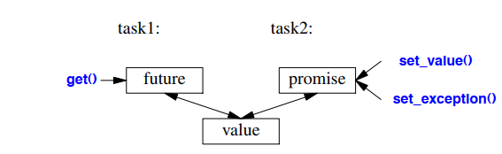

## Introduction
از دیدگاه یک کاربر نهایی، کتابخانه استاندارد ایده‌آل باید اجزایی را ارائه دهد که به‌طور مستقیم تقریباً هر نیازی را پشتیبانی کنند. برای یک حوزه کاربردی خاص، یک کتابخانه تجاری بزرگ می‌تواند به این ایده‌آل نزدیک شود. با این حال، این چیزی نیست که کتابخانه استاندارد C++ در تلاش برای انجام آن است. یک کتابخانه قابل مدیریت و در دسترس برای همگان نمی‌تواند همه چیز برای همه افراد باشد. در عوض، کتابخانه استاندارد C++ تلاش می‌کند اجزایی را ارائه دهد که برای اکثر افراد در اکثر حوزه‌های کاربردی مفید باشند. به عبارت دیگر، هدف این کتابخانه خدمت به تقاطع همه نیازها است، نه اتحاد آن‌ها. علاوه بر این، پشتیبانی از چند حوزه کاربردی بسیار مهم، مانند محاسبات ریاضی و پردازش متن، به مرور وارد این کتابخانه شده است.

## Resource Management
یکی از وظایف کلیدی هر برنامه غیرساده مدیریت منابع است. منبع چیزی است که باید دریافت شده و بعداً (به صورت صریح یا ضمنی) آزاد شود. مثال‌هایی از منابع شامل حافظه، قفل‌ها، سوکت‌ها، دستگیره‌های نخ (thread handles) و دستگیره‌های فایل هستند. در یک برنامه بلندمدت، آزاد نکردن یک منبع به‌موقع («نشت») می‌تواند باعث کاهش شدید کارایی و حتی منجر به یک خرابی ناگوار شود. حتی در برنامه‌های کوتاه‌مدت، نشت منابع می‌تواند مشکل‌ساز شود؛ مثلاً با ایجاد کمبود منابع، زمان اجرای برنامه به طرز چشمگیری افزایش یابد.

اجزای کتابخانه استاندارد به گونه‌ای طراحی شده‌اند که منابع را نشت ندهند. برای دستیابی به این هدف، آن‌ها به پشتیبانی پایه‌ای زبان برای مدیریت منابع با استفاده از جفت‌های سازنده/ویرانگر (constructor/destructor) تکیه می‌کنند تا اطمینان حاصل شود که یک منبع طول عمر بیشتری نسبت به شیء مسئول آن نداشته باشد. استفاده از جفت سازنده/ویرانگر در کلاس **Vector** برای مدیریت طول عمر عناصرش یک نمونه است (بخش §3.2.1.2) و تمامی کانتینرهای کتابخانه استاندارد به روش‌های مشابه پیاده‌سازی شده‌اند. مهم‌تر از همه، این روش به درستی با مدیریت خطا از طریق استثناها تعامل دارد. به‌عنوان مثال، این تکنیک در کلاس‌های قفل کتابخانه استاندارد استفاده می‌شود:

```cpp
mutex m; // برای محافظت از دسترسی به داده‌های مشترک
// ...
void f()
{
    unique_lock<mutex> lck {m}; // قفل mutex m را دریافت کن
    // ... دستکاری داده‌های مشترک ...
}
```

یک نخ (thread) تا زمانی که سازنده **lck** قفل **m** را دریافت نکند، پیش نخواهد رفت (بخش §5.3.4). ویرانگر متناظر این منبع را آزاد می‌کند. بنابراین، در این مثال، ویرانگر **unique_lock** قفل **mutex** را زمانی که کنترل از تابع **f()** خارج می‌شود (چه از طریق بازگشت، چه به‌صورت طبیعی با رسیدن به انتهای تابع، یا از طریق پرتاب استثنا) آزاد می‌کند.

این یک کاربرد از تکنیک «دریافت منبع به معنای مقداردهی اولیه است» (RAII؛ بخش‌های §3.2.1.2 و §13.3) است. این تکنیک پایه‌ای برای مدیریت ایدئال منابع در زبان C++ محسوب می‌شود. کانتینرها (مانند **vector** و **map**)، رشته (**string**)، و جریان‌های ورودی/خروجی (**iostream**) منابع خود (مانند دستگیره‌های فایل و بافرها) را به همین شیوه مدیریت می‌کنند.

## unique_ptr and shared_ptr
مثال‌هایی که تا کنون بررسی شدند، مدیریت اشیاء تعریف‌شده در یک دامنه (scope) و آزادسازی منابع آن‌ها هنگام خروج از دامنه را پوشش می‌دهند، اما در مورد اشیایی که در حافظه آزاد (free store) تخصیص داده می‌شوند چه باید کرد؟ در کتابخانه استاندارد و در هدر **<memory>**، دو «اشاره‌گر هوشمند» برای کمک به مدیریت اشیاء در حافظه آزاد ارائه شده است:  
1. **unique_ptr** برای نمایش مالکیت یکتا (§34.3.1)  
2. **shared_ptr** برای نمایش مالکیت اشتراکی (§34.3.2)  

استفاده اساسی از این «اشاره‌گرهای هوشمند» جلوگیری از نشت حافظه ناشی از برنامه‌نویسی بی‌دقت است. به عنوان مثال:

```cpp
void f(int i, int j) // X* در مقابل unique_ptr<X>
{
    X* p = new X; // تخصیص یک X جدید
    unique_ptr<X> sp {new X}; // تخصیص یک X جدید و واگذاری اشاره‌گر آن به unique_ptr
    // ...
    if (i<99) throw Z{}; // ممکن است یک استثنا پرتاب شود
    if (j<77) return; // ممکن است زودتر از تابع بازگردیم
    p->do_something(); // ممکن است یک استثنا پرتاب شود
    sp->do_something(); // ممکن است یک استثنا پرتاب شود
    // ...
    delete p; // نابود کردن *p
}
```

در اینجا، اگر **i < 99** یا **j < 77** باشد، فراموش کردیم که **p** را آزاد کنیم. از سوی دیگر، **unique_ptr** تضمین می‌کند که شیء مرتبط به درستی نابود می‌شود، صرف‌نظر از این که چگونه از تابع **f()** خارج می‌شویم (چه از طریق پرتاب استثنا، بازگشت یا رسیدن به انتهای تابع). جالب اینجاست که می‌توانستیم این مشکل را به سادگی با عدم استفاده از اشاره‌گر و **new** حل کنیم:

```cpp
void f(int i, int j) // استفاده از یک متغیر محلی
{
    X x;
    // ...
}
```

متأسفانه، استفاده بیش از حد از **new** (و همچنین اشاره‌گرها و مراجع) به نظر می‌رسد که یک مشکل رو به رشد است. با این حال، زمانی که واقعاً به معنای اشاره‌گرها نیاز دارید، **unique_ptr** مکانیزمی بسیار سبک با هیچ هزینه اضافی (از نظر فضا یا زمان) در مقایسه با استفاده صحیح از یک اشاره‌گر داخلی است. استفاده‌های بیشتر آن شامل انتقال اشیاء تخصیص‌داده‌شده در حافظه آزاد به داخل و خارج از توابع است:

```cpp
unique_ptr<X> make_X(int i) // ساخت یک X و انتقال فوری آن به unique_ptr
{
    // ... بررسی i و غیره ...
    return unique_ptr<X>{new X{i}};
}
```

یک **unique_ptr** مانند یک دسته برای یک شیء (یا آرایه) عمل می‌کند، همان‌طور که **vector** یک دسته برای دنباله‌ای از اشیاء است. هر دو طول عمر اشیاء دیگر را کنترل می‌کنند (با استفاده از RAII) و هر دو برای ساده و کارآمد کردن بازگشت، به مفاهیم حرکت (move semantics) متکی هستند.

**shared_ptr** مشابه **unique_ptr** است، با این تفاوت که **shared_ptr** به جای انتقال، کپی می‌شود. **shared_ptr**‌ها مالکیت یک شیء را به اشتراک می‌گذارند و آن شیء زمانی نابود می‌شود که آخرین **shared_ptr** مرتبط نابود شود. برای مثال:

```cpp
void f(shared_ptr<fstream>);
void g(shared_ptr<fstream>);
void user(const string& name, ios_base::openmode mode)
{
    shared_ptr<fstream> fp {new fstream(name, mode)};
    if (!*fp) throw No_file{}; // اطمینان از باز شدن صحیح فایل
    f(fp);
    g(fp);
    // ...
}
```

در اینجا، فایلی که توسط سازنده **fp** باز شده است، توسط آخرین تابعی که نسخه‌ای از **fp** را (به صورت صریح یا ضمنی) نابود می‌کند، بسته خواهد شد. توجه کنید که **f()** یا **g()** ممکن است یک تسک ایجاد کنند که نسخه‌ای از **fp** را نگه دارد یا به نحوی دیگر کپی‌ای را ذخیره کند که طول عمر بیشتری نسبت به **user()** داشته باشد. بنابراین، **shared_ptr** نوعی از جمع‌آوری زباله (garbage collection) ارائه می‌دهد که به مدیریت منابع مبتنی بر ویرانگر احترام می‌گذارد. این روش نه رایگان است و نه بیش از حد گران، اما طول عمر شیء مشترک را پیش‌بینی‌ناپذیر می‌کند. از **shared_ptr** فقط زمانی استفاده کنید که واقعاً به مالکیت مشترک نیاز دارید.

با داشتن **unique_ptr** و **shared_ptr**، می‌توانیم یک سیاست کامل «عدم استفاده از **new** مستقیم» (§3.2.1.2) را برای بسیاری از برنامه‌ها اعمال کنیم. با این حال، این «اشاره‌گرهای هوشمند» هنوز هم به صورت مفهومی اشاره‌گر هستند و بنابراین تنها گزینه دوم من برای مدیریت منابع به شمار می‌روند – پس از کانتینرها و انواع دیگری که منابع را در یک سطح مفهومی بالاتر مدیریت می‌کنند. به طور خاص، **shared_ptr** به تنهایی هیچ قانونی برای تعیین اینکه کدام مالکین می‌توانند شیء مشترک را بخوانند و/یا بنویسند ارائه نمی‌دهد. رقابت داده‌ها (§41.2.4) و دیگر اشکال سردرگمی فقط با حذف مشکلات مدیریت منابع حل نمی‌شوند.

کجا باید از «اشاره‌گرهای هوشمند» (مانند **unique_ptr**) به جای دسته‌های منابع با عملیات طراحی‌شده مخصوص برای منبع (مانند **vector** یا **thread**) استفاده کنیم؟ جای تعجب نیست که پاسخ این است: «وقتی به معنای اشاره‌گر نیاز داریم.»  
- وقتی شیء را به اشتراک می‌گذاریم، برای اشاره به آن به اشاره‌گر (یا مرجع) نیاز داریم، بنابراین **shared_ptr** انتخاب واضحی است (مگر اینکه یک مالک واضح وجود داشته باشد).  
- وقتی به یک شیء چندشکلی (polymorphic) اشاره می‌کنیم، نیاز به یک اشاره‌گر (یا مرجع) داریم، زیرا نوع دقیق شیء مورد اشاره یا حتی اندازه آن را نمی‌دانیم. بنابراین **unique_ptr** انتخاب واضحی است.  
- یک شیء چندشکلی مشترک معمولاً به **shared_ptr** نیاز دارد.  

ما نیازی به استفاده از اشاره‌گر برای بازگرداندن یک مجموعه از اشیاء از یک تابع نداریم؛ یک کانتینر که دسته‌ای برای منابع است این کار را به سادگی و به طور کارآمد انجام می‌دهد (§3.3.2).

## Concurrency
هم‌روندی (Concurrency) – اجرای همزمان چندین وظیفه – به طور گسترده برای **افزایش توان عملیاتی** (با استفاده از چندین پردازنده برای یک محاسبه) یا **بهبود پاسخ‌دهی** (با اجازه دادن به یک بخش از برنامه برای پیشرفت در حالی که بخش دیگر منتظر پاسخ است) استفاده می‌شود. تمام زبان‌های برنامه‌نویسی مدرن از این قابلیت پشتیبانی می‌کنند. پشتیبانی ارائه شده توسط کتابخانه استاندارد ++C، یک نسخه قابل حمل (portable) و نوع-ایمن (type-safe) از چیزی است که برای بیش از 20 سال در ++C استفاده شده و تقریباً توسط تمام سخت‌افزارهای مدرن پشتیبانی می‌شود. 

پشتیبانی کتابخانه استاندارد، عمدتاً با هدف پشتیبانی از هم‌روندی در سطح سیستم ارائه شده است، نه برای ارائه مستقیم مدل‌های پیشرفته‌تر هم‌روندی؛ چنین مدل‌های پیشرفته‌ای می‌توانند به صورت کتابخانه‌هایی ساخته شوند که از امکانات کتابخانه استاندارد استفاده می‌کنند.

کتابخانه استاندارد به طور مستقیم از اجرای هم‌زمان چندین نخ (threads) در یک فضای آدرس پشتیبانی می‌کند. برای این منظور، ++C یک **مدل حافظه مناسب** (§41.2) و مجموعه‌ای از **عملیات اتمی** (§41.3) فراهم می‌کند. با این حال، اکثر کاربران هم‌روندی را تنها از طریق کتابخانه استاندارد و کتابخانه‌هایی که بر پایه آن ساخته شده‌اند مشاهده می‌کنند. 

این بخش به طور خلاصه مثال‌هایی از امکانات اصلی پشتیبانی هم‌روندی در کتابخانه استاندارد ارائه می‌دهد: **نخ‌ها (threads)**، **قفل‌ها (mutexes)**، **عملیات lock()**، **وظایف بسته‌بندی‌شده (packaged_tasks)** و **آینده‌ها (futures)**. این ویژگی‌ها به طور مستقیم بر اساس امکانات ارائه‌شده توسط سیستم‌عامل‌ها ساخته شده‌اند و **هیچگونه کاهش کارایی** نسبت به امکانات سیستم‌عامل ندارند.

## Tasks and threads
ما به محاسباتی که می‌توانند به طور همزمان با سایر محاسبات اجرا شوند، **وظیفه (task)** می‌گوییم. یک **نخ (thread)** نمایشی در سطح سیستم از یک وظیفه در یک برنامه است. برای اجرای یک وظیفه به صورت همزمان با سایر وظایف، باید با ساختن یک `std::thread` (از کتابخانه `<thread>`) وظیفه موردنظر را به عنوان آرگومان به آن منتقل کنیم. یک وظیفه می‌تواند یک تابع یا یک شیء تابع (function object) باشد:

```cpp
void f(); // تابع
struct F { // شیء تابع
    void operator()(); // عملگر () برای F
};
```

### مثال:
در این مثال، دو نخ ایجاد می‌شوند که هر یک وظیفه‌ای را به صورت همزمان اجرا می‌کنند:

```cpp
void user() {
    thread t1 {f}; // اجرای f() در یک نخ جداگانه
    thread t2 {F()}; // اجرای F()() در یک نخ جداگانه
    t1.join(); // منتظر پایان t1
    t2.join(); // منتظر پایان t2
}
```

متد `join()` تضمین می‌کند که از تابع `user()` خارج نشویم تا زمانی که نخ‌ها کارشان را به پایان برسانند. مفهوم "join" یعنی "منتظر ماندن برای پایان نخ".

---

### تفاوت نخ‌ها با فرآیندها:
- نخ‌های یک برنامه **یک فضای آدرس مشترک** دارند. 
- برخلاف نخ‌ها، فرآیندها معمولاً داده‌ها را به طور مستقیم با یکدیگر به اشتراک نمی‌گذارند.
- به دلیل اشتراک فضای آدرس، نخ‌ها می‌توانند از طریق **اشیای مشترک** با یکدیگر ارتباط برقرار کنند. این ارتباط معمولاً توسط **قفل‌ها (locks)** یا سایر مکانیزم‌ها کنترل می‌شود تا از **data race** (دسترسی همزمان و کنترل‌نشده به یک متغیر) جلوگیری شود.

---

### مشکل در هم‌زمانی و مثال خطا:
نوشتن برنامه‌های هم‌زمان ممکن است بسیار دشوار باشد. به عنوان مثال، وظایف زیر تعریف شده‌اند:

```cpp
void f() { cout << "Hello "; }
struct F {
    void operator()() { cout << "Parallel World!\n"; }
};
```

اگر دو نخ به طور همزمان این وظایف را اجرا کنند:

```cpp
thread t1 {f};
thread t2 {F()};
t1.join();
t2.join();
```

این کد یک **خطای بد** است. هر دو وظیفه از شیء `cout` به طور همزمان استفاده می‌کنند، اما **بدون هیچ‌گونه هم‌زمان‌سازی (synchronization)**. 

خروجی حاصل می‌تواند غیرقابل پیش‌بینی باشد و در اجرای‌های مختلف برنامه متفاوت باشد. برای مثال، ممکن است خروجی زیر تولید شود:

```
PaHerallllel o World!
```

---

### راه‌حل و نکته مهم:
برای تعریف وظایف در یک برنامه هم‌زمان، هدف این است که:
1. **وظایف را کاملاً جدا از هم نگه داریم**، مگر در جاهایی که ارتباطات ساده و واضح بین آن‌ها وجود دارد.
2. **وظایف را به صورت ایزوله تعریف کنیم**: یعنی داده‌های مشترک نباید بدون کنترل استفاده شوند.

ساده‌ترین راه برای فکر کردن به یک وظیفه هم‌زمان، این است که به آن به چشم یک تابع نگاه کنیم که به طور همزمان با فراخواننده خود اجرا می‌شود. برای این کار باید:
- آرگومان‌ها را منتقل کنیم،
- نتیجه را دریافت کنیم،
- و اطمینان حاصل کنیم که داده‌های مشترک به صورت ناامن استفاده نمی‌شوند (یعنی **data race** وجود نداشته باشد).

## Passing Arguments
معمولاً، یک وظیفه (task) برای اجرا نیاز به داده‌ای دارد که روی آن کار کند. ما می‌توانیم داده‌ها (یا اشاره‌گرها و مراجع به داده‌ها) را به‌راحتی به‌عنوان آرگومان ارسال کنیم. به‌عنوان‌مثال:

```cpp
void f(vector<double>& v); // تابعی که کاری را بر روی v انجام می‌دهد

struct F { // شیء تابعی که کاری را بر روی v انجام می‌دهد
    vector<double>& v;
    F(vector<double>& vv) : v{vv} { }
    void operator()(); // عملگر کاربردی (application operator)
};

int main()
{
    vector<double> some_vec {1,2,3,4,5,6,7,8,9};
    vector<double> vec2 {10,11,12,13,14};

    thread t1 {f, some_vec}; // اجرای f(some_vec) در یک رشته (thread) جداگانه
    thread t2 {F{vec2}}; // اجرای F(vec2)() در یک رشته جداگانه

    t1.join();
    t2.join();
}
```

واضح است که `F{vec2}` یک **مرجع** به بردار `vec2` را در کلاس `F` ذخیره می‌کند. اکنون `F` می‌تواند از این بردار استفاده کند، به این امید که هیچ وظیفه‌ی دیگری در حین اجرای `F` به `vec2` دسترسی نداشته باشد. اگر `vec2` را **با مقدار** (by value) ارسال کنیم، این ریسک از بین می‌رود.

**مقداردهی اولیه با `{f, some_vec}` از یک سازنده‌ی تابع متغیر (variadic template constructor) در کلاس `thread` استفاده می‌کند که می‌تواند یک توالی دلخواه از آرگومان‌ها را بپذیرد.** کامپایلر بررسی می‌کند که آیا آرگومان اول می‌تواند با آرگومان‌های بعدی فراخوانی شود یا خیر و در صورت امکان، شیء تابعی موردنیاز را برای ارسال به `thread` می‌سازد.

بنابراین، اگر `F::operator()()` و `f()` **الگوریتم یکسانی را اجرا کنند**، نحوه‌ی پردازش این دو وظیفه تقریباً معادل خواهد بود: در هر دو مورد، یک شیء تابعی (function object) برای اجرای درون **رشته (thread)** ساخته می‌شود.

---

### **توضیح برنامه و مفهوم آن**

این کد **موازی‌سازی (multithreading)** در C++ را نشان می‌دهد. در اینجا، دو روش برای اجرای یک تابع در یک **رشته (thread) جداگانه** ارائه شده است:

1. **ارسال یک تابع معمولی (`f`) به یک رشته (thread)**
2. **ارسال یک شیء تابعی (`F`) به یک رشته (thread)**

---

### **۱. ارسال یک تابع معمولی به یک رشته (`thread t1 {f, some_vec};`)**
در این خط:
```cpp
thread t1 {f, some_vec}; 
```
- `t1` یک **رشته جدید** ایجاد می‌کند که در آن تابع `f` اجرا خواهد شد.
- `some_vec` به‌عنوان آرگومان به تابع `f` ارسال می‌شود.
- `f` باید یک تابع تعریف‌شده باشد که ورودی آن یک مرجع به `vector<double>` است:

    ```cpp
    void f(vector<double>& v);
    ```

- مقداردهی `{f, some_vec}` از **یک سازنده تابع متغیر (variadic template constructor)** در کلاس `thread` استفاده می‌کند. 
- کامپایلر بررسی می‌کند که آیا `f` را می‌توان با `some_vec` فراخوانی کرد، سپس شیء تابعی موردنیاز را برای اجرا درون `thread` می‌سازد.

---

### **۲. ارسال یک شیء تابعی (`F`) به یک رشته (`thread t2 {F{vec2}};`)**
در این قسمت:
```cpp
thread t2 {F{vec2}}; 
```
- `F` یک **ساختار (struct)** است که شامل یک **مرجع (`vector<double>& v`)** به `vec2` می‌باشد.
- `F` یک **عملگر تابعی (`operator()`)** دارد که امکان اجرای آن به‌عنوان یک تابع را می‌دهد.
- در اینجا، `F{vec2}` یک شیء از `F` ایجاد می‌کند که مرجعی به `vec2` نگه می‌دارد.
- این شیء، سپس به `thread` ارسال می‌شود که باعث اجرای `F::operator()()` در یک رشته جدید می‌شود.

---

### **چرا `vec2` را با مرجع (`&`) ارسال می‌کنیم؟**
- در ساختار `F`، `vec2` **با مرجع (`vector<double>& v`) ذخیره می‌شود**.
- یعنی هر تغییری که در `F` روی `v` انجام شود، روی `vec2` اصلی اعمال خواهد شد.
- **مشکل این روش:** اگر هم‌زمان وظیفه دیگری روی `vec2` اجرا شود، احتمال بروز **شرایط رقابتی (race condition)** وجود دارد.
- **راه‌حل:** اگر `vec2` را **با مقدار (`by value`)** ارسال کنیم، کپی جدیدی از `vec2` ایجاد شده و مشکلی در هم‌زمانی پیش نمی‌آید.

---

### **اجرای هم‌زمان و هماهنگی (`join`)**
```cpp
t1.join();
t2.join();
```
- `join()` باعث می‌شود که `main()` تا زمان پایان `t1` و `t2` منتظر بماند.
- بدون `join()`، `main()` ممکن است قبل از اتمام `t1` و `t2` اجرا را تمام کند و برنامه از بین برود.

---

### **مقایسه دو روش (`f` و `F::operator()`)**
- هر دو روش به `thread` یک **تابع برای اجرا** می‌دهند.
- در روش `F`, یک شیء تابعی (`function object`) ساخته شده و اجرا می‌شود.
- در روش `f`, از یک **تابع عادی** استفاده شده است.
- عملکرد نهایی هر دو تقریباً یکسان است.

---

### **جمع‌بندی**
✅ **نحوه ارسال داده به thread:**
- **با مقدار (by value):** ایمن‌تر، اما کندتر (چون نیاز به کپی دارد).
- **با مرجع (by reference):** سریع‌تر، اما نیازمند هماهنگی برای جلوگیری از شرایط رقابتی.

✅ **نحوه ارسال تابع به thread:**
- **تابع عادی (`f`)** مستقیماً ارسال می‌شود.
- **شیء تابعی (`F`)** از `operator()` برای اجرا استفاده می‌کند.

✅ **هدف کلی:** اجرای موازی کد و پردازش هم‌زمان داده‌ها برای بهبود کارایی.

---
**نتیجه:**  
این مثال نشان می‌دهد که چطور می‌توان از **رشته‌ها (`threads`)** برای اجرای هم‌زمان توابع یا اشیاء تابعی در C++ استفاده کرد و تفاوت بین ارسال داده با مقدار و با مرجع را بررسی کرد. 🚀

---

## Returning Results
در مثال ارائه‌شده در **§5.3.2**، آرگومان‌ها را با **مرجع غیر `const`** ارسال می‌کنم. من فقط زمانی این کار را انجام می‌دهم که انتظار داشته باشم **وظیفه (task) مقدار داده‌ای که به آن ارجاع داده شده را تغییر دهد** (§7.7). این یک روش **کمی زیرکانه، اما رایج** برای بازگرداندن نتیجه است.

یک تکنیک **کمتر مبهم** این است که **داده‌های ورودی را با مرجع `const` ارسال کنیم** و **محل ذخیره نتیجه را به‌عنوان یک آرگومان جداگانه ارسال کنیم**:

```cpp
void f(const vector<double>& v, double* res); // دریافت ورودی از v و ذخیره نتیجه در *res

class F {
public:
    F(const vector<double>& vv, double* p) : v{vv}, res{p} { }
    void operator()(); // ذخیره نتیجه در *res

private:
    const vector<double>& v; // منبع ورودی
    double* res; // مقصد خروجی
};

int main()
{
    vector<double> some_vec;
    vector<double> vec2;
    // ...
    double res1;
    double res2;

    thread t1 {f, some_vec, &res1}; // اجرای f(some_vec, &res1) در یک رشته (thread) جداگانه
    thread t2 {F{vec2, &res2}}; // اجرای F{vec2, &res2}() در یک رشته جداگانه

    t1.join();
    t2.join();

    cout << res1 << ' ' << res2 << '\n';
}
```

من ارسال نتیجه **از طریق آرگومان‌ها** را **روش چندان ظریفی نمی‌دانم**، بنابراین در **§5.3.5.1** دوباره به این موضوع بازخواهم گشت.

## Sharing Data
گاهی اوقات، وظایف نیاز دارند داده‌ها را به اشتراک بگذارند. در چنین شرایطی، دسترسی باید همگام‌سازی شود تا در هر لحظه حداکثر یک وظیفه بتواند به داده‌ها دسترسی داشته باشد. برنامه‌نویسان باتجربه این را به‌عنوان یک ساده‌سازی تشخیص خواهند داد (مثلاً مشکلی در خواندن هم‌زمان داده‌های تغییرناپذیر توسط چندین وظیفه وجود ندارد)، اما باید در نظر گرفت که چگونه می‌توان اطمینان حاصل کرد که در هر لحظه حداکثر یک وظیفه به یک مجموعه داده مشخص دسترسی داشته باشد.  

عنصر اساسی این راه‌حل، یک **موتکس** (mutex) یا **شیء حذف متقابل** است. یک رشته (thread) با استفاده از عملیات `lock()` یک موتکس را به دست می‌آورد:  

```cpp
mutex m; // موتکس کنترل‌کننده
int sh; // داده‌ی مشترک

void f()
{
    unique_lock<mutex> lck {m}; // گرفتن موتکس
    sh += 7; // دستکاری داده‌ی مشترک
} // آزادسازی موتکس به‌صورت ضمنی
```

سازنده‌ی `unique_lock`، موتکس را از طریق فراخوانی `m.lock()` به دست می‌آورد. اگر یک رشته‌ی دیگر قبلاً این موتکس را گرفته باشد، رشته‌ی جدید منتظر می‌ماند (مسدود می‌شود) تا رشته‌ی دیگر دسترسی خود را تکمیل کند. زمانی که یک رشته دسترسی خود به داده‌های مشترک را تکمیل کرد، `unique_lock` موتکس را آزاد می‌کند (با یک فراخوانی `m.unlock()`). امکانات حذف متقابل و قفل کردن در کتابخانه‌ی `<mutex>` استاندارد C++ قرار دارند.  

ارتباط بین داده‌های مشترک و یک موتکس مبتنی بر قرارداد است: برنامه‌نویس باید بداند که کدام موتکس مربوط به کدام داده است. واضح است که این روش مستعد خطاست، و از طرفی نیز می‌توانیم با استفاده از روش‌های مختلف زبان، این ارتباط را شفاف‌تر کنیم. به‌عنوان مثال:  

```cpp
class Record {
public:
    mutex rm;
    // ...
};
```

بدیهی است که اگر نمونه‌ای از `Record` با نام `rec` داشته باشیم، `rec.rm` یک موتکس است که باید قبل از دسترسی به داده‌های دیگر این کلاس، آن را به دست آوریم، هرچند یک توضیح یا نام بهتر می‌تواند به خواننده کمک بیشتری کند.  

گاهی اوقات نیاز است که چندین منبع را به‌صورت هم‌زمان برای انجام یک عملیات در اختیار بگیریم. این وضعیت می‌تواند منجر به **بن‌بست (deadlock)** شود. برای مثال، اگر `thread1` ابتدا `mutex1` را گرفته و سپس تلاش کند `mutex2` را بگیرد، درحالی‌که `thread2` ابتدا `mutex2` را گرفته و سپس سعی کند `mutex1` را بگیرد، هیچ‌کدام از این دو وظیفه هرگز پیش نخواهند رفت.  

کتابخانه‌ی استاندارد C++ یک راهکار برای جلوگیری از این مشکل ارائه می‌دهد که امکان گرفتن چندین قفل را به‌صورت هم‌زمان فراهم می‌کند:  

```cpp
void f()
{
    // ...
    unique_lock<mutex> lck1 {m1,defer_lock}; // defer_lock: هنوز قفل را دریافت نکن
    unique_lock<mutex> lck2 {m2,defer_lock};
    unique_lock<mutex> lck3 {m3,defer_lock};
    // ...
    lock(lck1,lck2,lck3); // گرفتن هم‌زمان همه‌ی قفل‌ها
    // ... دستکاری داده‌های مشترک ...
} // آزادسازی ضمنی همه‌ی موتکس‌ها
```

تابع `lock()` تنها زمانی اجرا می‌شود که بتواند تمام موتکس‌های ورودی را به‌طور هم‌زمان دریافت کند و هرگز زمانی که یک موتکس در حال حاضر گرفته شده باشد، مسدود نمی‌شود. همچنین، **سازنده‌های تخریب‌کننده** (destructors) برای `unique_lock`های جداگانه تضمین می‌کنند که موتکس‌ها هنگام خروج از حوزه‌ی عملکرد، آزاد شوند.  

**ارتباط از طریق داده‌های مشترک، یک سطح پایین از ارتباطات است.** به‌ویژه، برنامه‌نویس باید روش‌هایی برای تعیین اینکه کدام کار انجام شده و کدام کار هنوز انجام نشده است، طراحی کند. از این نظر، استفاده از داده‌های مشترک در مقایسه با مفهوم **فراخوانی و بازگشت تابع** کمتر کارآمد است. از سوی دیگر، برخی معتقدند که اشتراک‌گذاری داده‌ها باید کارآمدتر از کپی کردن آرگومان‌ها و مقادیر بازگشتی باشد. این موضوع **در مورد داده‌های حجیم می‌تواند درست باشد**، اما **عملیات قفل کردن و باز کردن قفل نسبتاً پرهزینه هستند**. از سوی دیگر، ماشین‌های مدرن **در کپی کردن داده‌ها، به‌ویژه داده‌های فشرده مانند عناصر یک بردار (vector)، بسیار سریع هستند**. بنابراین، **از داده‌های مشترک به‌خاطر "کارایی" بدون تفکر و اندازه‌گیری دقیق استفاده نکنید**.

### **توضیح متن درباره‌ی همگام‌سازی دسترسی به داده‌های مشترک در برنامه‌های چندنخی (Multi-threading)**

در برنامه‌های چندنخی، زمانی که چندین **وظیفه (task)** یا **رشته (thread)** به‌طور هم‌زمان اجرا می‌شوند، ممکن است نیاز داشته باشند که به یک مجموعه داده مشترک دسترسی پیدا کنند. این مسئله می‌تواند مشکلاتی ایجاد کند، زیرا اگر چندین رشته هم‌زمان بخواهند داده‌ی مشترک را تغییر دهند، ممکن است داده‌ها خراب شده یا نتایج نامعتبر تولید شوند.

#### **🔹 راه‌حل: استفاده از Mutex (حذف متقابل)**
برای جلوگیری از این مشکل، از **موتکس (Mutex - Mutual Exclusion Object)** استفاده می‌شود. موتکس یک **قفل (lock)** است که در هر لحظه فقط یک رشته می‌تواند آن را دریافت کند و به داده‌های محافظت‌شده دسترسی داشته باشد. سایر رشته‌ها باید منتظر بمانند تا این قفل آزاد شود.

🔸 **مثال اولیه‌ی استفاده از Mutex در C++:**
```cpp
mutex m;  // موتکس کنترل‌کننده
int sh;   // داده‌ی مشترک

void f() {
    unique_lock<mutex> lck {m}; // گرفتن قفل
    sh += 7; // تغییر در داده‌ی مشترک
} // قفل به‌صورت خودکار در پایان تابع آزاد می‌شود
```
در این مثال:
- `unique_lock<mutex>` مسئول مدیریت قفل است.
- وقتی یک `unique_lock` ساخته می‌شود، به‌صورت خودکار `m.lock()` را اجرا می‌کند.
- زمانی که تابع تمام می‌شود، `unique_lock` به‌طور خودکار `m.unlock()` را اجرا کرده و قفل را آزاد می‌کند.

#### **🔹 مشکل ارتباط بین داده‌ها و Mutex**
موتکس‌ها به یک مجموعه داده اختصاص دارند، اما **برنامه‌نویس باید بداند که کدام موتکس برای کدام داده است**. اگر این ارتباط به‌درستی تعریف نشود، ممکن است برنامه دچار **خطاهای همگام‌سازی (Synchronization Errors)** شود.

🔸 **روش بهتر: تعریف Mutex در داخل کلاس‌ها**
برای روشن‌تر کردن این ارتباط، می‌توان موتکس را در کنار داده‌ها در کلاس‌ها تعریف کرد:
```cpp
class Record {
public:
    mutex rm;
    // سایر داده‌های کلاس...
};
```
در اینجا، اگر نمونه‌ای از `Record` با نام `rec` داشته باشیم، به‌طور طبیعی `rec.rm` یک موتکس است که باید قبل از دسترسی به داده‌های دیگر این کلاس، آن را دریافت کنیم.

---

### **🔹 مشکل بن‌بست (Deadlock)**
در برخی مواقع، ممکن است یک رشته **قفل یک موتکس را دریافت کند و منتظر بماند تا قفل دیگری را بگیرد، در حالی که یک رشته‌ی دیگر قفل دوم را گرفته و منتظر قفل اولی است**. در این حالت، هیچ‌کدام از رشته‌ها نمی‌توانند ادامه دهند و برنامه **در بن‌بست گیر می‌کند**.

🔸 **مثال از ایجاد بن‌بست:**
- `thread1` ابتدا `mutex1` را می‌گیرد و سپس سعی می‌کند `mutex2` را بگیرد.
- `thread2` ابتدا `mutex2` را می‌گیرد و سپس سعی می‌کند `mutex1` را بگیرد.
- هیچ‌کدام از این دو رشته نمی‌توانند ادامه دهند، چون هرکدام منتظر دیگری است.

✅ **راه‌حل: استفاده از `lock()` برای دریافت چندین قفل به‌صورت هم‌زمان**
```cpp
void f() {
    unique_lock<mutex> lck1 {m1, defer_lock}; // قفل هنوز گرفته نشده
    unique_lock<mutex> lck2 {m2, defer_lock};
    unique_lock<mutex> lck3 {m3, defer_lock};

    lock(lck1, lck2, lck3); // همه‌ی قفل‌ها را به‌صورت هم‌زمان بگیر
    // تغییر داده‌های مشترک...
} // قفل‌ها به‌صورت خودکار آزاد می‌شوند
```
در این روش:
- از `defer_lock` استفاده می‌شود تا قفل‌ها فوراً گرفته نشوند.
- سپس تابع `lock()` هم‌زمان همه‌ی قفل‌ها را دریافت می‌کند.
- این روش **هیچ‌گاه در حالت انتظار یک قفل را نگه نمی‌دارد و منتظر قفل دیگر نمی‌ماند**، بنابراین **احتمال بن‌بست کاهش می‌یابد**.

---

### **🔹 آیا اشتراک‌گذاری داده سریع‌تر از کپی کردن آن است؟**
برخی از برنامه‌نویسان تصور می‌کنند که **استفاده از داده‌های مشترک، سریع‌تر از کپی کردن داده‌ها بین رشته‌ها است**. اما این همیشه درست نیست!

- **اگر داده‌های بزرگی مانند آرایه‌ها یا فایل‌های حجیم وجود داشته باشد، اشتراک‌گذاری آن‌ها می‌تواند کارآمدتر از کپی کردن باشد.**
- **اما عملیات قفل کردن (`lock()`) و آزادسازی قفل (`unlock()`) زمان‌بر هستند.**
- **پردازنده‌های مدرن در کپی کردن داده‌های کوچک بسیار سریع هستند، مخصوصاً وقتی داده‌ها فشرده و در حافظه نزدیک هم باشند (مثل عناصر یک `vector`).**

✅ **پس نباید از داده‌های مشترک فقط به دلیل "بهینه بودن" استفاده کرد، بلکه باید کارایی را اندازه‌گیری کرد و تصمیم منطقی گرفت.**

---

### **📌 خلاصه‌ی نکات مهم**
1. **وقتی چندین رشته به یک داده‌ی مشترک دسترسی دارند، باید از `mutex` برای کنترل همگام‌سازی استفاده کنیم.**
2. **استفاده از `unique_lock<mutex>` باعث می‌شود که قفل‌ها به‌صورت خودکار مدیریت شوند.**
3. **اگر چندین موتکس نیاز است، استفاده از `lock()` برای گرفتن هم‌زمان آن‌ها مانع از بروز بن‌بست می‌شود.**
4. **انتخاب بین اشتراک‌گذاری داده‌ها و کپی کردن آن‌ها بستگی به اندازه‌ی داده و هزینه‌ی عملیات قفل کردن دارد.**

✅ **در کل، مدیریت صحیح همگام‌سازی در برنامه‌های چندنخی بسیار مهم است، زیرا اشتباهات در این بخش می‌توانند باعث خرابی داده‌ها، کند شدن برنامه، یا حتی توقف اجرای آن شوند.**

## Waiting for Events
گاهی اوقات، یک رشته (Thread) نیاز دارد که منتظر یک رویداد خارجی بماند، مانند اتمام کار یک رشته دیگر یا سپری شدن مقدار مشخصی از زمان. ساده‌ترین «رویداد» در اینجا، گذر زمان است.

در نظر بگیرید:

```cpp
using namespace std::chrono; // مراجعه کنید به §35.2
auto t0 = high_resolution_clock::now();
this_thread::sleep_for(milliseconds{20});
auto t1 = high_resolution_clock::now();
cout << duration_cast<nanoseconds>(t1−t0).count() << " nanoseconds passed\n";
```

توجه داشته باشید که حتی نیازی به راه‌اندازی یک رشته جدید هم نداشتم؛ به‌طور پیش‌فرض، `this_thread` به همان یک و تنها رشته اشاره می‌کند (§42.2.6).  
از `duration_cast` برای تنظیم واحدهای زمان ساعت به نانوثانیه‌هایی که می‌خواستم، استفاده کردم. قبل از انجام هر کار پیچیده‌ای با زمان، به بخش‌های §5.4.1 و §35.2 مراجعه کنید. قابلیت‌های مربوط به زمان در هدر `<chrono>` یافت می‌شوند.

پشتیبانی پایه برای ارتباط از طریق رویدادهای خارجی توسط `condition_variable` فراهم شده است که در هدر `<condition_variable>` یافت می‌شود (§42.3.4).  
یک `condition_variable` مکانیزمی است که به یک رشته اجازه می‌دهد منتظر یک رشته دیگر بماند. به‌طور خاص، این امکان را می‌دهد که یک رشته منتظر بماند تا یک شرایط مشخص (که اغلب به آن رویداد گفته می‌شود) در نتیجه کاری که توسط رشته‌های دیگر انجام شده، رخ دهد.

مثال کلاسیک در این زمینه ارتباط بین دو رشته از طریق صف پیام‌ها است. برای سادگی، صف و مکانیزم جلوگیری از شرایط رقابتی (Race Condition) را به‌صورت سراسری برای تولیدکننده و مصرف‌کننده تعریف می‌کنم:

```cpp
class Message { // شیء مورد نظر برای ارسال
    // ...
};

queue<Message> mqueue; // صف پیام‌ها
condition_variable mcond; // متغیری برای ارتباط رویدادها
mutex mmutex; // مکانیزم قفل‌گذاری
```

نوع‌های `queue`، `condition_variable` و `mutex` توسط کتابخانه استاندارد فراهم شده‌اند.

**مصرف‌کننده (Consumer)** پیام‌ها را خوانده و پردازش می‌کند:

```cpp
void consumer()
{
    while(true) {
        unique_lock<mutex> lck{mmutex}; // دریافت قفل mmutex
        while (mcond.wait(lck)) /* هیچ کاری انجام نده */; // آزادسازی قفل و انتظار
        // پس از بیدار شدن، قفل مجدداً دریافت می‌شود

        auto m = mqueue.front(); // دریافت پیام
        mqueue.pop();
        lck.unlock(); // آزادسازی قفل

        // ... پردازش پیام m ...
    }
}
```

در اینجا، به‌طور صریح عملیات روی صف و `condition_variable` را با `unique_lock` روی `mutex` محافظت می‌کنیم.  
متد `wait` در `condition_variable`، هنگام انتظار، قفل داده‌شده را آزاد می‌کند (به‌طوری که دیگر رشته‌ها بتوانند صف را تغییر دهند) و پس از اتمام انتظار، مجدداً قفل را دریافت می‌کند.

**تولیدکننده (Producer)** به این صورت خواهد بود:

```cpp
void producer()
{
    while(true) {
        Message m;
        // ... پر کردن پیام ...

        unique_lock<mutex> lck {mmutex}; // محافظت از عملیات
        mqueue.push(m);
        mcond.notify_one(); // ارسال اعلان
    } // آزادسازی قفل در انتهای دامنه
}
```

استفاده از `condition_variable` روش‌های متنوع و کارآمدی را برای اشتراک‌گذاری اطلاعات فراهم می‌کند، اما می‌تواند کمی پیچیده باشد (§42.3.4).

---

### **توضیح کامل و دقیق درباره‌ی کد و مفاهیم مربوطه**

---

## **۱. مفهوم انتظار در برنامه‌های چندنخی (Multithreading)**
در برنامه‌نویسی چندنخی، ممکن است یک **رشته (Thread)** نیاز داشته باشد که برای وقوع یک رویداد خارجی منتظر بماند. این رویداد می‌تواند مواردی مانند:
- اتمام کار یک رشته‌ی دیگر
- سپری شدن یک بازه‌ی زمانی مشخص
- دریافت داده از ورودی
- دریافت یک سیگنال از یک پردازش دیگر

باشد. برای مدیریت این نوع سناریوها، **انتظار فعال (Busy Waiting)** گزینه‌ی خوبی نیست، زیرا باعث مصرف بیهوده‌ی پردازنده می‌شود. بنابراین، مکانیزم‌هایی برای **مدیریت بهینه‌ی انتظار** ارائه شده‌اند.

---

## **۲. منتظر ماندن برای گذر زمان با `sleep_for`**
در کد ارائه‌شده، اولین مثال مربوط به **انتظار برای گذر زمان** است. 

```cpp
using namespace std::chrono; // استفاده از قابلیت‌های زمان در C++ 
auto t0 = high_resolution_clock::now(); // ذخیره‌ی زمان فعلی
this_thread::sleep_for(milliseconds{20}); // متوقف کردن رشته برای ۲۰ میلی‌ثانیه
auto t1 = high_resolution_clock::now(); // ذخیره‌ی زمان پس از توقف
cout << duration_cast<nanoseconds>(t1−t0).count() << " nanoseconds passed\n";
```

### **تحلیل کد:**
1. `high_resolution_clock::now()` زمان فعلی را با بالاترین دقت ممکن ذخیره می‌کند.
2. `this_thread::sleep_for(milliseconds{20})` رشته‌ی فعلی را برای **۲۰ میلی‌ثانیه** متوقف می‌کند.
3. `high_resolution_clock::now()` دوباره زمان را پس از توقف ذخیره می‌کند.
4. `duration_cast<nanoseconds>` اختلاف زمان قبل و بعد را به **نانوثانیه** تبدیل کرده و چاپ می‌کند.

### **چرا از `this_thread::sleep_for` استفاده می‌کنیم؟**
- این تابع باعث می‌شود رشته فعلی برای مدت زمان مشخصی به حالت **انتظار غیرفعال (Passive Waiting)** برود، که باعث کاهش مصرف پردازنده می‌شود.

---

## **۳. همگام‌سازی (Synchronization) و ارتباط بین رشته‌ها با `condition_variable`**
در یک سناریوی **تولید و مصرف (Producer-Consumer)**، معمولاً دو رشته‌ی جداگانه داریم:
- **تولیدکننده (Producer):** داده‌ای را تولید کرده و در یک صف قرار می‌دهد.
- **مصرف‌کننده (Consumer):** داده‌ها را از صف دریافت کرده و پردازش می‌کند.

### **۳.۱: تعریف ساختار داده‌ها**
```cpp
class Message { // شیء پیام برای ارسال بین رشته‌ها
    // ...
};

queue<Message> mqueue; // صف پیام‌ها
condition_variable mcond; // متغیر شرطی برای همگام‌سازی
mutex mmutex; // متغیر قفل برای جلوگیری از شرایط رقابتی
```
- `queue<Message> mqueue`: صفی برای ذخیره‌ی پیام‌های ارسال‌شده توسط تولیدکننده.
- `condition_variable mcond`: متغیری برای کنترل انتظار و بیدار کردن رشته‌ها.
- `mutex mmutex`: قفل برای جلوگیری از مشکلات همزمانی.

---

## **۴. مصرف‌کننده (Consumer)**
```cpp
void consumer()
{
    while(true) {
        unique_lock<mutex> lck{mmutex}; // دریافت قفل mmutex
        while (mcond.wait(lck)) /* هیچ کاری انجام نده */; // آزادسازی قفل و انتظار
        // پس از بیدار شدن، قفل مجدداً دریافت می‌شود

        auto m = mqueue.front(); // دریافت پیام
        mqueue.pop();
        lck.unlock(); // آزادسازی قفل

        // ... پردازش پیام m ...
    }
}
```

### **مراحل اجرای `consumer()`**
1. `unique_lock<mutex> lck{mmutex};` → **قفل mutex** برای جلوگیری از شرایط رقابتی در صف پیام.
2. `mcond.wait(lck);` → **انتظار برای وقوع یک رویداد:**
   - قفل را آزاد می‌کند تا تولیدکننده بتواند داده‌ای را اضافه کند.
   - هنگام بیدار شدن، قفل را دوباره دریافت می‌کند.
3. `auto m = mqueue.front();` → پیام جلویی صف را دریافت می‌کند.
4. `mqueue.pop();` → پیام را از صف حذف می‌کند.
5. `lck.unlock();` → قفل را آزاد می‌کند تا سایر رشته‌ها بتوانند صف را تغییر دهند.
6. پیام را پردازش می‌کند.

### **چرا `mcond.wait(lck)` قفل را آزاد می‌کند؟**
- وقتی رشته در حال انتظار است، **قفل را آزاد می‌کند تا سایر رشته‌ها بتوانند تغییراتی روی صف اعمال کنند**.  
- وقتی رویداد موردنظر رخ دهد (`notify_one()` اجرا شود)، قفل را دوباره دریافت می‌کند و ادامه‌ی کار را انجام می‌دهد.

---

## **۵. تولیدکننده (Producer)**
```cpp
void producer()
{
    while(true) {
        Message m;
        // ... پر کردن پیام ...

        unique_lock<mutex> lck {mmutex}; // محافظت از عملیات
        mqueue.push(m);
        mcond.notify_one(); // ارسال اعلان
    } // آزادسازی قفل در انتهای دامنه
}
```

### **مراحل اجرای `producer()`**
1. `Message m;` → یک پیام جدید ایجاد می‌کند.
2. پیام را مقداردهی می‌کند.
3. `unique_lock<mutex> lck {mmutex};` → **قفل mutex** را دریافت می‌کند تا تغییرات در صف را ایمن نگه دارد.
4. `mqueue.push(m);` → پیام را به صف اضافه می‌کند.
5. `mcond.notify_one();` → **به یک رشته‌ی منتظر (مصرف‌کننده) اطلاع می‌دهد که داده‌ای در صف موجود است.**
6. قفل به‌طور خودکار در انتهای بلاک آزاد می‌شود.

---

## **۶. چرا `condition_variable` برای این کار مناسب است؟**
بدون استفاده از `condition_variable`، رشته‌ی مصرف‌کننده باید مرتباً صف را بررسی کند (Polling)، که موجب **اتلاف منابع پردازنده** می‌شود. اما با `condition_variable`:
- **مصرف‌کننده فقط وقتی که داده‌ای در صف موجود است از خواب بیدار می‌شود.**
- **مصرف بیهوده‌ی پردازنده کاهش می‌یابد.**
- **هماهنگی بین رشته‌ها بهینه‌تر انجام می‌شود.**

---

## **۷. نکات کلیدی**
1. **`this_thread::sleep_for`** برای متوقف کردن یک رشته برای مدت مشخصی استفاده می‌شود.
2. **`condition_variable`** مکانیزمی برای همگام‌سازی بین رشته‌هاست که منتظر وقوع یک رویداد می‌ماند.
3. **`mutex`** از دسترسی همزمان به منابع مشترک محافظت می‌کند.
4. **`notify_one()`** یک رشته‌ی منتظر را بیدار می‌کند.
5. **`wait(lck)`** قفل را آزاد کرده و منتظر می‌ماند تا رویداد موردنظر رخ دهد.

---

## **۸. خلاصه‌ی عملکرد کلی**
- **تولیدکننده** پیام را تولید کرده و در صف قرار می‌دهد، سپس `notify_one()` را فراخوانی می‌کند.
- **مصرف‌کننده** تا زمانی که پیام جدیدی در صف نباشد، در **حالت انتظار** باقی می‌ماند.
- وقتی **تولیدکننده** پیامی ارسال کند، **مصرف‌کننده بیدار شده** و پیام را پردازش می‌کند.
- این فرایند **بدون مصرف بیهوده‌ی پردازنده** و بهینه انجام می‌شود.

---

### **۹. آیا این روش بهینه است؟**
بله، این روش بهینه است، زیرا:
✅ **انتظار فعال (Busy Waiting) ندارد.**  
✅ **رشته‌ی مصرف‌کننده فقط در صورت وجود داده بیدار می‌شود.**  
✅ **امکان استفاده در سناریوهای پیشرفته‌ی همگام‌سازی را دارد.**  

💡 اگر چندین مصرف‌کننده داشته باشیم، می‌توان از `notify_all()` استفاده کرد تا همه‌ی آن‌ها بیدار شوند.

---

### **نتیجه‌گیری**
این مثال نشان می‌دهد که چگونه می‌توان با استفاده از `condition_variable` و `mutex`، ارتباط **بِهینه و همگام** بین رشته‌ها را برقرار کرد و از مشکلات **شرایط رقابتی و مصرف بیهوده‌ی منابع** جلوگیری کرد. 🚀


---

### **`condition_variable` در C++ – توضیح کامل با مثال‌های فراوان**

---
## **۱. `condition_variable` چیست؟**
در برنامه‌نویسی چندنخی (Multithreading)، `condition_variable` یک مکانیزم برای **همگام‌سازی (Synchronization)** بین رشته‌ها است. این امکان را می‌دهد که **یک یا چند رشته منتظر یک رویداد بمانند** و وقتی که شرایط موردنظر فراهم شد، **بهینه بیدار شوند**.

💡 **مشکل اصلی در چندنخی:**  
وقتی چندین **رشته (Thread)** با یک **منبع مشترک (Shared Resource)** کار می‌کنند، باید به‌گونه‌ای مدیریت شوند که **تداخل و مشکلات همزمانی (Race Condition) ایجاد نشود**.

✅ **راه‌حل:**  
- استفاده از `mutex` برای **محافظت از منابع مشترک**.
- استفاده از `condition_variable` برای **مدیریت انتظار و بیداری رشته‌ها**.

---

## **۲. نحوه‌ی کار `condition_variable`**
### **سه بخش اصلی `condition_variable`:**
1. **انتظار (`wait()`)**  
   - باعث می‌شود که یک رشته **منتظر یک رویداد بماند**.
   - در حین انتظار، **قفل را آزاد می‌کند تا رشته‌های دیگر کار خود را انجام دهند**.
   - وقتی که بیدار شد، **دوباره قفل را دریافت می‌کند**.

2. **اعلان (`notify_one()` و `notify_all()`)**  
   - `notify_one()` → **یک رشته‌ی منتظر را بیدار می‌کند.**
   - `notify_all()` → **همه‌ی رشته‌های منتظر را بیدار می‌کند.**

3. **محافظت (`mutex`)**  
   - `condition_variable` **بدون `mutex` کار نمی‌کند**.
   - همیشه باید با `std::unique_lock<std::mutex>` استفاده شود.

---

## **۳. مثال ساده: دو رشته‌ی تولیدکننده و مصرف‌کننده**
### **📌 مسئله:**  
- **یک رشته (producer)** عددی را تولید می‌کند و در یک متغیر ذخیره می‌کند.
- **یک رشته‌ی دیگر (consumer)** باید منتظر بماند تا داده‌ی جدید آماده شود.

### **📌 کد کامل**
```cpp
#include <iostream>
#include <thread>
#include <mutex>
#include <condition_variable>

using namespace std;

mutex mtx;  // قفل برای حفاظت از منبع مشترک
condition_variable cv;  // متغیر شرطی برای همگام‌سازی
int data = 0;  // داده‌ی مشترک
bool ready = false;  // وضعیت داده

void consumer() {
    unique_lock<mutex> lock(mtx);  // دریافت قفل
    cout << "Consumer waiting...\n";
    
    cv.wait(lock, [] { return ready; });  // منتظر بمان تا ready شود

    cout << "Consumer received data: " << data << endl;
    ready = false;  // داده مصرف شد
}

void producer() {
    this_thread::sleep_for(chrono::seconds(1));  // شبیه‌سازی تاخیر

    unique_lock<mutex> lock(mtx);  // دریافت قفل
    data = 100;  // مقداردهی داده
    ready = true;
    
    cout << "Producer produced data: " << data << endl;
    cv.notify_one();  // بیدار کردن یک مصرف‌کننده
}

int main() {
    thread t1(consumer);
    thread t2(producer);

    t1.join();
    t2.join();

    return 0;
}
```

---

### **۴. تحلیل دقیق این مثال**
#### **📌 مراحل اجرا:**
1. **مصرف‌کننده (consumer)**:
   - ابتدا **قفل `mutex` را دریافت می‌کند**.
   - سپس **با `cv.wait()` منتظر می‌ماند** تا `ready == true` شود.
   - در این مدت، **قفل را آزاد می‌کند** تا تولیدکننده بتواند کارش را انجام دهد.
   - وقتی که `ready` مقدار `true` گرفت، **بیدار شده و داده را پردازش می‌کند**.

2. **تولیدکننده (producer)**:
   - بعد از ۱ ثانیه تأخیر، **قفل `mutex` را دریافت می‌کند**.
   - مقدار `data` را برابر `100` قرار داده و `ready` را `true` می‌کند.
   - **یک رشته‌ی منتظر را بیدار می‌کند** (`cv.notify_one();`).

✅ **نتیجه:** مصرف‌کننده بدون مصرف بیهوده‌ی پردازنده، **منتظر داده می‌ماند** و فقط وقتی که `producer` داده را تولید کند، بیدار می‌شود.

---

## **۵. مثال `notify_all()`: بیدار کردن چندین مصرف‌کننده**
اگر چندین رشته‌ی مصرف‌کننده داشته باشیم، از `notify_all()` استفاده می‌کنیم.

### **📌 کد: چند مصرف‌کننده و یک تولیدکننده**
```cpp
#include <iostream>
#include <thread>
#include <mutex>
#include <condition_variable>
#include <vector>

using namespace std;

mutex mtx;
condition_variable cv;
int data = 0;
bool ready = false;

void consumer(int id) {
    unique_lock<mutex> lock(mtx);
    cv.wait(lock, [] { return ready; });  // انتظار برای داده

    cout << "Consumer " << id << " received data: " << data << endl;
}

void producer() {
    this_thread::sleep_for(chrono::seconds(1));

    unique_lock<mutex> lock(mtx);
    data = 42;
    ready = true;
    
    cout << "Producer produced data: " << data << endl;
    cv.notify_all();  // بیدار کردن تمام مصرف‌کننده‌ها
}

int main() {
    vector<thread> consumers;
    for (int i = 1; i <= 3; ++i)
        consumers.emplace_back(consumer, i);

    thread t1(producer);

    for (auto &t : consumers) t.join();
    t1.join();

    return 0;
}
```

---

### **۶. `condition_variable` در مقابل `sleep_for`**
اگر `condition_variable` را حذف کنیم و فقط از `sleep_for` استفاده کنیم، **کارایی به شدت کاهش می‌یابد** زیرا:
- مصرف‌کننده‌ها **بیهوده در یک حلقه چک می‌کنند** که آیا داده آمده است یا نه.
- پردازنده **مدام درگیر پردازش غیرضروری می‌شود**.
- در حالت چند مصرف‌کننده، پردازش **غیر بهینه و کند** خواهد بود.

🚀 **`condition_variable` باعث می‌شود مصرف‌کننده فقط وقتی که لازم است، بیدار شود.**

---

### **۷. جمع‌بندی و نکات مهم**
✅ **`condition_variable` باعث مدیریت کارآمد انتظار و بیداری در برنامه‌های چندنخی می‌شود.**  
✅ **`wait()`** منتظر یک رویداد می‌ماند، درحالی‌که قفل را آزاد می‌کند.  
✅ **`notify_one()`** یک رشته‌ی منتظر را بیدار می‌کند.  
✅ **`notify_all()`** همه‌ی رشته‌های منتظر را بیدار می‌کند.  
✅ **همیشه باید `condition_variable` را با `mutex` استفاده کنیم.**  

---

### **۸. چه زمانی از `condition_variable` استفاده کنیم؟**
✅ زمانی که یک یا چند **رشته باید منتظر یک شرط خاص بمانند**.  
✅ زمانی که **نباید پردازنده را بیهوده مصرف کنیم**.  
✅ در سناریوهای **ارتباط بین تولیدکننده و مصرف‌کننده**.  
✅ در **برنامه‌های بلادرنگ (Real-time)** برای بهینه‌سازی پردازش‌های همزمان.

🚀 **`condition_variable` یکی از مهم‌ترین ابزارهای همگام‌سازی در C++ است که کارایی برنامه‌های چندنخی را بهبود می‌دهد!**

## Communicating Tasks
کتابخانه استاندارد چند قابلیت را فراهم می‌کند که به برنامه‌نویسان امکان می‌دهد تا در سطح مفهومی وظایف (کاری که می‌تواند به‌طور همزمان انجام شود) کار کنند، به‌جای اینکه مستقیماً در سطح پایین‌تری با نخ‌ها (threads) و قفل‌ها (locks) سروکار داشته باشند:

1. **future** و **promise** برای بازگرداندن یک مقدار از یک وظیفه‌ای که روی یک نخ جداگانه اجرا شده است.  
2. **packaged_task** برای کمک به اجرای وظایف و اتصال مکانیزم‌های مربوط به بازگرداندن نتیجه.  
3. **async()** برای اجرای یک وظیفه به روشی بسیار مشابه با فراخوانی یک تابع.  

این قابلیت‌ها در **<future>** قرار دارند.

## future and promise
نکته مهم درباره **future** و **promise** این است که آن‌ها امکان انتقال یک مقدار بین دو وظیفه را بدون نیاز به استفاده صریح از یک قفل فراهم می‌کنند؛ به‌عبارت دیگر، **«سیستم»** این انتقال را به‌صورت کارآمد پیاده‌سازی می‌کند.  

ایده‌ی اصلی ساده است: زمانی که یک وظیفه می‌خواهد مقداری را به وظیفه‌ی دیگری منتقل کند، آن مقدار را در یک **promise** قرار می‌دهد. به نوعی، پیاده‌سازی این مکانیزم باعث می‌شود که مقدار در **future** متناظر ظاهر شود و از آنجا قابل خواندن باشد (معمولاً توسط وظیفه‌ای که آن را اجرا کرده است).  

ما می‌توانیم این مفهوم را به‌صورت گرافیکی نمایش دهیم:



اگر یک **future<X>** به نام **fx** داشته باشیم، می‌توانیم مقدار نوع **X** را از آن دریافت کنیم:

```cpp
X v = fx.get(); // در صورت لزوم، منتظر می‌مانیم تا مقدار محاسبه شود
```

اگر مقدار هنوز آماده نباشد، نخ (thread) ما تا زمانی که مقدار برسد، مسدود (blocked) می‌شود. اگر مقدار قابل محاسبه نباشد، **get()** ممکن است یک استثنا (exception) پرتاب کند (این استثنا ممکن است از سیستم باشد یا از وظیفه‌ای که سعی داشتیم مقدار را از آن بگیریم منتقل شده باشد).

هدف اصلی **promise** این است که عملیات ساده‌ی «قرار دادن» مقدار را فراهم کند (این عملیات‌ها **set_value()** و **set_exception()** نام دارند) تا با **get()** از **future** مطابقت داشته باشد.  

نام‌های **future** و **promise** تاریخی هستند؛ لطفاً مرا سرزنش نکنید! این نام‌ها منبعی غنی برای بازی با کلمات هستند.

اگر یک **promise** داشته باشید و نیاز به ارسال یک نتیجه از نوع **X** به یک **future** داشته باشید، می‌توانید به دو روش این کار را انجام دهید:  

1. مقدار را ارسال کنید.  
2. یک استثنا را ارسال کنید.  

به‌عنوان مثال:

```cpp
void f(promise<X>& px) // یک وظیفه: قرار دادن نتیجه در px
{
    try {
        X res;
        // ... مقدار res را محاسبه کنید ...
        px.set_value(res);
    }
    catch (...) { // مشکل: مقدار res محاسبه نشد
        // استثنا را به نخ future منتقل کنید:
        px.set_exception(current_exception());
    }
}
```

**current_exception()** به استثنای گرفته‌شده اشاره دارد (§30.4.1.2).  

برای پردازش استثنایی که از طریق **future** منتقل شده است، تابعی که **get()** را صدا می‌زند باید آماده‌ی گرفتن آن در جایی باشد. به‌عنوان مثال:

```cpp
void g(future<X>& fx) // یک وظیفه: دریافت نتیجه از fx
{
    try {
        X v = fx.get(); // در صورت لزوم، منتظر می‌مانیم تا مقدار محاسبه شود
        // ... استفاده از v ...
    }
    catch (...) { // مشکل: کسی نتوانست v را محاسبه کند
        // ... مدیریت خطا ...
    }
}
```

---

### **توضیح کامل future و promise در C++**

در برنامه‌نویسی همروند (concurrent programming)، مدیریت داده‌ها بین چندین **نخ (thread)** یکی از چالش‌های اساسی است. در بسیاری از مواقع، نیاز داریم داده‌ای را از یک وظیفه (task) به وظیفه‌ی دیگری منتقل کنیم. معمولاً این کار با **قفل‌ها (locks)** انجام می‌شود، اما استفاده‌ی مستقیم از قفل‌ها ممکن است باعث مشکلاتی مانند **بن‌بست (deadlock)**، **شرایط رقابتی (race conditions)** و **افت عملکرد** شود.

C++ برای حل این مشکل **future** و **promise** را در کتابخانه‌ی **`<future>`** ارائه کرده است که بدون نیاز به استفاده‌ی صریح از **قفل‌ها**، امکان انتقال داده‌ها بین **دو وظیفه‌ی همزمان** را فراهم می‌کنند.  

---

## **1. مفهوم future و promise**

### **Promise چیست؟**
**`promise<T>`** وسیله‌ای است که به شما اجازه می‌دهد یک مقدار **T** را در آینده تنظیم کنید. این مقدار ممکن است یک مقدار عادی باشد یا یک **استثنا (exception)**.

### **Future چیست؟**
**`future<T>`** وسیله‌ای برای دریافت مقدار **T** در آینده است. این مقدار همان مقداری است که یک **promise** در نخ دیگر آن را تنظیم کرده است.

### **ارتباط بین Future و Promise**
وقتی داده‌ای را در یک **promise** قرار می‌دهیم، **سیستم** به طور خودکار این مقدار را در **future** متناظر نمایان می‌کند. این کار به‌صورت کارآمد انجام می‌شود و نیازی به **قفل دستی** ندارد.

---

## **2. نحوه استفاده از future و promise**
### **خواندن مقدار از یک future**
اگر یک **future** از نوع **X** داشته باشیم، می‌توانیم مقدار آن را با `get()` دریافت کنیم:

```cpp
X v = fx.get(); // در صورت لزوم، منتظر می‌مانیم تا مقدار محاسبه شود
```

### **نحوه عملکرد `get()`**
1. اگر مقدار آماده باشد، بلافاصله مقدار را برمی‌گرداند.
2. اگر مقدار هنوز آماده نباشد، **نخ مسدود (blocked)** می‌شود تا زمانی که مقدار برسد.
3. اگر مقدار به هر دلیلی قابل محاسبه نباشد، `get()` ممکن است **یک استثنا پرتاب کند**.

---

## **3. قرار دادن مقدار در promise**
هدف اصلی **promise** این است که امکان قرار دادن مقدار را فراهم کند. برای انجام این کار، از دو متد استفاده می‌کنیم:

1. **`set_value()`** → مقدار نهایی را در promise قرار می‌دهد.
2. **`set_exception()`** → یک استثنا را در promise قرار می‌دهد.

---

## **4. مثال عملی: ارسال مقدار از promise به future**
فرض کنید می‌خواهیم مقدار یک متغیر از نوع **X** را از یک نخ به نخ دیگر منتقل کنیم:

### **وظیفه‌ای که مقدار را تولید و در `promise` قرار می‌دهد**
```cpp
void f(std::promise<X>& px) // یک وظیفه: قرار دادن نتیجه در px
{
    try {
        X res;
        // ... مقدار res را محاسبه کنید ...
        px.set_value(res); // مقدار را در promise قرار می‌دهیم
    }
    catch (...) { // خطا: مقدار res محاسبه نشد
        px.set_exception(std::current_exception()); // استثنا را به future ارسال می‌کنیم
    }
}
```

🔹 **کاری که این تابع انجام می‌دهد:**
- مقدار **`res`** را محاسبه می‌کند.
- اگر محاسبه موفقیت‌آمیز بود، مقدار را در **promise** قرار می‌دهد.
- اگر خطایی رخ دهد، **استثنا** را در **promise** ذخیره می‌کند.

---

### **وظیفه‌ای که مقدار را از `future` دریافت می‌کند**
```cpp
void g(std::future<X>& fx) // یک وظیفه: دریافت نتیجه از fx
{
    try {
        X v = fx.get(); // اگر مقدار آماده نبود، منتظر می‌مانیم
        // ... از v استفاده کنید ...
    }
    catch (...) { // خطا: کسی نتوانست v را محاسبه کند
        // ... مدیریت خطا ...
    }
}
```

🔹 **کاری که این تابع انجام می‌دهد:**
- مقدار را از **future** می‌خواند.
- اگر مقدار آماده نباشد، نخ را مسدود می‌کند تا مقدار برسد.
- اگر **promise** استثنا ارسال کرده باشد، آن را می‌گیرد و مدیریت می‌کند.

---

## **5. بررسی دقیق استثناها و `current_exception()`**
گاهی اوقات مقدار قابل محاسبه نیست و **یک استثنا رخ می‌دهد**. در چنین شرایطی، می‌توان **استثنا را نیز از طریق promise به future منتقل کرد**.

### **ارسال استثنا**
```cpp
catch (...) { 
    px.set_exception(std::current_exception()); // استثنا را به future منتقل کن
}
```

### **دریافت و مدیریت استثنا**
```cpp
catch (...) { 
    // مدیریت خطا
}
```
**`current_exception()`** به **آخرین استثنای رخ داده در بلوک `try-catch`** اشاره دارد.

---

## **6. تفاوت `future` و `promise` با `thread` و `mutex`**
🔹 **`std::thread`** → برای اجرای توابع در نخ‌های جدید استفاده می‌شود، اما مدیریت داده‌ها را بر عهده ندارد.  
🔹 **`std::mutex`** → برای مدیریت همزمانی و جلوگیری از تداخل داده‌ها استفاده می‌شود.  
🔹 **`std::promise` و `std::future`** → برای انتقال داده‌ها بین نخ‌ها به **روشی ایمن و کارآمد بدون نیاز به قفل دستی** طراحی شده‌اند.

---

## **7. نتیجه‌گیری**
- **future و promise** امکان انتقال داده‌ها را بین **دو وظیفه‌ی همزمان** بدون نیاز به **قفل‌ها** فراهم می‌کنند.
- **promise** مقدار یا استثنا را ذخیره می‌کند.
- **future** مقدار را دریافت می‌کند و اگر مقدار آماده نباشد، نخ را تا دریافت مقدار مسدود می‌کند.
- **`get()`** یا مقدار را بازمی‌گرداند یا یک استثنا پرتاب می‌کند.
- **`set_value()`** مقدار را در promise تنظیم می‌کند.
- **`set_exception()`** یک استثنا را به future ارسال می‌کند.
- این مکانیسم به **بهبود عملکرد و جلوگیری از مشکلات همزمانی** کمک می‌کند.

---

**مثال کلی: ترکیب promise و future با نخ (thread)**

```cpp
#include <iostream>
#include <future>
#include <thread>

void compute(std::promise<int>& px) {
    try {
        int res = 42;  // مقداری تولید کن
        px.set_value(res);  // مقدار را در promise ذخیره کن
    } catch (...) {
        px.set_exception(std::current_exception()); // اگر خطا رخ داد، آن را ارسال کن
    }
}

int main() {
    std::promise<int> px;
    std::future<int> fx = px.get_future();

    std::thread t(compute, std::ref(px)); // اجرای تابع در یک نخ جداگانه

    try {
        int value = fx.get(); // مقدار را دریافت کن
        std::cout << "Result: " << value << std::endl;
    } catch (...) {
        std::cout << "Error: Exception occurred!" << std::endl;
    }

    t.join(); // منتظر اتمام نخ بمان
    return 0;
}
```
✅ **توضیح:**  
- `promise<int>` مقدار را در یک نخ تنظیم می‌کند.  
- `future<int>` مقدار را در نخ اصلی دریافت می‌کند.  
- `std::thread` وظیفه‌ی پردازش مقدار را اجرا می‌کند.  
- `get()` مقدار را خوانده و اگر آماده نبود، منتظر می‌ماند.  

با این روش، می‌توان به **برنامه‌نویسی همروند امن و کارآمد** دست یافت. 🚀
