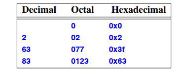
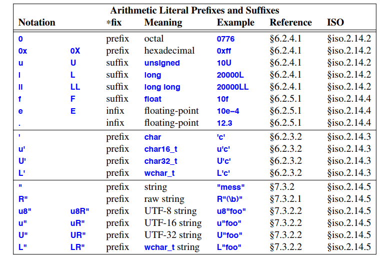
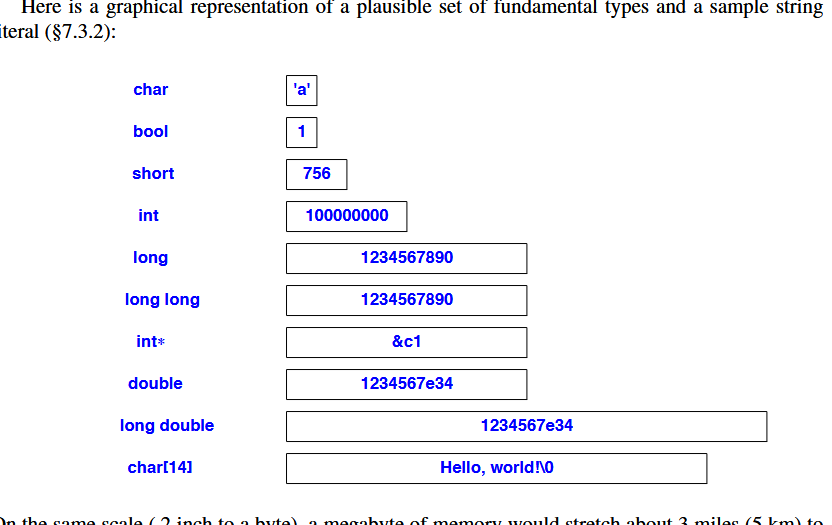
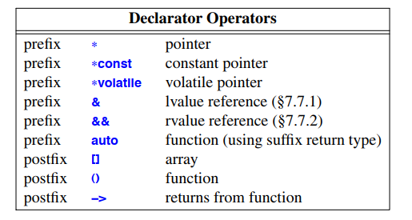
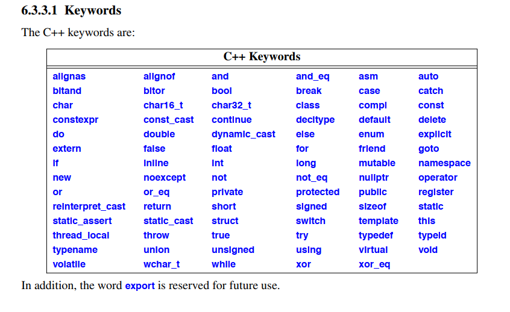

زبان C++ و کتابخانه استاندارد آن توسط استاندارد ISO تعریف شده‌اند: ISO/IEC 14882:2011. در این کتاب، ارجاع‌ها به استاندارد به شکل §iso.23.3.6.1 نوشته شده‌اند. اگر جایی در متن کتاب ابهام، نقص یا اشتباهی دیدید، بهتر است به خود استاندارد مراجعه کنید. اما انتظار نداشته باشید استاندارد مثل یک آموزش ساده برای غیرمتخصص‌ها باشد.

رعایت دقیق استاندارد زبان و کتابخانه C++ به تنهایی تضمین‌کننده کد خوب یا قابل حمل نیست. استاندارد فقط می‌گوید برنامه‌نویس روی چه چیزهایی می‌تواند در هر پیاده‌سازی حساب کند و روی چه چیزهایی نمی‌تواند. ممکن است برنامه‌ای کاملاً مطابق استاندارد باشد ولی کیفیت خوبی نداشته باشد. همچنین، بسیاری از برنامه‌های واقعی برای دسترسی به امکانات سیستم یا سخت‌افزار که در زبان C++ قابل بیان مستقیم نیستند، به ویژگی‌هایی متکی‌اند که استاندارد تضمین نمی‌کند همیشه قابل حمل باشند.

بسیاری از ویژگی‌های مهم در استاندارد به عنوان «رفتار تعریف‌شده توسط پیاده‌سازی» (implementation-defined) شناخته می‌شوند. یعنی هر پیاده‌سازی باید یک رفتار مشخص و مستند برای آن ویژگی داشته باشد. مثلا:

```cpp
unsigned char c1 = 64;  // رفتار مشخص است: چون char حداقل 8 بیت دارد و 64 در آن جا می‌شود
unsigned char c2 = 1256; // رفتار به پیاده‌سازی بستگی دارد: اگر char فقط 8 بیت باشد، مقدار برش می‌خورد
```

مقدار c1 مشخص است چون char حداقل ۸ بیت دارد و مقدار ۶۴ در آن جا می‌شود. اما مقدار c2 به این دلیل تعریف‌شده توسط پیاده‌سازی است که اندازه char به پیاده‌سازی بستگی دارد. اگر char فقط ۸ بیت باشد، مقدار ۱۲۵۶ به مقدار ۲۳۲ برش می‌خورد.

بیشتر ویژگی‌های «تعریف‌شده توسط پیاده‌سازی» به تفاوت‌های سخت‌افزاری مربوط می‌شوند. همچنین برخی رفتارها «تعریف‌نشده» یا «نامشخص» هستند؛ یعنی چند رفتار ممکن است درست باشند ولی پیاده‌ساز مجبور نیست بگوید کدام یکی رخ می‌دهد. برای مثال، مقدار برگشتی از عملگر new مشخص نیست یا مقدار متغیری که توسط دو نخ همزمان تغییر می‌کند، مگر اینکه هماهنگی لازم انجام شده باشد.

در برنامه‌های واقعی معمولاً باید به رفتارهای تعریف‌شده توسط پیاده‌سازی متکی باشیم، چون این موضوع اجازه می‌دهد برنامه روی سیستم‌های مختلف به خوبی کار کند. مثلا اگر همه کاراکترها ۸ بیت و همه اشاره‌گرها ۳۲ بیت بودند، C++ خیلی ساده‌تر می‌شد. اما کاراکترهای ۱۶ و ۳۲ بیت و اشاره‌گرهای ۱۶ و ۶۴ بیت در دنیای واقعی زیادند.

برای اینکه برنامه‌ها بیشتر قابل حمل باشند، بهتر است صریحاً مشخص کنیم روی کدام ویژگی‌های تعریف‌شده توسط پیاده‌سازی حساب می‌کنیم و آن بخش‌ها را در قسمت‌های مشخص و جداگانه برنامه قرار دهیم. مثلا همه وابستگی‌ها به اندازه سخت‌افزار را در یک فایل هدر با ثابت‌ها و تعریف نوع‌ها جمع کنیم. کتابخانه استاندارد برای این کار، کلاس numeric\_limits (§40.2) را دارد. همچنین می‌توانیم با استفاده از static\_assert (§2.4.3.3) فرضیاتمان درباره این ویژگی‌ها را بررسی کنیم:

```cpp
static_assert(4 <= sizeof(int), "sizeof(int) too small");
```

رفتار «تعریف‌نشده» (undefined behavior) وضعیت بدتری دارد. یعنی استاندارد هیچ رفتار منطقی از پیاده‌سازی نمی‌خواهد و معمولاً استفاده از چنین ویژگی‌هایی باعث رفتارهای خطرناک و ناپایدار می‌شود. مثلا:

```cpp
const int size = 4 * 1024;
char page[size];
void f()
{
  page[size + size] = 7;  // رفتار تعریف‌نشده است
}
```

در این کد، ممکن است داده‌های دیگر را خراب کند یا باعث خطای سخت‌افزاری شود. پیاده‌سازی لازم نیست یکی از رفتارهای ممکن را انتخاب کند. وقتی بهینه‌سازهای قدرتمند استفاده شوند، اثرات رفتار تعریف‌نشده حتی غیرقابل پیش‌بینی‌تر می‌شوند. اگر چند رفتار ممکن و منطقی وجود داشته باشد، آن ویژگی معمولاً «نامشخص» یا «تعریف‌شده توسط پیاده‌سازی» در نظر گرفته می‌شود نه «تعریف‌نشده».

صرف زمان و تلاش برای اطمینان از این که برنامه از رفتارهای نامشخص یا تعریف‌نشده استفاده نکند، ارزش زیادی دارد. در بسیاری موارد ابزارهایی هم وجود دارند که به شما در این کار کمک می‌کنند.

---------------------
---------------------
---------------------
---------------------
---------------------

رفتارهای دیگر «نامشخص» (unspecified) هستند؛ یعنی چندین رفتار ممکن قابل قبول است، اما پیاده‌ساز موظف نیست مشخص کند کدام یک دقیقاً رخ می‌دهد. معمولاً دلیل این که چیزی نامشخص در نظر گرفته می‌شود این است که رفتار دقیق آن به دلایل بنیادی قابل پیش‌بینی نیست. برای مثال، مقدار دقیق برگشتی از عملگر new نامشخص است. همچنین مقدار یک متغیر که توسط دو رشته همزمان تغییر می‌کند نامشخص است مگر این که مکانیزم هماهنگی برای جلوگیری از «رقابت داده» (data race) استفاده شده باشد (§41.2).

در برنامه‌های واقعی معمولاً لازم است که به رفتارهای تعریف‌شده توسط پیاده‌سازی تکیه کنیم. این قیمت را می‌پردازیم تا بتوانیم برنامه را روی انواع مختلف سیستم‌ها به خوبی اجرا کنیم. مثلاً زبان C++ خیلی ساده‌تر بود اگر همه کاراکترها ۸ بیت و همه اشاره‌گرها ۳۲ بیت بودند، اما در دنیای واقعی مجموعه‌های کاراکتری ۱۶ و ۳۲ بیتی و اشاره‌گرهای ۱۶ و ۶۴ بیتی رایج هستند.

برای افزایش قابلیت حمل برنامه بهتر است صریح باشیم درباره این که روی کدام ویژگی‌های تعریف‌شده توسط پیاده‌سازی حساب می‌کنیم و بخش‌های حساس‌تر را در قسمت‌های مشخص و جداگانه برنامه قرار دهیم. مثلاً همه وابستگی‌ها به اندازه‌های سخت‌افزاری را به صورت ثابت‌ها و تعریف نوع‌ها در یک فایل هدر جمع کنیم. برای پشتیبانی از این روش، کتابخانه استاندارد کلاس numeric\_limits (§40.2) را ارائه می‌دهد. همچنین می‌توان بسیاری از فرضیات مربوط به ویژگی‌های تعریف‌شده توسط پیاده‌سازی را با static\_assert (§2.4.3.3) بررسی کرد. برای مثال:

```cpp
static_assert(4 <= sizeof(int), "sizeof(int) too small");
```

رفتار «تعریف‌نشده» (undefined) بدتر است. اگر استاندارد برای یک ساختار هیچ رفتار منطقی مشخص نکرده باشد، آن ساختار تعریف‌نشده است. معمولاً وقتی از ویژگی تعریف‌نشده استفاده می‌کنیم، برنامه به شکل بسیار بدی رفتار می‌کند. مثلاً:

```cpp
const int size = 4 * 1024;
char page[size];
void f()
{
  page[size + size] = 7;  // رفتار تعریف‌نشده است
}
```

نتایج ممکن این کد شامل خراب شدن داده‌های دیگر و ایجاد خطا یا استثناء سخت‌افزاری است. پیاده‌سازی مجبور نیست یکی از نتایج ممکن را انتخاب کند.

وقتی بهینه‌سازهای قدرتمند به کار می‌روند، اثرات رفتار تعریف‌نشده می‌تواند کاملاً غیرقابل پیش‌بینی شود. اگر مجموعه‌ای از رفتارهای ممکن و قابل پیاده‌سازی به سادگی وجود داشته باشد، آن ویژگی معمولاً «نامشخص» یا «تعریف‌شده توسط پیاده‌سازی» در نظر گرفته می‌شود نه «تعریف‌نشده».

صرف زمان و تلاش زیاد برای اطمینان از این که برنامه از ویژگی‌های نامشخص یا تعریف‌نشده استفاده نکند، بسیار ارزشمند است. در بسیاری موارد، ابزارهایی هم وجود دارند که در این زمینه به کمک برنامه‌نویس می‌آیند.


## Implementations
ترجمه متن:

یک پیاده‌سازی C++ می‌تواند یا «میزبان» (hosted) باشد یا «بدون میزبان» (freestanding) (§iso.17.6.1.3).
یک پیاده‌سازی میزبان شامل تمامی امکانات کتابخانه استاندارد است که در استاندارد (§30.2) و در این کتاب توضیح داده شده‌اند.
یک پیاده‌سازی بدون میزبان ممکن است امکانات کمتری از کتابخانه استاندارد را ارائه دهد، به شرطی که موارد زیر فراهم باشند:
پیاده‌سازی‌های بدون میزبان برای کدی طراحی شده‌اند که تنها با حداقل‌ترین پشتیبانی از سیستم‌عامل اجرا می‌شود.
بسیاری از پیاده‌سازی‌ها همچنین گزینه‌ای (غیر استاندارد) برای عدم استفاده از استثناها (exceptions) ارائه می‌دهند، برای برنامه‌های بسیار حداقلی که نزدیک به سخت‌افزار اجرا می‌شوند.

-------------------
-------------------
-------------------
-------------------

حتماً! این متن درباره دو نوع اصلی پیاده‌سازی زبان برنامه‌نویسی C++ صحبت می‌کند: **میزبان (hosted)** و **بدون میزبان (freestanding)**.

---

### ۱. پیاده‌سازی میزبان (Hosted Implementation)

* این نوع پیاده‌سازی همان حالت معمولی است که بیشتر برنامه‌های C++ روی آن اجرا می‌شوند، یعنی روی یک سیستم عامل کامل مثل ویندوز، لینوکس یا مک.
* پیاده‌سازی میزبان تمامی امکانات کتابخانه استاندارد C++ را در اختیار برنامه‌نویس می‌گذارد؛ مثل توابع استاندارد، ساختارهای داده، ورودی/خروجی و … که در مستندات استاندارد زبان مشخص شده‌اند.
* معمولاً برنامه‌های کاربردی که روی سیستم‌عامل‌های کامل اجرا می‌شوند، از این نوع پیاده‌سازی استفاده می‌کنند.

---

### ۲. پیاده‌سازی بدون میزبان (Freestanding Implementation)

* این نوع پیاده‌سازی برای محیط‌هایی است که سیستم‌عامل یا حداقل پشتیبانی از سیستم‌عامل بسیار محدود یا حتی وجود ندارد؛ مثلاً سیستم‌های تعبیه‌شده (embedded systems)، میکروکنترلرها، سیستم‌های خیلی نزدیک به سخت‌افزار و …
* در این حالت، همه امکانات کتابخانه استاندارد C++ ارائه نمی‌شود و فقط بخشی از آن که برای محیط هدف ضروری است، در دسترس است.
* استاندارد C++ حداقل امکاناتی را مشخص کرده که این نوع پیاده‌سازی باید ارائه دهد تا برنامه‌ها بتوانند روی چنین محیط‌هایی اجرا شوند.
* بسیاری از پیاده‌سازی‌های بدون میزبان گزینه‌ای غیر استاندارد دارند که می‌شود استثناها (exceptions) را غیرفعال کرد؛ چون مدیریت استثناها بار اضافی و پیچیدگی به برنامه‌های خیلی نزدیک به سخت‌افزار اضافه می‌کند که معمولاً در این محیط‌ها نمی‌خواهند یا نمی‌توانند از آن استفاده کنند.

---

### جمع‌بندی

* اگر برنامه‌ای روی سیستم عامل کامل اجرا می‌شود، معمولاً از پیاده‌سازی میزبان استفاده می‌کند که تمام امکانات استاندارد را دارد.
* اگر برنامه‌ای روی سخت‌افزار کم‌منابع یا بدون سیستم‌عامل کامل اجرا می‌شود، از پیاده‌سازی بدون میزبان استفاده می‌کند که امکانات محدودتری دارد و می‌تواند استثناها را غیرفعال کند تا سبک‌تر و نزدیک‌تر به سخت‌افزار باشد.

---


-------------------
-------------------
-------------------
-------------------

## The Basic Source Character Set
ترجمه متن:

استاندارد C++ و مثال‌های این کتاب با استفاده از مجموعه‌کاراکترهای پایه منبع نوشته شده‌اند که شامل حروف، اعداد، کاراکترهای گرافیکی و فاصله‌ها از نسخه آمریکایی مجموعه‌کاراکتر ۷ بیتی بین‌المللی ISO 646-1983 به نام ASCII (ANSI3.4-1968) می‌باشد.
این موضوع می‌تواند برای کسانی که C++ را در محیطی با مجموعه‌کاراکتر متفاوت استفاده می‌کنند، مشکل‌ساز باشد:

* ASCII شامل کاراکترهای علامت‌گذاری و نمادهای عملگر (مانند ]، { و !) است که در برخی مجموعه‌کاراکترها موجود نیستند.
* نیاز به روشی برای نمایش کاراکترهایی وجود دارد که نمایش راحتی ندارند (مانند newline یا «کاراکتری با مقدار ۱۷»).
* ASCII کاراکترهایی مانند ñ، Þ و Æ را که برای نوشتن زبان‌های غیر از انگلیسی استفاده می‌شوند، ندارد.

برای استفاده از مجموعه‌کاراکتر گسترده‌تر در کد منبع، محیط برنامه‌نویسی می‌تواند مجموعه‌کاراکتر گسترده را به مجموعه‌کاراکتر پایه منبع به چند روش نگاشت کند، مثلاً با استفاده از نام‌های کاراکتر جهانی (§6.2.3.2).

## Types
ترجمه متن:

در نظر بگیرید:

```cpp
x = y + f(2);
```

برای اینکه این عبارت در یک برنامه C++ معنا پیدا کند، نام‌های `x`، `y` و `f` باید به صورت مناسب اعلام شده باشند. یعنی، برنامه‌نویس باید مشخص کند که موجودیت‌هایی با نام‌های `x`، `y` و `f` وجود دارند و این موجودیت‌ها از نوع‌هایی هستند که عملیات‌های `=` (اختصاص مقدار)، `+` (جمع) و `()` (فراخوانی تابع) به ترتیب روی آن‌ها معنی‌دار باشد.

هر نام (شناسه) در یک برنامه C++ دارای یک نوع (type) مرتبط است. این نوع تعیین می‌کند که چه عملیاتی می‌توان روی آن نام (یعنی روی موجودیتی که نام به آن اشاره می‌کند) انجام داد و این عملیات‌ها چگونه تفسیر می‌شوند. به عنوان مثال:

```cpp
float x;    // x یک متغیر عدد اعشاری است  
int y = 7;  // y یک متغیر عدد صحیح است با مقدار اولیه ۷  
float f(int); // f تابعی است که یک عدد صحیح به عنوان ورودی می‌گیرد و یک عدد اعشاری بازمی‌گرداند  
```

این اعلان‌ها باعث می‌شوند مثال بالا معنا پیدا کند. چون `y` به عنوان `int` اعلام شده، می‌توان از آن در عملیات جمع استفاده کرد و به آن مقدار اختصاص داد. همچنین `f` به عنوان تابعی اعلام شده که یک عدد صحیح می‌گیرد، پس می‌توان آن را با ورودی عدد صحیح ۲ فراخوانی کرد.

این فصل به معرفی انواع بنیادی (§6.2.1) و اعلان‌ها (§6.3) می‌پردازد. مثال‌های این فصل صرفاً برای نشان دادن ویژگی‌های زبان هستند و هدفشان انجام کاری مفید نیست. مثال‌های بیشتر و واقع‌گرایانه‌تر در فصول بعدی ارائه می‌شوند. این فصل تنها عناصر پایه‌ای را که برنامه‌های C++ بر اساس آن‌ها ساخته می‌شوند، ارائه می‌دهد. برای تکمیل یک پروژه واقعی در C++ و به ویژه برای خواندن کد نوشته‌شده توسط دیگران، باید این عناصر به همراه اصطلاحات و سینتکس ساده مربوط به آن‌ها را بدانید.
با این حال، درک کامل همه جزئیات ذکرشده در این فصل برای فهمیدن فصول بعدی لازم نیست. بنابراین، ممکن است ترجیح دهید این فصل را به طور اجمالی مرور کنید، مفاهیم اصلی را مشاهده کنید و در صورت نیاز به جزئیات بیشتر، بعدها دوباره مراجعه کنید.

## Booleans
ترجمه متن:

نوع بولی (Boolean) که در C++ با `bool` نشان داده می‌شود، می‌تواند یکی از دو مقدار `true` یا `false` را داشته باشد. نوع بولی برای بیان نتایج عملیات‌های منطقی استفاده می‌شود. به عنوان مثال:

```cpp
void f(int a, int b)
{
    bool b1 {a == b};
    // ...
}
```

اگر مقدار `a` و `b` برابر باشد، `b1` مقدار `true` می‌گیرد؛ در غیر این صورت، مقدار آن `false` می‌شود.

استفاده رایج از نوع `bool`، به عنوان نوع خروجی تابعی است که یک شرط (پیش‌شرط) را بررسی می‌کند. به عنوان مثال:

```cpp
bool is_open(File*);
bool greater(int a, int b) { return a > b; }
```

براساس تعریف، مقدار `true` هنگام تبدیل به عدد صحیح (integer) برابر با ۱ و مقدار `false` برابر با ۰ است. بالعکس، اعداد صحیح می‌توانند به صورت ضمنی به `bool` تبدیل شوند: اعداد غیر صفر به `true` تبدیل می‌شوند و ۰ به `false`. برای مثال:

```cpp
bool b1 = 7;   // 7 نابرابر صفر است، پس b1 مقدار true می‌گیرد
bool b2 {7};   // خطا: Narrowing (تبدیل ناامن)
int i1 = true; // i1 مقدار 1 می‌شود
int i2 {true}; // i2 مقدار 1 می‌شود
```

اگر بخواهید از نگارش مقداردهی اولیه `{}` استفاده کنید تا از Narrowing جلوگیری کنید و در عین حال بخواهید یک عدد صحیح را به `bool` تبدیل کنید، می‌توانید به صورت صریح این کار را انجام دهید:

```cpp
void f(int i)
{
    bool b {i != 0};
    // ...
};
```

در عبارات حسابی و منطقی، `bool` ها به `int` تبدیل می‌شوند؛ عملیات‌های حسابی و منطقی روی مقادیر تبدیل شده انجام می‌شوند. اگر لازم باشد نتیجه دوباره به `bool` تبدیل شود، مقدار ۰ به `false` و مقدار غیر صفر به `true` تبدیل می‌شود. به عنوان مثال:

```cpp
bool a = true;
bool b = true;
bool x = a + b;   // a + b برابر 2 است، پس x مقدار true می‌گیرد
bool y = a || b;  // a || b برابر 1 است، پس y مقدار true می‌گیرد ("||" یعنی "یا")
bool z = a - b;   // a - b برابر 0 است، پس z مقدار false می‌گیرد
```

اشاره‌گرها (pointer) نیز می‌توانند به صورت ضمنی به `bool` تبدیل شوند (§10.5.2.5). اشاره‌گر غیر تهی (non-null) به `true` و اشاره‌گر `nullptr` به `false` تبدیل می‌شود. مثلاً:

```cpp
void g(int* p)
{
    bool b = p;            // تبدیل ضمنی به true یا false
    bool b2 {p != nullptr}; // تست صریح برابر نبودن با nullptr
    if (p) {               // معادل p != nullptr
        // ...
    }
}
```

من ترجیح می‌دهم از `if (p)` به جای `if (p != nullptr)` استفاده کنم، چون مستقیم‌تر مفهوم «اگر p معتبر است» را بیان می‌کند و همچنین کوتاه‌تر است. شکل کوتاه‌تر احتمال خطا را کمتر می‌کند.

--------------------
--------------------
--------------------
--------------------

---

## Narrowing Conversion چیست؟

**Narrowing conversion** در C++ به تبدیل نوع داده‌ای گفته می‌شود که ممکن است منجر به از دست رفتن اطلاعات یا تغییر ناخواسته مقدار شود.
به عبارت دیگر، وقتی داده‌ای از نوعی بزرگ‌تر یا دقیق‌تر به نوعی کوچک‌تر یا کم‌دقت‌تر تبدیل شود و احتمال افت دقت یا کاهش دامنه مقدار وجود داشته باشد، این تبدیل «narrowing» است.

---

### چرا مشکل است؟

* Narrowing باعث می‌شود مقدار تبدیل‌شده با مقدار اصلی متفاوت باشد.
* مثلاً تبدیل یک عدد اعشاری (double یا float) به عدد صحیح (int) باعث حذف بخش اعشاری می‌شود.
* یا تبدیل یک عدد بزرگ‌تر از محدوده نوع مقصد، ممکن است به مقدار نامعقول یا عدد دیگری تبدیل شود.

---

## Narrowing Conversion در C++11 و بعد از آن

C++11 مقداردهی اولیه با آکولاد `{}` را معرفی کرد که به آن **list initialization** یا **uniform initialization** گفته می‌شود.
این روش مقداردهی اولیه **نمی‌گذارد Narrowing conversions به صورت ضمنی انجام شود** و در صورت وقوع، کامپایلر خطا می‌دهد.
هدف این است که خطاهای ناشی از تبدیل‌های ناخواسته زودتر شناسایی شوند.

---

## مثال‌های Narrowing Conversion

### 1. تبدیل عدد اعشاری به صحیح (از دست رفتن بخش کسری)

```cpp
double pi = 3.14159;

int a = pi;    // درست است ولی a می‌شود 3، بخش اعشاری حذف می‌شود (narrowing)
int b{pi};     // خطا: narrowing conversion با مقداردهی اولیه با {} مجاز نیست
```

### 2. تبدیل مقدار بزرگ‌تر به نوع با محدوده کوچکتر (آندر فلو/اور فلو)

```cpp
int large = 1000;

char c = large;   // ممکن است مقدار غیرمنتظره‌ای داشته باشد چون char معمولاً 1 بایت است و نمی‌تواند همه مقادیر int را نگه دارد (narrowing)
char d{large};    // خطا: narrowing conversion با مقداردهی اولیه با {} مجاز نیست
```

### 3. تبدیل نوع صحیح بزرگ به نوع کوچک‌تر

```cpp
long long big = 5000000000;

int x = big;    // ممکن است مقدار نادرست شود چون int کوچک‌تر است
int y{big};     // خطا: narrowing conversion با مقداردهی اولیه با {}
```

### 4. تبدیل عدد صحیح غیر صفر به bool با مقداردهی اولیه با {}

```cpp
int num = 7;

bool b1 = num;  // درست است، چون غیر صفر است، b1 برابر true می‌شود
bool b2{num};   // خطا: narrowing conversion، مقداردهی اولیه با {} این تبدیل را قبول نمی‌کند
```

---

## تبدیل‌های امن که Narrowing نیستند

برخی تبدیل‌ها narrowing نیستند و در مقداردهی اولیه با `{}` مجازند:

```cpp
int i = 5;
double d1 = i;      // تبدیل صحیح به اعشاری narrowing نیست
double d2{ i };     // درست است
char c1 = 'a';
int i2 = c1;        // تبدیل char به int narrowing نیست
int i3{ c1 };       // درست است
```

---

## نکات مهم درباره Narrowing Conversion

* مقداردهی اولیه با آکولاد `{}` از Narrowing جلوگیری می‌کند و در صورت وقوع خطا می‌دهد.
* Narrowing معمولا در تبدیل‌های **float به int**، **نوع بزرگ به نوع کوچک‌تر** یا **تبدیل‌های غیرمطمئن** رخ می‌دهد.
* استفاده از مقداردهی اولیه با `{}` کمک می‌کند خطاهای مخفی تبدیل نوع سریع‌تر دیده شوند.
* برای انجام تبدیل‌های narrowing به صورت کنترل‌شده، بهتر است تبدیل صریح (`static_cast`) استفاده شود یا مقداردهی با شرط انجام شود.

---

## مثال استفاده از cast برای تبدیل ایمن

```cpp
double pi = 3.14159;

// تبدیل صریح برای جلوگیری از خطا و آگاه بودن از narrow شدن
int a = static_cast<int>(pi);  // مقدار 3 می‌گیرد ولی برنامه‌نویس آگاه است

// یا مقداردهی ایمن با {} و شرط
double val = 5.5;
int b{ (val < std::numeric_limits<int>::max()) ? static_cast<int>(val) : 0 };
```

---

### خلاصه

* **Narrowing conversion** یعنی تبدیل نوع داده‌ای که منجر به از دست دادن داده یا دقت می‌شود.
* در C++11 به بعد، مقداردهی اولیه با `{}` این تبدیل‌ها را ممنوع می‌کند و خطا می‌دهد.
* استفاده از `{}` به برنامه‌نویس کمک می‌کند از خطاهای ناخواسته تبدیل داده جلوگیری کند و برنامه قابل اطمینان‌تر شود.

---


------------------------
------------------------
------------------------
------------------------
------------------------

## Character Types
در زبان ++C انواع مختلفی از نوع داده‌های کاراکتری وجود دارد که بازتاب‌دهنده‌ی تنوع ـ و گاهی گیج‌کننده ـ مجموعه‌های کاراکتری و شیوه‌های رمزگذاری آن‌ها هستند. این‌ها عبارت‌اند از:

* **char**: نوع پیش‌فرض کاراکتر که برای متن برنامه استفاده می‌شود. `char` برای نگهداری کاراکترهای مجموعه کاراکتری پیاده‌سازی زبان به کار می‌رود و معمولاً ۸ بیتی است.
* **signed char**: مشابه `char` است، اما تضمین شده که علامت‌دار باشد، یعنی می‌تواند مقادیر مثبت و منفی را نگهداری کند.
* **unsigned char**: مشابه `char` است، اما تضمین شده که بدون علامت باشد، یعنی فقط مقادیر مثبت را نگهداری می‌کند.
* **wchar\_t**: برای نگهداری کاراکترهای مجموعه کاراکتری بزرگ‌تر مانند یونیکد فراهم شده است (نگاه کنید به بخش 7.3.2.2). اندازه‌ی `wchar_t` بستگی به پیاده‌سازی دارد و به اندازه‌ای بزرگ است که بتواند بزرگ‌ترین مجموعه کاراکتری پشتیبانی‌شده توسط تنظیمات محلی (locale) پیاده‌سازی را نگهداری کند (نگاه کنید به فصل 39).
* **char16\_t**: نوعی برای نگهداری مجموعه‌های کاراکتری ۱۶ بیتی، مانند UTF-16.
* **char32\_t**: نوعی برای نگهداری مجموعه‌های کاراکتری ۳۲ بیتی، مانند UTF-32.

این‌ها شش نوع متفاوت هستند (با وجود اینکه پسوند `_t` اغلب برای نام مستعار نوع‌ها استفاده می‌شود؛ نگاه کنید به بخش 6.5). در هر پیاده‌سازی، نوع `char` معادل یکی از دو نوع `signed char` یا `unsigned char` خواهد بود، اما این سه نام همچنان به‌عنوان نوع‌های مجزا شناخته می‌شوند.


یک متغیر از نوع `char` می‌تواند یکی از کاراکترهای مجموعه‌ی کاراکتری پیاده‌سازی را در خود نگه دارد. برای مثال:

```cpp
char ch = 'a';
```

تقریباً به‌طور عمومی، یک `char` دارای ۸ بیت است، بنابراین می‌تواند یکی از ۲۵۶ مقدار مختلف را نگهداری کند. به‌طور معمول، مجموعه‌ی کاراکتری استفاده‌شده نوعی از ISO-646 است، مانند ASCII، که کاراکترهایی را که روی صفحه‌کلید شما ظاهر می‌شوند فراهم می‌کند. بسیاری از مشکلات ناشی از این واقعیت است که این مجموعه کاراکتری تنها به‌طور جزئی استاندارد شده است.

تفاوت‌های جدی بین مجموعه‌های کاراکتری‌ای که از زبان‌های طبیعی مختلف پشتیبانی می‌کنند، و حتی بین مجموعه‌هایی که از یک زبان طبیعی به روش‌های مختلف پشتیبانی می‌کنند، وجود دارد. در این‌جا، ما فقط به چگونگی تأثیر این تفاوت‌ها بر قوانین زبان C++ علاقه‌مندیم. موضوع گسترده‌تر و جالب‌ترِ نحوه‌ی برنامه‌نویسی در محیطی چندزبانه و با مجموعه‌های کاراکتری گوناگون، فراتر از حوزه‌ی این کتاب است، گرچه در چند بخش به آن اشاره شده است (بخش‌های 6.2.3، 36.2.1، و فصل 39).

می‌توان با اطمینان فرض کرد که مجموعه کاراکتری پیاده‌سازی شامل ارقام اعشاری، ۲۶ حرف الفبای انگلیسی، و برخی علائم نگارشی پایه‌ای است. اما نمی‌توان با اطمینان فرض کرد که:

* در یک مجموعه کاراکتری ۸ بیتی، بیش از ۱۲۷ کاراکتر وجود ندارد (برای مثال، برخی مجموعه‌ها ۲۵۵ کاراکتر دارند).
* تعداد حروف الفبا بیشتر از حروف زبان انگلیسی نیست (بیشتر زبان‌های اروپایی حروف بیشتری دارند، مانند æ، þ، و ß).
* حروف الفبا پشت سر هم هستند (در EBCDIC بین 'i' و 'j' فاصله وجود دارد).
* همه‌ی کاراکترهایی که برای نوشتن C++ لازم‌اند در دسترس هستند (برخی مجموعه‌های کاراکتری ملی نمادهایی مانند {، }، \[، ]، | و \ را ندارند).
* یک `char` در ۱ بایت جا می‌گیرد. در برخی پردازنده‌های توکار (embedded) که سخت‌افزار دسترسی به بایت ندارند، ممکن است `char` چهار بایت باشد. همچنین استفاده از رمزگذاری یونیکد ۱۶ بیتی برای `char`های پایه منطقی است.

هرجا که امکان دارد، باید از فرض کردن در مورد نمایش (representation) اشیاء خودداری کنیم. این قانون کلی حتی برای کاراکترها نیز صدق می‌کند.


هر کاراکتر دارای یک مقدار عددی (صحیح) در مجموعه کاراکتری مورد استفاده‌ی پیاده‌سازی است. برای مثال، مقدار `'b'` در مجموعه کاراکتری ASCII برابر با ۹۸ است. در اینجا یک حلقه داریم که مقدار عددی هر کاراکتری را که وارد کنید نمایش می‌دهد:

```cpp
void intval()
{
    for (char c; cin >> c; )
        cout << "the value of '" << c << "' is " << int{c} << '\n';
}
```

یادداشت `int{c}` مقدار عددی (صحیح) کاراکتر `c` را برمی‌گرداند («عددی از نوع int که می‌توان از `c` ساخت»).

امکان تبدیل `char` به عدد صحیح این سؤال را مطرح می‌کند: آیا `char` علامت‌دار (signed) است یا بدون‌علامت (unsigned)؟
مقادیر ۲۵۶‌تایی قابل نمایش با یک بایت ۸ بیتی را می‌توان به صورت بازه‌ی ۰ تا ۲۵۵ یا −۱۲۷ تا ۱۲۷ تفسیر کرد.
نه، نه به صورت −۱۲۸ تا ۱۲۷ همان‌طور که شاید انتظار داشته باشید: استاندارد C++ احتمال استفاده از سخت‌افزارهایی با مکمل یک (one’s-complement) را باز می‌گذارد که در این صورت یکی از مقادیر از دست می‌رود؛ بنابراین استفاده از −۱۲۸ قابل حمل (portable) نیست.

متأسفانه، علامت‌دار یا بدون‌علامت بودن یک `char` معمولی به پیاده‌سازی بستگی دارد.
زبان C++ دو نوع را فراهم می‌کند که جواب این سؤال در موردشان مشخص است:

* `signed char` که می‌تواند دست‌کم مقادیر بین −۱۲۷ تا ۱۲۷ را نگه دارد.
* `unsigned char` که می‌تواند دست‌کم مقادیر بین ۰ تا ۲۵۵ را نگه دارد.

خوشبختانه، این تفاوت تنها زمانی اهمیت پیدا می‌کند که با مقادیری خارج از بازه ۰ تا ۱۲۷ سروکار داشته باشید و بیشتر کاراکترهای رایج در همین بازه قرار دارند.

ذخیره کردن مقادیر خارج از این بازه در یک `char` معمولی می‌تواند منجر به مشکلات پنهان در قابلیت حمل شود. اگر نیاز دارید از بیش از یک نوع `char` استفاده کنید یا مقادیر عددی را در متغیرهای `char` ذخیره کنید، به بخش §6.2.3.1 مراجعه نمایید.

توجه داشته باشید که انواع کاراکتری، نوع‌های عددی صحیح (integral types؛ §6.2.1) هستند، بنابراین عملیات محاسباتی و منطقی بیتی (bitwise؛ §10.3) روی آن‌ها قابل اعمال است. برای مثال:

```cpp
void digits()
{
    for (int i=0; i!=10; ++i)
        cout << static_cast<char>('0'+i);
}
```

این تابع ده رقم (0 تا 9) را در خروجی `cout` چاپ می‌کند.
در این‌جا، کاراکتر `'0'` به مقدار عددی‌اش تبدیل می‌شود و `i` به آن اضافه می‌شود. حاصل جمع، یک `int` است که سپس به `char` تبدیل شده و چاپ می‌شود.

عبارت `'0'+i` به‌تنهایی یک `int` است، بنابراین اگر `static_cast<char>` را حذف کرده بودیم، خروجی چیزی مانند ۴۸، ۴۹ و ... می‌بود، نه ۰، ۱ و ...


ــــــــــــــــــــــــ
ــــــــــــــــــــــــ
ــــــــــــــــــــــــ
ــــــــــــــــــــــــ

خیلی سؤال خوبی پرسیدی 👌 چون دقیقاً اینجاست که خیلی‌ها دچار سوءتفاهم می‌شن.

بیاید اینو قدم‌به‌قدم باز کنیم:

---

## 🧠 سوال تو:

> اگر مقدار ASCII یک کاراکتر مثلاً 250 باشه، و سیستم از `signed char` استفاده کنه، **چی میشه؟** آیا این مقدار جا میشه یا مشکل به وجود میاد؟

---

## 🧮 پاسخ فنی:

### حالت‌های ممکن:

#### ✅ اگر از `unsigned char` استفاده کنی:

* مشکلی نداری. چون `unsigned char` می‌تونه مقادیر بین `0` تا `255` رو نگه داره.
* پس `250` در این حالت بدون مشکل ذخیره می‌شه.

#### ❌ ولی اگر از `signed char` استفاده کنی:

* معمولاً `signed char` **فقط بازه‌ی `-128` تا `127`** رو پشتیبانی می‌کنه (در معماری‌های دو مکمل یا Two's Complement که بسیار رایج هست).
* پس **مقدار 250 خارج از بازه هست!**

---

## 🤔 پس اگر من بنویسم:

```cpp
signed char c = 250;
```

چه اتفاقی می‌افته؟

### 🔥 اتفاق بد:

* این مقدار **از نظر فنی "تبدیل مقداری نادرست" یا "overflow" هست** چون 250 توی `signed char` جا نمی‌شه.
* **اِین رفتار "implementation-defined" یا "نامشخص بسته به کامپایلر/معماری" هست.**
* توی برخی سیستم‌ها مقدار منفی می‌گیری (مثلاً ممکنه تبدیل بشه به -6 یا چیز دیگه‌ای).

---

## مثال عددی:

عدد 250 در دودویی:

```
250 = 11111010
```

حالا اگه این بیت‌ها رو توی `signed char` ببینی (که 8 بیت هست) و به‌صورت signed تفسیرش کنی، به خاطر بیت علامت (MSB = 1)، مقدارش منفی می‌شه:

```cpp
int i = static_cast<signed char>(250); // مقدار i می‌تونه -6 بشه
```

یعنی تو همون بیت‌ها رو داری، ولی نحوه‌ی تفسیرش فرق داره.

---

## ✅ پس راه‌حل چیه؟

* **اگر می‌خوای از ASCIIهای بالاتر از 127 استفاده کنی (مثلاً کد 250)**، **از `unsigned char` استفاده کن**.
* یا اگر مجبوری از `char` معمولی استفاده کنی، ابتدا بررسی کن که در کامپایلرت `char` به صورت `signed` تعریف شده یا `unsigned` (با استفاده از تست ساده یا مستندات).

---

## 💡 چک کردن signed یا unsigned بودن `char`:

```cpp
#include <iostream>
#include <type_traits>

int main() {
    if (std::is_signed<char>::value)
        std::cout << "char is signed\n";
    else
        std::cout << "char is unsigned\n";
}
```

---

## 🎯 جمع‌بندی نهایی:

| حالت                     | نتیجه                                                              |
| ------------------------ | ------------------------------------------------------------------ |
| `unsigned char c = 250;` | ✅ مشکلی نیست                                                       |
| `signed char c = 250;`   | ❌ رفتاری غیرقابل‌پیش‌بینی یا اشتباه                                |
| `char c = 250;`          | 🔁 بستگی به این داره که `char` در سیستم شما signed هست یا unsigned |

----------------------
----------------------
----------------------
----------------------
----------------------

حتماً! اجازه بده متن رو با دقت بیشتر و در سطحی فنی‌تر بررسی کنیم، چون موضوع تفاوت در انواع کاراکترها در C++ مخصوصاً زمانی که با رمزگذاری (encoding) و بین‌المللی‌سازی (i18n) سر و کار داریم بسیار مهمه.

---

## 📌 بخش اول: چرا چند نوع کاراکتر داریم؟

زبان C++ در محیط‌هایی اجرا می‌شه که ممکنه از مجموعه‌ کاراکتری (character set) و رمزگذاری‌های مختلفی استفاده کنن، برای همین باید راهی داشته باشه تا:

1. کاراکترهای ساده ASCII رو مدیریت کنه.
2. کاراکترهای غیرانگلیسی مثل عربی، فارسی، چینی، ژاپنی و ... رو پشتیبانی کنه.
3. با سیستم‌عامل‌ها یا سخت‌افزارهایی که معماری خاص دارن (مثل EBCDIC، یا بدون واحد byte) هم کار کنه.

---

## 🧱 انواع داده‌های کاراکتری در C++

### 1. `char`

* نوع پیش‌فرض برای کاراکترهاست.
* **اندازه معمول**: 1 بایت (8 بیت)
* **نکته مهم**: ممکنه signed یا unsigned باشه (به پیاده‌سازی بستگی داره)
* **مناسب برای**: کاراکترهای استاندارد ASCII (مثل حروف انگلیسی، ارقام، علائم پایه)

---

### 2. `signed char` و `unsigned char`

* هر دو اندازه‌ای برابر با `char` دارن (معمولاً 1 بایت) ولی:

  * `signed char`: محدوده \[−127، 127] (یا \[−128، 127] بسته به معماری)
  * `unsigned char`: محدوده \[0، 255]
* **تفاوت با `char`**: در تفسیر بیت هشتم (MSB)
* مناسب برای: پردازش بایت‌ها، مخصوصاً وقتی به بایت خام نیاز داریم (مثل رمزگذاری یا فایل‌های باینری)

---

### 3. `wchar_t`

* برای نمایش کاراکترهای خارج از ASCII، مثلاً زبان‌های آسیایی.
* اندازه آن **به سیستم عامل و کامپایلر بستگی دارد**:

  * در Windows: معمولاً 2 بایت
  * در Linux: معمولاً 4 بایت
* استفاده برای Unicode، ولی **رمزگذاری مشخصی نداره** (یعنی ممکنه UTF-16 یا UTF-32 باشه)

---

### 4. `char16_t` و `char32_t`  (از C++11 به بعد)

* **`char16_t`**:

  * همیشه 16 بیتی
  * مناسب برای UTF-16
* **`char32_t`**:

  * همیشه 32 بیتی
  * مناسب برای UTF-32
* این‌ها برای کار با Unicode به شیوه‌ای **قابل‌حمل و قابل‌پیش‌بینی** طراحی شده‌اند.

---

## 📚 تفاوت‌های کلیدی بین این نوع‌ها:

| نوع داده        | اندازه (معمولی) | Signed؟    | محدوده مقداری        | استفاده رایج     |
| --------------- | --------------- | ---------- | -------------------- | ---------------- |
| `char`          | 1 بایت          | بستگی دارد | 0-255 یا -128 تا 127 | متن ASCII        |
| `signed char`   | 1 بایت          | بله        | -128 تا 127          | عدد با علامت     |
| `unsigned char` | 1 بایت          | خیر        | 0 تا 255             | بایت خام         |
| `wchar_t`       | 2 یا 4 بایت     | بستگی دارد | وابسته به سیستم      | متن Unicode محلی |
| `char16_t`      | 2 بایت          | خیر        | 0 تا 65535           | UTF-16           |
| `char32_t`      | 4 بایت          | خیر        | 0 تا 0x10FFFF        | UTF-32           |

---

## 🎯 مثال دقیق: چرا نوع `char` ممکنه دردسرساز بشه؟

فرض کن بخوای کاراکتری با مقدار باینری 200 (یعنی 0xC8) رو در `char` ذخیره کنی:

* اگر `char` در پیاده‌سازی شما **signed** باشه: مقدار 200 به صورت منفی (مثلاً −56) تفسیر می‌شه!
* اگر `char` **unsigned** باشه: مقدار 200 به درستی نگه‌داری می‌شه.

همین موضوع باعث بروز باگ‌های ظریفی در برنامه‌هایی می‌شه که داده‌های باینری یا رمزگذاری شده رو با `char` معمولی مدیریت می‌کنن.

---

## 🧠 چرا `char16_t` و `char32_t` قابل‌اعتمادترن؟

چون:

* اندازه‌شون همیشه مشخصه.
* به صورت رسمی برای UTF-16 و UTF-32 طراحی شده‌ن.
* در بین پلتفرم‌ها رفتار یکسانی دارن.

---

## 💡 توصیه‌های عملی:

1. اگر فقط با متون انگلیسی و ساده کار می‌کنید → از `char` استفاده کنید.
2. اگر با فایل‌های باینری یا داده‌های رمزگذاری شده سروکار دارید → از `unsigned char` استفاده کنید.
3. اگر قصد دارید متن چندزبانه (مثلاً فارسی، چینی، عربی) بخونید یا بنویسید → از `char16_t` یا `char32_t` استفاده کنید.
4. همیشه در تبدیل کاراکترها به `int` یا بالعکس، **تبدیل صریح (cast)** انجام دهید تا قابل‌فهم و بدون خطا باشد.

---

-----------------------
-----------------------
-----------------------
-----------------------
-----------------------

## Signed and Unsigned Characters
در زبان ++C، این موضوع به پیاده‌سازی وابسته است که آیا نوع `char` ساده به‌صورت پیش‌فرض علامت‌دار (`signed`) یا بدون علامت (`unsigned`) در نظر گرفته می‌شود. این موضوع می‌تواند منجر به رفتارهای غیرمنتظره و وابسته به پیاده‌سازی شود.

برای مثال:

```cpp
char c = 255; // 255 به معنای "تمام بیت‌ها 1" است، یا به‌صورت هگزادسیمال 0xFF
int i = c;
```

مقدار متغیر `i` چه خواهد بود؟ متأسفانه، پاسخ این سؤال وابسته به پیاده‌سازی است. در سیستم‌هایی با بایت‌های 8 بیتی، مقدار `i` بستگی به این دارد که بیت‌های `char` چگونه به `int` گسترش یابند. اگر `char` به صورت `unsigned` تعریف شده باشد، مقدار `i` برابر 255 خواهد بود. اما اگر `char` به صورت `signed` باشد، مقدار `i` برابر −1 خواهد شد. در این حالت، کامپایلر ممکن است در مورد تبدیل مقدار 255 به مقدار `char` منفی، هشدار دهد.

با این حال، زبان ++C مکانیزم کلی برای تشخیص این مشکل ارائه نمی‌دهد. یکی از راه‌حل‌ها، استفاده از نوع‌های `signed char` یا `unsigned char` به‌جای `char` ساده است. متأسفانه، برخی از توابع کتابخانه استاندارد، مانند `strcmp()`، فقط از `char` ساده استفاده می‌کنند.

یک `char` باید مانند یکی از نوع‌های `signed char` یا `unsigned char` عمل کند، ولی این سه نوع با یکدیگر متمایز هستند؛ بنابراین نمی‌توان اشاره‌گرها به این نوع‌ها را به یکدیگر تبدیل کرد. برای مثال:

```cpp
void f(char c, signed char sc, unsigned char uc)
{
    char* pc = &uc; // خطا: تبدیل اشاره‌گر مجاز نیست
    signed char* psc = pc; // خطا: تبدیل اشاره‌گر مجاز نیست
    unsigned char* puc = pc; // خطا: تبدیل اشاره‌گر مجاز نیست
    psc = puc; // خطا: تبدیل اشاره‌گر مجاز نیست
}
```

متغیرهای این سه نوع `char` می‌توانند آزادانه به یکدیگر انتساب یابند. اما اگر مقداری بیش از حد به `signed char` اختصاص دهید، نتیجه آن تعریف‌نشده است. برای مثال:

```cpp
void g(char c, signed char sc, unsigned char uc)
{
    c = 255; // اگر `char` ساده علامت‌دار باشد و 8 بیت باشد، نتیجه به پیاده‌سازی وابسته است
    c = sc;  // مجاز
    c = uc;  // به پیاده‌سازی وابسته است اگر `char` علامت‌دار باشد و مقدار uc بزرگ باشد
    sc = uc; // به پیاده‌سازی وابسته است اگر مقدار uc بزرگ باشد
    uc = sc; // مجاز: تبدیل به نوع بدون علامت
    sc = c;  // به پیاده‌سازی وابسته است اگر `char` بدون علامت باشد و مقدار c بزرگ باشد
    uc = c;  // مجاز: تبدیل به نوع بدون علامت
}
```

برای شفاف‌سازی، فرض کنیم `char`ها 8 بیتی هستند:

```cpp
signed char sc = -160;
unsigned char uc = sc; // uc == 116 چون 256 - 160 = 116
cout << uc; // چاپ 't'
char count[256]; // فرض بر 8 بیت بودن char
++count[sc]; // احتمالاً فاجعه: دسترسی خارج از محدوده آرایه
++count[uc]; // مجاز
```

هیچ‌یک از این مشکلات بالقوه و سردرگمی‌ها رخ نمی‌دهند اگر فقط از `char` ساده استفاده کرده و از مقداردهی منفی به آن اجتناب کنید.

-------------------------
-------------------------
-------------------------
-------------------------

حتماً، بیایید قدم‌به‌قدم و ساده‌تر توضیح بدهیم که این مطلب درباره‌ی چی صحبت می‌کند:

---

### 💡 موضوع اصلی:

در زبان ++C، وقتی از نوع داده‌ای `char` استفاده می‌کنید، ممکن است این نوع به صورت **علامت‌دار (signed)** یا **بدون علامت (unsigned)** در نظر گرفته شود. و اینکه کدام حالت استفاده می‌شود **به پیاده‌سازی (کامپایلر و سیستم)** بستگی دارد.

---

### 📌 چرا این موضوع مهم است؟

چون اگر `char` علامت‌دار باشد، عددهایی مثل 255 به صورت **منفی** تفسیر می‌شوند. اما اگر `char` بدون علامت باشد، همان عدد به صورت **مثبت** باقی می‌ماند.

---

### 🎯 مثال ساده:

```cpp
char c = 255;
int i = c;
```

حالا `i` چی می‌شود؟

* اگر `char` علامت‌دار باشد → `i = -1`
* اگر `char` بدون علامت باشد → `i = 255`

یعنی **نتیجه نهایی به کامپایلر و سیستم بستگی دارد**! این می‌تواند باعث ایجاد **باگ‌های عجیب و سخت برای یافتن** در برنامه شود.

---

### ⚠️ مشکل دیگر:

سه نوع `char` در C++ داریم:

* `char` (نوع معمولی)
* `signed char` (علامت‌دار صریح)
* `unsigned char` (بدون علامت صریح)

نکته مهم اینجاست که این سه نوع از نظر زبان C++ **متفاوت** هستند. یعنی نمی‌توانید به راحتی اشاره‌گرها (Pointers) به آن‌ها را با هم تبدیل کنید.

مثال:

```cpp
unsigned char uc;
char* pc = &uc;  // خطا
```

---

### 🔁 ولی مقدارها چی؟

شما می‌توانید مقدارها را از یک نوع `char` به دیگری **انتقال دهید**:

```cpp
signed char sc;
unsigned char uc;
char c;

c = sc; // مجاز
sc = c; // بسته به پیاده‌سازی ممکن است خطرناک باشد
```

اگر مقداری که به نوع `signed char` می‌دهید بزرگ‌تر از محدوده‌ی آن باشد (مثلاً 255)، نتیجه ممکن است **تعریف‌نشده یا نادرست** باشد.

---

### 🧪 مثال عملی:

```cpp
signed char sc = -160;
unsigned char uc = sc; // مقدار uc می‌شود 116 (چون 256 - 160 = 116)
cout << uc; // چاپ کاراکتر 't'
```

ولی حالا اگر از این مقدار برای دسترسی به آرایه استفاده کنید:

```cpp
char count[256];
++count[sc];  // فاجعه: اگر sc منفی باشد، آرایه را از محدوده‌اش بیرون می‌زنید!
++count[uc];  // مجاز: چون uc همیشه مثبت است
```

---

### ✅ نتیجه‌گیری:

برای جلوگیری از باگ‌های غیرمنتظره:

* همیشه از `signed char` یا `unsigned char` به صورت صریح استفاده کنید.
* از مقداردهی منفی به `char` ساده خودداری کنید.
* هنگام استفاده از آرایه‌ها با اندیس‌های `char` دقت کنید.
* در توابعی مثل `strcmp` که از `char` ساده استفاده می‌کنند، باید بیشتر مراقب باشید چون آنجا کنترل دست شما نیست.

------------------
------------------
------------------
------------------
------------------

## Character Literals
---

### 🌟 نویسه‌ (Character Literal) چیست؟

نویسه‌ای که داخل تک‌کوتیشن (') قرار بگیرد، یک **نویسه‌ی کاراکتری (Character Literal)** محسوب می‌شود. برای مثال: `'a'` یا `'0'`.

نوع داده‌ای این نویسه‌ها **`char`** است. این نوع داده می‌تواند **به‌صورت ضمنی (implicit)** به مقدار عددی معادل خودش در جدول نویسه‌ای سیستم (مانند ASCII) تبدیل شود.

برای مثال، اگر برنامه روی سیستمی اجرا شود که از **مجموعه نویسه‌ای ASCII** استفاده می‌کند:

* مقدار عددی `'0'` برابر **48** خواهد بود.

استفاده از نویسه‌ها به‌جای نوشتن مستقیم اعداد (مثل 48) باعث می‌شود **برنامه‌ها قابل‌انتقال‌تر (portable)** باشند.

---

### 🔁 نویسه‌های خاص و Escape Sequences

برخی نویسه‌ها دارای شکل نوشتاری خاصی هستند که با بک‌اسلش (`\`) آغاز می‌شوند. با وجود ظاهرشان، این‌ها **نویسه‌های تکی** محسوب می‌شوند.

همچنین، می‌توان یک نویسه را با استفاده از **اعداد اکتال (مبنای ۸)** یا **هگزادسیمال (مبنای ۱۶)** نمایش داد:

* **اکتال:** با `\` و سپس 1 تا 3 رقم اکتال
* **هگزادسیمال:** با `\x` و سپس هر تعداد رقم هگزادسیمال

رشته اکتال یا هگزادسیمال تا اولین نویسه‌ای که خارج از محدوده مجاز باشد، ادامه پیدا می‌کند.

---

### 📊 مثال‌هایی از نمایش نویسه‌ها:

| نماد اکتال | نماد هگز | عدد ده‌دهی | معنای ASCII |
| ---------- | -------- | ---------- | ----------- |
| `'\6'`     | `'\x6'`  | 6          | ACK         |
| `'\60'`    | `'\x30'` | 48         | '0'         |
| `'\137'`   | `'\x5f'` | 95         | '\_'        |

این امکان باعث می‌شود هر نویسه‌ای از مجموعه نویسه‌ای ماشین را نمایش دهیم و حتی داخل رشته‌ها جاسازی کنیم.
اما: **استفاده از این روش‌ها (عدد نویسه‌ای) باعث کاهش قابلیت انتقال برنامه می‌شود** چون جدول نویسه‌ای ممکن است در سیستم‌های مختلف فرق کند.

---

### ⚠️ نویسه‌های چندتایی مانند `'ab'`

می‌توان بیش از یک نویسه داخل تک‌کوتیشن نوشت (مثلاً `'ab'`) ولی این کار:

* قدیمی است (archaic)
* وابسته به پیاده‌سازی است
* و **بهتر است از آن اجتناب کنید**

نوع چنین نویسه‌هایی **`int`** است، نه `char`.

---

### 💡 توصیه برای نوشتن اعداد نویسه‌ای:

برای جلوگیری از ابهام:

* در نمایش **اکتال**، همیشه از **سه رقم** استفاده کنید.
* در نمایش **هگزادسیمال**، از **دو رقم** استفاده کنید.

مثال‌ها:

```cpp
char v1[] = "a\xah\129"; // 6 نویسه: 'a'، '\xa'، 'h'، '\12'، '9'، '\0'
char v2[] = "a\xah\127"; // 5 نویسه: 'a'، '\xa'، 'h'، '\127'، '\0'
char v3[] = "a\xad\127"; // 4 نویسه: 'a'، '\xad'، '\127'، '\0'
char v4[] = "a\xad\0127"; // 5 نویسه: 'a'، '\xad'، '\012'، '7'، '\0'
```

---

### 🌍 نویسه‌های عریض (Wide Characters) و یونیکد

* برای نویسه‌های گسترده از `L'ab'` استفاده می‌شود، نوع آن‌ها `wchar_t` است.
* تعداد و معنای نویسه‌های بین کوتیشن وابسته به پیاده‌سازی است.

++C می‌تواند مجموعه نویسه‌های بزرگ‌تر از ASCII، مثل **Unicode** را پشتیبانی کند.
برای نمایش این نویسه‌ها از پیشوندهای `u` یا `U` استفاده می‌شود:

```cpp
U'\UFADEBEEF'   // نویسه یونی‌کدی با 8 رقم هگزادسیمال
u'\uDEAD'       // معادل U'\U0000DEAD'
u'\xDEAD'       // هم‌معنی با بالا
```

* `u'\uXXXX'` معادل `U'\U0000XXXX'` است.
* اگر تعداد رقم‌ها ۴ یا ۸ نباشد → **خطای نحوی (Lexical Error)** خواهد بود.

مقدار این نویسه‌ها مطابق با استاندارد **ISO/IEC 10646** تعریف شده‌اند و به آن‌ها **universal character names** گفته می‌شود.

---


-----------------
-----------------
-----------------
-----------------
-----------------

با وجود ظاهرشان، این‌ها کاراکترهای منفرد هستند.

ما می‌توانیم یک کاراکتر از مجموعه کاراکترهای پیاده‌سازی‌شده را با استفاده از یک عدد اُکتال یک، دو یا سه‌رقمی (با پیشوند `\` و سپس رقم‌های اُکتال) یا با یک عدد هگزادسیمال (با پیشوند `\x` و سپس رقم‌های هگزادسیمال) نمایش دهیم. برای تعداد رقم‌های هگزادسیمال در این نوع نمایش، هیچ محدودیتی وجود ندارد. دنباله‌ای از رقم‌های اُکتال یا هگزادسیمال با اولین کاراکتری که دیگر رقم اُکتال یا هگزادسیمال نیست پایان می‌یابد. برای مثال:

| اُکتال   | هگزادسیمال | دسیمال | ASCII |
| -------- | ---------- | ------ | ----- |
| `'\6'`   | `'\x6'`    | 6      | ACK   |
| `'\60'`  | `'\x30'`   | 48     | `'0'` |
| `'\137'` | `'\x5f'`   | 95     | `'_'` |

این امکان را فراهم می‌کند که هر کاراکتری در مجموعه کاراکترهای ماشین را نمایش دهیم و به‌ویژه بتوان آن‌ها را در رشته‌های کاراکتری (بخش §7.3.2 را ببینید) جاسازی کرد. استفاده از هر نوع نمایش عددی برای کاراکترها باعث می‌شود برنامه روی ماشین‌هایی با مجموعه کاراکترهای متفاوت، قابل‌حمل نباشد (غیر قابل portable شود).

امکان دارد بیش از یک کاراکتر را در یک نویسه‌ی کاراکتری قرار داد، مانند `'ab'`. این نوع استفاده‌ها قدیمی، وابسته به پیاده‌سازی و بهتر است از آن‌ها اجتناب شود. نوع چنین نویسه‌هایی `int` است.

هنگامی که می‌خواهید یک مقدار عددی را با استفاده از نمایش اُکتال در یک رشته قرار دهید، عاقلانه است که همیشه از سه رقم برای عدد استفاده کنید. این نوع نمایش به‌اندازه‌ی کافی سخت‌خوان است، بدون اینکه لازم باشد نگران باشید آیا کاراکتر بعدی خودش رقم است یا نه. برای مقادیر هگزادسیمال، از دو رقم استفاده کنید.

به این مثال‌ها توجه کنید:

```cpp
char v1[] = "a\xah\129";  // 6 کاراکتر: 'a' '\xa' 'h' '\12' '9' '\0'
char v2[] = "a\xah\127";  // 5 کاراکتر: 'a' '\xa' 'h' '\127' '\0'
char v3[] = "a\xad\127";  // 4 کاراکتر: 'a' '\xad' '\127' '\0'
char v4[] = "a\xad\0127"; // 5 کاراکتر: 'a' '\xad' '\012' '7' '\0'
```

نویسه‌های کاراکتری گسترده (wide character literals) به‌صورت `L'ab'` نوشته می‌شوند و از نوع `wchar_t` هستند. تعداد کاراکترها بین کوتیشن‌ها و معنای آن‌ها وابسته به پیاده‌سازی است.

یک برنامه‌ی C++ می‌تواند مجموعه‌های کاراکتری بسیار غنی‌تری نسبت به مجموعه‌ی 127 کاراکتری ASCII را مدیریت کند، مانند Unicode. نویسه‌های این مجموعه‌های بزرگ‌تر به‌صورت دنباله‌هایی از چهار یا هشت رقم هگزادسیمال و با پیشوند `U` یا `u` نشان داده می‌شوند. برای مثال:

```cpp
U'\UFADEBEEF'
u'\uDEAD'
u'\xDEAD'
```

نشانه‌گذاری کوتاه‌تر `u'\uXXXX'` معادل `U'\U0000XXXX'` برای هر رقم هگزادسیمال X است. اگر تعداد رقم‌های هگزادسیمال غیر از چهار یا هشت باشد، خطای واژگانی (lexical error) رخ می‌دهد. معنای عدد هگزادسیمال مطابق با استاندارد ISO/IEC 10646 تعریف شده است و به این مقادیر "نام‌های کاراکتری جهانی" (universal character names) گفته می‌شود. در استاندارد C++، نام‌های کاراکتری جهانی در بخش‌های زیر توضیح داده شده‌اند:
§iso.2.2, §iso.2.3, §iso.2.14.3, §iso.2.14.5, و §iso.E.


---------------------
---------------------
---------------------
---------------------
---------------------

این متن درباره‌ی روش‌های نمایش کاراکترها (character literals) در زبان C++ است و مفاهیم مهمی را در مورد چگونگی استفاده از کدهای عددی برای نمایش کاراکترها، تفاوت بین انواع نمایش‌ها و نکاتی در مورد پرتابل بودن برنامه‌ها توضیح می‌دهد. در ادامه، آن را به زبان ساده‌تر و همراه با توضیح مرحله به مرحله بررسی می‌کنیم:

---

### 1. **نمایش عددی کاراکترها (Octal و Hexadecimal)**

در C++ می‌توان یک کاراکتر را به‌جای نوشتن مستقیم `'A'` یا `'0'`، با عدد اُکتال (پایه ۸) یا هگزادسیمال (پایه ۱۶) نوشت:

* **Octal**: با `\` و سپس 1 تا 3 رقم اُکتال نوشته می‌شود.

  * مثال: `'\60'` معادل عدد 48 دسیمال است → کاراکتر `'0'`
* **Hexadecimal**: با `\x` و سپس هر تعداد رقم هگزادسیمال نوشته می‌شود.

  * مثال: `'\x30'` هم معادل عدد 48 → کاراکتر `'0'`

🟠 نکته: استفاده از این روش‌ها باعث **غیر قابل حمل بودن (non-portable)** برنامه بین سیستم‌هایی با مجموعه کاراکتر متفاوت (مثلاً غیر ASCII) می‌شود.

---

### 2. **مشکلات خوانایی و ابهام در نمایش**

اگر بعد از یک مقدار اُکتال، عدد دیگری بنویسیم، ممکن است تفسیر اشتباه شود. پس:

* همیشه برای اُکتال **۳ رقم**
* و برای هگزادسیمال **۲ رقم** بنویسید.

🔹 مثال‌ها:

```cpp
char v1[] = "a\xah\129";  // شامل: 'a' '\x0a' 'h' '\012' '9' '\0'
char v2[] = "a\xah\127";  // '\127' یعنی یک کاراکتر واحد
char v4[] = "a\xad\0127"; // چون \012 سه‌رقمی است، '7' جداست
```

---

### 3. **استفاده از چند کاراکتر در یک literal**

نوشتن `'ab'` (دو کاراکتر در یک نقل‌قول) قانونی ولی **قدیمی و ناسازگار** است. در این حالت:

* نوع مقدار `int` است، نه `char`
* مقدارش بسته به پیاده‌سازی متفاوت است
  ✅ بهتر است از این نوع استفاده نکنید.

---

### 4. **کاراکترهای گسترده (Wide Characters)**

برای پشتیبانی از زبان‌هایی با کاراکترهای زیاد (مثل چینی، فارسی، ...)، از نوع‌های گسترده مثل `wchar_t` استفاده می‌شود:

* شکل کلی: `L'a'`, `L"hello"`
* این نوع‌ها وابسته به پیاده‌سازی سیستم‌عامل هستند.

---

### 5. **کاراکترهای یونیکد (Unicode)**

برای پشتیبانی از استاندارد جهانی یونیکد (مانند ایموجی‌ها یا حروف نادر)، از پیشوندهای `u` یا `U` استفاده می‌شود:

```cpp
u'\uDEAD'      // 16 بیتی → معادل U'\U0000DEAD'
U'\UFADEBEEF'  // 32 بیتی
```

✅ این نمایش‌ها دقیقاً بر اساس استاندارد **ISO/IEC 10646** هستند و فقط با **چهار یا هشت** رقم هگزادسیمال معتبرند.

---

### جمع‌بندی نکات مهم:

| موضوع                        | توضیح                                                               |
| ---------------------------- | ------------------------------------------------------------------- |
| `'\60'`                      | کاراکتر اُکتال (سه‌رقمی بهتر است)                                   |
| `'\x30'`                     | کاراکتر هگزادسیمال (دو رقمی بهتر است)                               |
| `'ab'`                       | مجاز ولی ناسازگار و قدیمی                                           |
| `L'a'`                       | wide character (برای Unicode و زبان‌های دیگر)                       |
| `u'\uXXXX'`, `U'\UXXXXXXXX'` | کاراکترهای یونیکد جهانی، بسیار پرکاربرد برای بین‌المللی‌سازی برنامه |

اگر بخوای، می‌تونم برات کدی بنویسم که این انواع رو چاپ کنه تا در عمل ببینی چطور رفتار می‌کنن.

---------------------
---------------------
---------------------
---------------------
---------------------

---

### ✅ قانون اُکتال (`\`):

* حداکثر **۳ رقم** بعد از `\` مجاز است.
* تفسیر وقتی به کاراکتری غیر از رقم (۰ تا ۷) برسد یا به رقم چهارم، تمام می‌شود.

| مثال    | اُکتال                   | دسیمال | توضیح                              |
| ------- | ------------------------ | ------ | ---------------------------------- |
| `\12`   | ۱۲                       | 10     | LF یا linefeed                     |
| `\127`  | ۱۲۷                      | 87     | 'W' در ASCII                       |
| `\0127` | → `\012` = 10, `'7'` جدا |        | تفسیر به 2 کاراکتر: `'\n'` و `'7'` |

---

### ✅ قانون هگزادسیمال (`\x`):

* تا زمانی که بعد از `\x` حروف هگزادسیمال (0–9, a–f, A–F) باشند، جزو escape هستند.
* وقتی به کاراکتر غیرهگز برسد، قطع می‌شود.

| مثال     | هگزادسیمال | دسیمال | توضیح               |
| -------- | ---------- | ------ | ------------------- |
| `\xA`    | A          | 10     | LF (linefeed)       |
| `\xAD`   | AD         | 173    | Extended ASCII      |
| `\x1F4`  | 1F4        | 500    |                     |
| `\xah`   | فقط A      | 10     | `h` جدا حساب می‌شود |
| `\x123G` | 123        | 291    | `G` جدا حساب می‌شود |

---

### 🛑 خلاصه کاربردی:

| مورد       | تا چند رقم؟ | ادامه تا کِی؟                            | معادل               |
| ---------- | ----------- | ---------------------------------------- | ------------------- |
| اُکتال `\` | ۳ رقم       | وقتی به رقم غیر‌اکتال یا رقم چهارم برسیم | پایه ۸ → به دسیمال  |
| هگز `\x`   | نامحدود     | تا رسیدن به حرف غیر‌هگز                  | پایه ۱۶ → به دسیمال |

---

-----------------
-----------------
-----------------
-----------------
-----------------

## Integer Types
در زبان برنامه‌نویسی C++، انواع عدد صحیح (integer types) مانند نوع `char`، در سه شکل وجود دارند:

1. نوع "معمولی" یا ساده (`int`)
2. نوع علامت‌دار (`signed int`)
3. نوع بدون علامت (`unsigned int`)

علاوه بر این، عدد صحیح در چهار اندازه مختلف وجود دارد:

* `short int` (یا به طور خلاصه `short`)
* `int` (نوع پیش‌فرض)
* `long int` (که می‌توان به صورت ساده `long` نامید)
* `long long int` (که می‌توان آن را به صورت ساده `long long` نامید)

هیچ نوعی به نام `long short int` وجود ندارد، یعنی نمی‌توان یک نوع عدد صحیح را همزمان هم `short` و هم `long` تعریف کرد.

انواع عدد صحیح بدون علامت (`unsigned`) برای استفاده‌هایی که داده‌ها به‌عنوان آرایه‌ای از بیت‌ها (bit array) در نظر گرفته می‌شوند مناسب هستند. اما استفاده از `unsigned` به‌جای `int` فقط برای بدست آوردن یک بیت اضافی جهت نمایش اعداد مثبت، تقریباً هیچ‌وقت کار درستی نیست. تلاش برای تضمین مثبت بودن مقادیر با استفاده از `unsigned` معمولاً توسط قوانین تبدیل ضمنی (implicit conversion) که در بخش‌های 10.5.1 و 10.5.2.1 توضیح داده شده‌اند، بی‌اثر می‌شود.

بر خلاف `char` که ممکن است بسته به پیاده‌سازی علامت‌دار یا بدون علامت باشد، `int` همیشه علامت‌دار است. در واقع، `signed int` فقط یک شکل صریح‌تر از همان `int` معمولی است و نوع متفاوتی نیست.

اگر نیاز به کنترل دقیق‌تری بر اندازه‌های عدد صحیح دارید، می‌توانید از نام‌های مستعار (alias) تعریف‌شده در هدر `<cstdint>` استفاده کنید، مانند:

* `int64_t`: عدد صحیح علامت‌دار دقیقاً ۶۴ بیتی
* `uint_fast16_t`: عدد صحیح بدون علامت با اندازه ۱۶ بیت که به‌طور بهینه سریع‌ترین است
* `int_least32_t`: عدد صحیح علامت‌دار با حداقل ۳۲ بیت (که می‌تواند همان `int` معمولی باشد)

انواع عدد صحیح معمولی (`int` و انواع مشابه) اندازه‌های حداقلی مشخصی دارند (در بخش 6.2.8 توضیح داده شده)، بنابراین استفاده از انواع `<cstdint>` در برخی موارد اضافی است و نباید بیش‌ازحد مورد استفاده قرار گیرد.

علاوه بر انواع استاندارد عدد صحیح، پیاده‌سازی‌های مختلف زبان ممکن است انواع عدد صحیح توسعه‌یافته نیز ارائه دهند (هم علامت‌دار و هم بدون علامت). این نوع‌ها باید رفتار مشابهی با عدد صحیح داشته باشند و در تبدیل‌ها و مقادیر ثابت عددی (integer literals) به‌عنوان عدد صحیح در نظر گرفته می‌شوند، اما معمولاً دارای بازه‌ی بزرگ‌تری هستند (فضای بیشتری اشغال می‌کنند).

## Integer Literals
---

عددهای صحیح (اعداد صحیح) به سه شکل مختلف ظاهر می‌شوند: ده‌دهی، هشت‌دهی و شانزده‌دهی. عددهای ده‌دهی رایج‌ترین نوع هستند و همانطور که انتظار می‌رود نوشته می‌شوند:
7، 1234، 976، 12345678901234567890
کامپایلر باید درباره عددهایی که بیش از حد طولانی هستند که قابل نمایش باشند هشدار دهد، اما خطا فقط برای مقداردهی اولیه (initializer) های {} تضمین شده است (§6.3.5).

عددی که با صفر شروع شده و بعد از آن x یا X بیاید (0x یا 0X) عددی به مبنای شانزده (هگزادسیمال) است. عددی که با صفر شروع شود ولی بعد از آن x یا X نیاید، عددی به مبنای هشت (اکتال) است. برای مثال:



حروف a, b, c, d, e, و f یا معادل بزرگ آنها برای نمایش اعداد ۱۰ تا ۱۵ استفاده می‌شوند. نمایش هشت‌دهی و شانزده‌دهی برای نمایش الگوهای بیت (bit patterns) بسیار مفید است.
استفاده از این نمایش‌ها برای نمایش اعداد واقعی می‌تواند باعث سردرگمی شود. برای مثال، روی سیستمی که یک int با ۱۶ بیت به صورت مکمل دو نمایش داده می‌شود، مقدار 0xffff برابر با عدد منفی -1 در ده‌دهی است. اگر تعداد بیت‌های بیشتری برای نمایش عدد استفاده می‌شد، این مقدار 65535 مثبت می‌بود.

پسوند U برای مشخص کردن عددهای بدون علامت (unsigned) به کار می‌رود. به همین ترتیب، پسوند L برای مشخص کردن عددهای long استفاده می‌شود. برای مثال، عدد 3 یک int است، 3U یک unsigned int است و 3L یک long int است.
ترکیب این پسوندها نیز مجاز است. برای مثال:

```cpp
cout << 0xF0UL << ' ' << 0LU << '\n';
```

اگر پسوندی داده نشود، کامپایلر بر اساس مقدار عدد و اندازه‌های عددی پیاده‌سازی، نوع مناسبی برای عدد صحیح در نظر می‌گیرد (§6.2.4.2).

ایده خوبی است که استفاده از اعداد نامفهوم و پیچیده را محدود کرده و به جای آن از متغیرهای ثابت (const) (§7.5)، constexpr (§10.4) و شمارنده‌ها (enumerator) (§8.4) استفاده شود که به خوبی کامنت‌گذاری شده باشند.

---


## Types of Integer Literals
به‌طور کلی، نوع (Type) یک عدد صحیح (Integer Literal) در زبان C++ به فرم، مقدار، و پسوند آن بستگی دارد:

* **اگر عدد ده‌دهی (Decimal) باشد و پسوندی نداشته باشد**، اولین نوعی که مقدار عددی را می‌تواند در خود جای دهد، به عنوان نوع آن انتخاب می‌شود. ترتیب بررسی نوع‌ها به این صورت است:
  `int` → `long int` → `long long int`

* **اگر عدد هشت‌دهی (Octal) یا شانزده‌دهی (Hexadecimal) باشد و پسوندی نداشته باشد**، ترتیب بررسی نوع‌ها به صورت زیر است:
  `int` → `unsigned int` → `long int` → `unsigned long int` → `long long int` → `unsigned long long int`

* **اگر پسوند `u` یا `U` داشته باشد** (یعنی unsigned باشد)، اولین نوعی که مقدار را پشتیبانی کند، از میان گزینه‌های زیر انتخاب می‌شود:
  `unsigned int` → `unsigned long int` → `unsigned long long int`

* **اگر عدد ده‌دهی و دارای پسوند `l` یا `L` باشد**، اولین نوعی که مقدار را پوشش دهد، به عنوان نوع انتخاب می‌شود:
  `long int` → `long long int`

* **اگر عدد هشت‌دهی یا شانزده‌دهی و دارای پسوند `l` یا `L` باشد**، ترتیب بررسی به صورت زیر است:
  `long int` → `unsigned long int` → `long long int` → `unsigned long long int`

* **اگر دارای پسوند ترکیبی مانند `ul`, `lu`, `uL`, `Lu`, `Ul`, `lU`, `UL`, یا `LU` باشد**، نوع آن از بین موارد زیر تعیین می‌شود:
  `unsigned long int` → `unsigned long long int`

* **اگر عدد ده‌دهی و دارای پسوند `ll` یا `LL` باشد**، نوع آن همیشه `long long int` است.

* **اگر عدد هشت‌دهی یا شانزده‌دهی و دارای پسوند `ll` یا `LL` باشد**، ترتیب بررسی نوع‌ها به این صورت است:
  `long long int` → `unsigned long long int`

* **اگر دارای پسوند ترکیبی مانند `llu`, `llU`, `ull`, `Ull`, `LLu`, `LLU`, `uLL`, یا `ULL` باشد**، نوع آن همیشه `unsigned long long int` است.

### مثال:

* عدد `100000` در ماشینی با `int` ۳۲-بیتی از نوع `int` است، ولی در ماشینی با `int` ۱۶-بیتی و `long` ۳۲-بیتی از نوع `long int` خواهد بود.
* عدد شانزده‌دهی `0xA000` در ماشینی با `int` ۳۲-بیتی از نوع `int` است، ولی در ماشینی با `int` ۱۶-بیتی از نوع `unsigned int` خواهد بود.

این وابستگی‌ها به پیاده‌سازی سیستم را می‌توان با استفاده از پسوندها حذف کرد:

* `100000L` همیشه از نوع `long int` است،
* `0xA000U` همیشه از نوع `unsigned int` است، فارغ از اینکه ماشین چه معماری‌ای دارد.

## Floating-Point Types
انواع عدد اعشاری (Floating-point types) برای نمایش اعداد اعشاری (نزدیک به اعداد حقیقی) استفاده می‌شوند. یک عدد اعشاری تقریب یک عدد حقیقی است که در مقدار ثابتی از حافظه ذخیره می‌شود.

سه نوع عدد اعشاری وجود دارد:

* `float` (دقت تک‌گانه یا single-precision)،
* `double` (دقت دوگانه یا double-precision)،
* `long double` (دقت توسعه‌یافته یا extended-precision).

معنای دقیق دقت تک‌گانه، دوگانه و توسعه‌یافته **وابسته به پیاده‌سازی** (implementation-defined) است؛ یعنی ممکن است در سیستم‌های مختلف متفاوت باشد.

برای انتخاب نوع مناسب دقت در مسائلی که این انتخاب اهمیت دارد، باید درک عمیقی از محاسبات اعشاری داشته باشید. اگر چنین درکی ندارید:

* مشورت بگیرید،
* زمان بگذارید و یاد بگیرید،
* یا از `double` استفاده کنید و امیدوار باشید که کافی باشد.

## Floating-Point Literals
به‌طور پیش‌فرض، یک عدد اعشاری (floating-point literal) از نوع `double` است. همچنین، یک کامپایلر باید در مورد اعداد اعشاری‌ای که بیش از حد بزرگ هستند و قابل نمایش نیستند، هشدار دهد.

برخی نمونه‌های عدد اعشاری:

```
1.23   .23   0.23   1.    1.0   1.2e10   1.23e−15
```

توجه داشته باشید که **نباید بین اجزای یک عدد اعشاری فاصله وجود داشته باشد**.
برای مثال، عبارت `65.43 e−21` یک عدد اعشاری نیست، بلکه از **چهار توکن مجزا** تشکیل شده است (و منجر به خطای نحوی می‌شود):

```
65.43   e   −   21
```

اگر می‌خواهید عدد اعشاری‌ای از نوع `float` تعریف کنید، می‌توانید از پسوند `f` یا `F` استفاده کنید:

```
3.14159265f   2.0f   2.997925F   2.9e−3f
```

اگر می‌خواهید عدد اعشاری‌ای از نوع `long double` تعریف کنید، می‌توانید از پسوند `l` یا `L` استفاده کنید:

```
3.14159265L   2.0L   2.997925L   2.9e−3L
```

## Prefixes and Suffixes
تعداد نسبتاً کمی پسوند (suffix) برای تعیین نوع مقادیر ثابت (literal) وجود دارد، و همچنین چند پیشوند (prefix) نیز تعریف شده‌اند.



توجه داشته باشید که منظور از "string" در اینجا، **"رشتهٔ ثابت" (string literal)** است (بخش §7.3.2)، نه «شی‌ای از نوع `std::string`».

بدیهی است که می‌توانیم `.` و `e` را به عنوان عملگرهای میانی (infix)، و `R"` و `u8"` را به عنوان قسمت ابتدایی یک مجموعه جداکننده‌ها در نظر بگیریم. با این حال، نویسنده معتقد است که **نام‌گذاری کمتر از ارائهٔ نمایی کلی از تنوع گیج‌کنندهٔ مقادیر ثابت اهمیت دارد**.

### پسوندها:

پسوندهای `l` و `L` می‌توانند با پسوندهای `u` و `U` ترکیب شوند تا انواع عدد صحیح بدون علامت `unsigned long` را مشخص کنند. به عنوان مثال:

```
1LU    // unsigned long
2UL    // unsigned long
3ULL   // unsigned long long
4LLU   // unsigned long long
5LUL   // خطا (ترکیب نامعتبر)
```

### برای اعداد اعشاری:

پسوندهای `l` و `L` می‌توانند برای تعیین نوع `long double` استفاده شوند:

```
1L     // long int
1.0L   // long double
```

### پیشوندها:

ترکیب‌هایی از پیشوندهای `R`، `L`، و `u` نیز مجاز هستند. مثلاً:

```
uR"**(foo\(bar))**"
```

نکته مهم اینکه پیشوند `U` برای کاراکترها به معنای "unsigned" است، اما برای رشته‌ها به معنای **رمزگذاری UTF-32** می‌باشد (رجوع شود به §7.3.2.2).

### مقادیر ثابت تعریف‌شده توسط کاربر:

علاوه بر این، برنامه‌نویس می‌تواند **پسوندهایی سفارشی برای انواع تعریف‌شده توسط کاربر** ایجاد کند. به عنوان مثال، با تعریف یک **عملگر literal سفارشی** (بخش §19.2.6)، می‌توان نوشت:

```
"foo bar"s    // مقدار ثابت از نوع std::string
123_km        // مقدار ثابت از نوع Distance
```

> پسوندهایی که با `_` شروع نمی‌شوند، برای استفاده در کتابخانه استاندارد رزرو شده‌اند.

-----------------
-----------------
-----------------
-----------------


این جمله‌ها از یک کتاب مرجع (احتمالاً *The C++ Programming Language*) گرفته شده‌اند و به موضوع **مقادیر ثابت (literals)** در زبان C++ می‌پردازند. بیایید با دقت و قدم‌به‌قدم توضیح بدهیم:

---

## 🔸 جمله‌ی اصلی:

> **"Note that 'string' here means 'string literal' (§7.3.2) rather than 'of type std::string.'"**

### 💬 معنی:

در اینجا وقتی گفته می‌شود "string"، منظور **رشتهٔ ثابت یا string literal** است، نه شی‌ای از کلاس `std::string`.

### ✅ فرق این دو:

```cpp
"hello"               // string literal (نوعش: const char[6])
std::string s = "hi"; // شی از کلاس std::string
```

> string literal مستقیماً در سورس‌کد نوشته می‌شود و معمولاً در حافظه به صورت آرایه‌ای از `const char` ذخیره می‌شود.
> ولی `std::string` یک کلاس پیچیده‌تر است که قابلیت‌های بیشتری مثل مدیریت حافظه، اندازه، الحاق، و ... را دارد.

---

## 🔸 جمله دوم:

> **"Obviously, we could also consider `.` and `e` as infix and `R"` and `u8"` as the first part of a set of delimiters."**

### 💬 معنی:

می‌توانیم بعضی از اجزای مقادیر ثابت را به شکل دیگری هم دسته‌بندی کنیم:

* `.` (نقطه) و `e` در اعداد اعشاری می‌توانند به عنوان **عملگرهای میانی (infix)** در نظر گرفته شوند:

  ```cpp
  1.23   // نقطه بین 1 و 23
  1.2e10 // e نمایی (1.2 × 10^10)
  ```
* `R"` و `u8"` هم می‌توانند به عنوان **شروع‌کنندهٔ مجموعه‌ای از جداکننده‌ها (delimiters)** دیده شوند:

  ```cpp
  R"(hello\nworld)" // raw string literal
  u8"سلام"          // UTF-8 encoded string
  ```

> در واقع اینجا نویسنده می‌گوید که از نظر نحوی (syntax)، می‌توان دیدگاه‌های مختلفی نسبت به این نمادها داشت. اما...

---

## 🔸 جمله نهایی:

> **"However, I consider the nomenclature less important than giving an overview of the bewildering variety of literals."**

### 💬 معنی:

با این حال، من (نویسنده) **نام‌گذاری دقیق و دسته‌بندی نحوی این نمادها را خیلی مهم نمی‌دانم**؛
چیزی که **مهم‌تر است، ارائه یک دید کلی از تنوع زیاد و شاید گیج‌کنندهٔ انواع literalها در زبان C++ است.**

---

## ✅ خلاصه مفهومی:

نویسنده در اینجا تأکید دارد که:

* نباید روی اسم‌گذاری یا دسته‌بندی بیش از حد تمرکز کنیم.
* باید بفهمیم که **C++ انواع بسیار زیادی از مقادیر ثابت دارد**: عددی، اعشاری، رشته‌ای، خام (raw)، یونیکد، با پسوند و پیشوندهای مختلف.
* برای درک کدهای C++ و جلوگیری از خطا، باید **با این تنوع آشنا باشیم**.

---

اگر بخوای، می‌تونم جدول دسته‌بندی literalهای C++ رو با مثال برات تهیه کنم.


-----------------
-----------------
-----------------
-----------------

حتماً! بیایید دقیق و با مثال بررسی کنیم که پیشوندهای `R"` و `u8"` در C++ چه هستند و چه کاربردی دارند:

---

## 🔹 `R"` — **Raw String Literal** (رشتهٔ خام)

### ✅ تعریف:

`R"` برای تعریف رشته‌ای استفاده می‌شود که در آن **هیچ کاراکتری escape نمی‌شود**. یعنی `\n`، `\"`، `\\` و... به‌صورت خام (همان‌طور که نوشته شده‌اند) باقی می‌مانند.

### 🔸 ساختار:

```cpp
R"(متن رشته)"
```

* شروع: `R"`
* پایان: `"`
* متن رشته بین دو پرانتز: `(...)`

### 🔸 مثال:

```cpp
const char* path = R"(C:\Users\Alireza\Desktop)";
```

بدون `R"`، باید می‌نوشتی:

```cpp
const char* path = "C:\\Users\\Alireza\\Desktop";
```

### 🟡 نکته مهم:

در raw string، حتی `\n` هم خط جدید نمی‌شود. رشته واقعاً شامل کاراکتر `\` و `n` خواهد بود.

---

## 🔹 `u8"` — **UTF-8 Encoded String Literal**

### ✅ تعریف:

`u8"` برای تعریف رشته‌ای استفاده می‌شود که **به‌صورت UTF-8 رمزگذاری می‌شود**.
نوع آن `const char*` (یا در C++20 به بعد `const char8_t*`) است.

### 🔸 مثال:

```cpp
const char* msg = u8"سلام دنیا";
```

در این مثال، `msg` یک رشتهٔ UTF-8 است که شامل کاراکترهای فارسی می‌باشد.

### 🔸 کاربرد:

مفید است وقتی می‌خواهید رشته‌ای چندزبانه داشته باشید یا با فایل‌های متنی Unicode/UTF-8 کار می‌کنید (مثل JSON یا XML با متون فارسی یا عربی).

---

## 🔹 ترکیب این دو: `u8R"`

می‌توان **رمزگذاری UTF-8 را با raw string ترکیب کرد**:

```cpp
const char* json = u8R"({
  "message": "سلام\nدنیا"
})";
```

در اینجا:

* رشته به‌صورت UTF-8 است.
* `\n` در رشته **escape نمی‌شود**؛ به صورت کاراکتر `\` و `n` باقی می‌ماند.

---

## ✅ مقایسه خلاصه:

| پیشوند       | معنی             | نوع داده                      | Escape می‌شود؟        | کاربرد                                     |
| ------------ | ---------------- | ----------------------------- | --------------------- | ------------------------------------------ |
| `"..."`      | رشتهٔ عادی       | `const char*`                 | بله (`\n`, `\\`, ...) | پیش‌فرض برای همه                           |
| `R"(...)"`   | رشتهٔ خام        | `const char*`                 | ❌ نه                  | برای مسیرها، regex، JSON، HTML             |
| `u8"..."`    | رشته UTF-8       | `const char*` (یا `char8_t*`) | بله                   | متون چندزبانه                              |
| `u8R"(...)"` | رشته UTF-8 و خام | `const char*`                 | ❌ نه                  | متون چندزبانه خام (مثل JSON با متون فارسی) |

---


---------
---------
---------
---------

## void 
نوع `void` از نظر نحوی یک نوع بنیادی محسوب می‌شود، اما تنها می‌توان از آن به‌عنوان بخشی از یک نوع پیچیده‌تر استفاده کرد؛ هیچ شیئی با نوع `void` وجود ندارد. این نوع برای مشخص کردن یکی از دو مورد استفاده می‌شود:

1. اینکه یک تابع مقداری بازنمی‌گرداند.
2. به‌عنوان نوع پایه برای اشاره‌گرهایی که به اشیائی با نوع ناشناخته اشاره می‌کنند.

برای مثال:

```cpp
void x;       // خطا: شیئی با نوع void وجود ندارد  
void& r;      // خطا: ارجاعی به نوع void وجود ندارد  
void f();     // تابع f مقداری بازنمی‌گرداند  
void* pv;     // اشاره‌گری به شیئی با نوع ناشناخته  
```

هنگام اعلان یک تابع، باید نوع مقدار بازگشتی را مشخص کنید. از نظر منطقی، ممکن است انتظار داشته باشید که بتوانید با حذف نوع بازگشتی، نشان دهید که یک تابع مقداری بازنمی‌گرداند. اما این کار باعث به‌هم‌ریختگی دستور زبان زبان برنامه‌نویسی می‌شود. به همین دلیل، `void` به‌عنوان یک «نوع بازگشتی ساختگی» (pseudo return type) برای نشان دادن اینکه تابعی مقدار باز نمی‌گرداند، استفاده می‌شود.

## Size
برخی جنبه‌های نوع‌های پایه‌ای در زبان C++، مانند اندازه‌ی `int`، به پیاده‌سازی وابسته هستند (§6.1). من در کتاب به این وابستگی‌ها اشاره کرده‌ام و اغلب توصیه می‌کنم از آن‌ها پرهیز شود یا اقداماتی برای کاهش تأثیرشان انجام گیرد. چرا باید نگران این موضوع باشید؟

افرادی که روی سیستم‌ها یا کامپایلرهای مختلف برنامه‌نویسی می‌کنند، اهمیت زیادی به این مسئله می‌دهند، چون اگر به آن توجه نکنند، ناچار خواهند شد وقت زیادی را صرف یافتن و رفع اشکال‌های مبهم کنند. کسانی که می‌گویند برایشان قابل‌انتقال بودن (portability) مهم نیست، معمولاً فقط از یک سیستم استفاده می‌کنند و تصور می‌کنند می‌توانند این نگرش را داشته باشند که «زبان همان چیزی است که کامپایلر من پیاده‌سازی می‌کند». این دیدگاه، محدود و کوته‌بینانه است. اگر برنامه‌ی شما موفق شود، روزی نیاز به انتقال (port) آن به سیستم‌های دیگر خواهد بود، و در آن زمان کسی باید مشکلات ناشی از ویژگی‌های وابسته به پیاده‌سازی را پیدا کرده و رفع کند.

علاوه بر این، ممکن است لازم شود برنامه‌تان را حتی در همان سیستم، با کامپایلرهای دیگری کامپایل کنید، و نسخه‌ی آینده‌ی کامپایلر مورد علاقه‌تان ممکن است برخی موارد را به‌گونه‌ای متفاوت از نسخه‌ی فعلی پیاده‌سازی کند. دانستن و محدود کردن تأثیر ویژگی‌های وابسته به پیاده‌سازی در هنگام نوشتن برنامه، بسیار آسان‌تر از آن است که بعداً بخواهید از دل یک کد به‌هم‌ریخته، مشکلات را بیرون بکشید.

محدود کردن تأثیر ویژگی‌های وابسته به پیاده‌سازی زبان نسبتاً آسان است. اما محدود کردن تأثیر وابستگی به کتابخانه‌های سیستمی بسیار دشوارتر است. یکی از راهکارها این است که تا حد امکان از امکانات استاندارد کتابخانه‌ی استاندارد C++ استفاده کنید.

دلیل وجود چندین نوع عدد صحیح (integer)، چندین نوع بدون علامت (unsigned)، و چندین نوع ممیز شناور (floating-point) در C++، این است که برنامه‌نویس بتواند از ویژگی‌های سخت‌افزاری بهینه استفاده کند. در بسیاری از ماشین‌ها، تفاوت‌های قابل‌توجهی در مصرف حافظه، سرعت دسترسی به حافظه، و سرعت محاسبات بین انواع مختلف داده‌های پایه وجود دارد. اگر با ماشین خاصی آشنایی داشته باشید، معمولاً انتخاب نوع صحیح مناسب برای یک متغیر خاص، آسان است.

نوشتن کد سطح پایین که واقعاً قابل‌انتقال باشد، کاری بسیار دشوارتر است.



--------------
--------------
--------------

In C++, `ptrdiff_t` is a signed integer type defined in the `<cstddef>` (or `<stddef.h>` in C) header. It is specifically designed to **represent the difference between two pointers**. Its main purpose is to **safely store the result of subtracting one pointer from another**.

---

### 🔹 Why `ptrdiff_t` is needed:

When you subtract two pointers pointing to elements of the same array, the result is the number of elements between them. However, that result is an integer, and the **correct type** to hold this result is not just `int` or `long`, but **`ptrdiff_t`**, because:

* It’s guaranteed to be able to hold the range of any pointer difference.
* It's portable across platforms (size can vary depending on 32-bit vs 64-bit systems).
* It avoids warnings or undefined behavior from mixing pointer arithmetic with incorrect types.

---

### 🔹 Syntax and Header

```cpp
#include <cstddef>  // for ptrdiff_t
```

---

### 🔹 Example

```cpp
#include <iostream>
#include <cstddef> // for ptrdiff_t

int main() {
    int arr[] = {10, 20, 30, 40, 50};

    int* p1 = &arr[1]; // points to 20
    int* p2 = &arr[4]; // points to 50

    std::ptrdiff_t diff = p2 - p1;

    std::cout << "Difference between pointers: " << diff << std::endl;
    return 0;
}
```

---

### 🔹 Output

```
Difference between pointers: 3
```

---

### 🔹 Why not just use `int`?

If you're on a system where pointer differences are larger than `int` (e.g., a 64-bit system), using `int` might:

* Truncate values (overflow risk)
* Cause compiler warnings
* Break portability

---

### 🔹 Summary

* `ptrdiff_t` is a signed integer type defined to store pointer differences.
* It is returned by pointer subtraction.
* Use it to write portable, correct C++ code involving pointer arithmetic.

## Alignment
شیء فقط به فضای ذخیره‌سازی کافی برای نگهداری نمایش خود نیاز ندارد. علاوه بر آن، در برخی معماری‌های سخت‌افزاری، بایت‌هایی که برای نگهداری آن استفاده می‌شوند باید به‌درستی تراز (Align) شده باشند تا سخت‌افزار بتواند به‌صورت کارآمد (یا در برخی موارد، اصلاً) به آن دسترسی داشته باشد. به‌عنوان مثال، یک عدد صحیح ۴ بایتی (int) اغلب باید روی مرز واژه‌ای (Word Boundary) ۴ بایتی تراز شده باشد، و گاهی یک عدد اعشاری ۸ بایتی (double) باید روی مرز واژه‌ای ۸ بایتی تراز شود. البته همه این‌ها بسیار به پیاده‌سازی وابسته هستند، و برای بیشتر برنامه‌نویسان کاملاً پنهان باقی می‌مانند. شما می‌توانید دهه‌ها کد ++C خوب بنویسید بدون اینکه نیاز داشته باشید به‌طور صریح دربارهٔ تراز‌بندی فکر کنید.

جایی که تراز‌بندی بیشتر خود را نشان می‌دهد، در چیدمان اشیاء (Object Layouts) است: گاهی ساختارها (structها) شامل «حفره‌هایی» هستند تا تراز‌بندی بهتری داشته باشند (بخش §8.2.1 را ببینید).

عملگر `alignof()` میزان تراز مورد نیاز برای عبارت ورودی‌اش را برمی‌گرداند. برای مثال:

```cpp
auto ac = alignof('c');     // تراز یک char
auto ai = alignof(1);       // تراز یک int
auto ad = alignof(2.0);     // تراز یک double
int a[20];
auto aa = alignof(a);       // تراز یک int
```

گاهی لازم است از تراز‌بندی در یک اعلان (declaration) استفاده کنیم، جایی که استفاده از عبارتی مانند `alignof(x+y)` مجاز نیست. در عوض، می‌توانیم از مشخص‌کنندهٔ نوع `alignas` استفاده کنیم: `alignas(T)` یعنی «مثل نوع T تراز شود».

برای مثال، می‌توانیم فضایی بدون مقدار اولیه (Uninitialized Storage) برای نوع `X` به شکل زیر کنار بگذاریم:

```cpp
void user(const vector<X>& vx)
{
    constexpr int bufmax = 1024;
    alignas(X) buffer[bufmax]; // بدون مقداردهی اولیه
    const int max = min(vx.size(), bufmax/sizeof(X));
    uninitialized_copy(vx.begin(), vx.begin() + max, buffer);
    // ...
}
```

-----
-----
-----

حتماً! بیایم موضوع **تراز حافظه (Memory Alignment)** در زبان ++C را کمی کامل‌تر و با **مثال‌های زیاد و ساده** بررسی کنیم تا بهتر جا بیفته.

---

## 🌟 تراز حافظه (Memory Alignment) یعنی چی؟

ترازبندی یعنی **داده‌ها در حافظه باید از آدرس‌هایی شروع بشن که با نوع داده هم‌خوانی داره**. این موضوع باعث میشه پردازنده بتونه با **سرعت بالا** به داده‌ها دسترسی پیدا کنه.

### 🎯 چرا تراز مهمه؟

1. **افزایش سرعت دسترسی به حافظه**
2. **جلوگیری از خطاهای سخت‌افزاری در بعضی سیستم‌ها**
3. **صرفه‌جویی در حافظه (گاهی)**

---

## 🔧 مثال ساده با نوع‌های پایه

```cpp
char c = 'A';     // فقط 1 بایت لازم داره
int i = 42;       // معمولاً 4 بایت، و باید از آدرس مضرب 4 شروع شه
double d = 3.14;  // معمولاً 8 بایت، از آدرس مضرب 8 شروع شه
```

### مثال حافظه‌ای:

فرض کنیم حافظه این شکلیه (اعداد سمت چپ آدرس‌ها هستن):

```
آدرس:       محتوا:
1000        c ('A')       ← مجاز برای char
1001-1003   فضای خالی     ← اینا واسه تراز i خالی می‌مونه
1004-1007   i (42)        ← تراز شده برای int
1008-1015   d (3.14)      ← تراز شده برای double
```

---

## 📏 استفاده از alignof

```cpp
#include <iostream>
using namespace std;

int main() {
    cout << alignof(char) << endl;    // معمولاً 1
    cout << alignof(int) << endl;     // معمولاً 4
    cout << alignof(double) << endl;  // معمولاً 8
}
```

---

## 📦 Struct و حفره‌های حافظه

```cpp
struct MyStruct {
    char c;   // 1 بایت
    int i;    // 4 بایت
};
```

ممکنه انتظار داشته باشی این ساختار فقط 5 بایت فضا بگیره، ولی به خاطر ترازبندی، معمولاً این‌طوریه:

```
آدرس:       محتوا:
0           c
1-3         فضای خالی ← تا i از آدرس 4 شروع شه
4-7         i
```

📏 بنابراین `sizeof(MyStruct)` احتمالاً **8** هست، نه 5.

---

## 🛠️ استفاده از alignas

```cpp
alignas(8) char myData[8]; // مطمئن می‌شیم این آرایه از آدرس مضرب 8 شروع میشه
```

یا:

```cpp
struct alignas(16) AlignedStruct {
    int data[4];  // اندازه‌اش 16 بایته، ولی با alignas(16) تضمین می‌کنیم که همیشه از آدرس مضرب 16 شروع شه
};
```

---

## 🧪 مثال کاربردی‌تر با buffer

فرض کن می‌خوای بدون اینکه حافظه‌ای رو مقداردهی اولیه کنی، اون رو تراز کنی و بعداً دستی پرش کنی:

```cpp
#include <vector>
#include <algorithm> // برای min
#include <memory>    // برای uninitialized_copy

template<typename X>
void user(const std::vector<X>& vx) {
    constexpr int bufmax = 1024;
    alignas(X) unsigned char buffer[bufmax];  // فضای خام، ولی با تراز درست

    const int max = std::min(vx.size(), bufmax / sizeof(X));

    // کپی بدون مقدار اولیه
    std::uninitialized_copy(vx.begin(), vx.begin() + max, reinterpret_cast<X*>(buffer));
}
```

✅ این کار توی سیستم‌هایی مثل سیستم‌عامل‌ها یا بازی‌ها کاربرد داره، چون:

* حافظه با کنترل بیشتر مدیریت میشه
* از فراخوانی کانستراکتور پیش‌فرض جلوگیری می‌کنیم

---

## 🎯 جمع‌بندی کلی:

| مفهوم          | توضیح                                                                    |
| -------------- | ------------------------------------------------------------------------ |
| `alignof(T)`   | می‌گه نوع T باید از چه آدرسی شروع بشه (مضرب چند)                         |
| `alignas(T)`   | می‌گه یه داده رو تراز کن مثل T                                           |
| تراز نادرست    | باعث کندی یا حتی خطا میشه                                                |
| ساختارها       | ممکنه فضای خالی بین اعضا داشته باشن تا تراز درست بشه                     |
| کاربرد پیشرفته | استفاده در حافظه‌های خام، سیستم‌های تعبیه‌شده، بازی‌سازی و سیستم‌عامل‌ها |

---

خیلی خب! بیایید **چیدمان حافظه یک `struct` با و بدون تراز مناسب** رو با شکل ترسیم کنیم تا دقیقاً ببینی چطور فضا در حافظه اشغال می‌شه و **حفره‌ها (padding)** کجا قرار می‌گیرند.

---

## 🧱 مثال: ساختار بدون تراز دستی

```cpp
struct A {
    char a;   // 1 بایت
    int b;    // 4 بایت
};
```

### 🎨 حافظه به‌صورت زیر چیده می‌شه (فرض می‌کنیم `int` باید از آدرس مضرب 4 شروع شه):

```
آدرس     محتوا
-----    -------
0        a (char)       ← 1 بایت
1        padding        ← برای تراز int (3 بایت خالی)
2        padding
3        padding
4        b (int)        ← 4 بایت
5
6
7
```

📏 **`sizeof(A)` = 8 بایت** (نه 5 بایت)

---

## ✅ حالا: استفاده از تراز بهینه

می‌تونیم ترتیب اعضای struct رو تغییر بدیم تا پدینگ کمتری مصرف شه:

```cpp
struct B {
    int b;    // 4 بایت
    char a;   // 1 بایت
};
```

### 🎨 حافظه در این حالت:

```
آدرس     محتوا
-----    -------
0        b (int)         ← 4 بایت
1        a (char)        ← 1 بایت
2        padding         ← 3 بایت خالی (برای رُند شدن)
3        padding
4        padding
```

📏 `sizeof(B)` هنوز **8 بایت** هست، اما پدینگ در آخر struct قرار گرفته.

---

## 🔧 تراز با `alignas`

فرض کن بخوای یک struct کاملاً 16 بایتی بسازی و مطمئن شی که همیشه از آدرس مضرب 16 شروع می‌شه:

```cpp
struct alignas(16) C {
    char c;
    int i;
};
```

🧠 این باعث میشه نه‌تنها داده‌ها درست تراز شن، بلکه کل struct همیشه روی آدرس مضرب 16 شروع شه — برای کارایی بالا یا سخت‌افزار خاص.

---

## 🧪 نمایش مقایسه‌ای:

| ساختار | اعضا                       | تراز داخلی           | اندازه نهایی (`sizeof`) | فضای هدررفته (Padding) |
| ------ | -------------------------- | -------------------- | ----------------------- | ---------------------- |
| `A`    | `char`, `int`              | 3 بایت بین `a` و `b` | 8 بایت                  | 3 بایت                 |
| `B`    | `int`, `char`              | 3 بایت انتهایی       | 8 بایت                  | 3 بایت                 |
| `C`    | `char`, `int` (با alignas) | تراز کل struct به 16 | 16 بایت                 | بسته به معماری         |

---


خیلی خوب! بیایم با یک مثال ساده و قابل درک، **تفاوت استفاده از ترازبندی (`alignas`) و بدون اون** رو نشون بدیم — هم با **کد++C** و هم با **نقشه حافظه ترسیمی**.

---

## 🧪 هدف:

می‌خوایم دو ساختار بسازیم:

1. یکی **بدون ترازبندی دستی**
2. یکی **با `alignas` و ترتیب مناسب**

و بررسی کنیم:

* **چه مقدار حافظه اشغال می‌کنند**
* **تفاوت در چیدمان حافظه‌شون**

---

## 🧱 ساختار اول: بدون ترازبندی دستی

```cpp
struct NoAlign {
    char a;   // 1 بایت
    int b;    // 4 بایت
    char c;   // 1 بایت
};
```

### 🎨 نقشه حافظه:

```
آدرس      محتوا
-----     --------
0         a (char)
1         padding (1)
2         padding (2)
3         padding (3)
4-7       b (int)
8         c (char)
9         padding (4)
10        padding (5)
11        padding (6)
```

📏 `sizeof(NoAlign)` = **12 بایت**
❗ 5 بایت از این فضا **هدر رفته** برای ترازبندی صحیح `int`

---

## ✅ ساختار دوم: با ترازبندی و چیدمان مناسب

```cpp
struct alignas(4) BetterAlign {
    int b;    // 4 بایت
    char a;   // 1 بایت
    char c;   // 1 بایت
    // بقیه فضا خودش رُند می‌شه تا مضرب 4 بشه
};
```

### 🎨 نقشه حافظه:

```
آدرس      محتوا
-----     --------
0-3       b (int)
4         a (char)
5         c (char)
6         padding (1)
7         padding (2)
```

📏 `sizeof(BetterAlign)` = **8 بایت**
✅ فقط 2 بایت پدینگ مصرف شده، حافظه بهینه‌تر استفاده شده

---

## 💻 برنامه نمونه برای تست

می‌تونی این کد رو در یک کامپایلر مثل GCC یا Clang امتحان کنی:

```cpp
#include <iostream>
#include <cstddef> // for offsetof

struct NoAlign {
    char a;
    int b;
    char c;
};

struct alignas(4) BetterAlign {
    int b;
    char a;
    char c;
};

int main() {
    std::cout << "sizeof(NoAlign) = " << sizeof(NoAlign) << std::endl;
    std::cout << "offsetof(NoAlign.b) = " << offsetof(NoAlign, b) << std::endl;

    std::cout << "sizeof(BetterAlign) = " << sizeof(BetterAlign) << std::endl;
    std::cout << "offsetof(BetterAlign.b) = " << offsetof(BetterAlign, b) << std::endl;

    return 0;
}
```

---

## 🔍 خروجی احتمالی:

```
sizeof(NoAlign) = 12
offsetof(NoAlign.b) = 4

sizeof(BetterAlign) = 8
offsetof(BetterAlign.b) = 0
```

---

## ✅ نتیجه نهایی:

| ساختار        | حافظه مصرفی | پدینگ | مزیت                             |
| ------------- | ----------- | ----- | -------------------------------- |
| `NoAlign`     | 12 بایت     | زیاد  | استفاده ساده، ولی حافظه هدر میره |
| `BetterAlign` | 8 بایت      | کم    | حافظه بهینه‌تر، سریع‌تر          |

---

-----
-----
-----

## Declarations
در زبان ++C، قبل از اینکه یک نام (یا شناسه) مورد استفاده قرار گیرد، باید **اعلان (declaration)** شود؛ یعنی نوع آن باید مشخص شود تا به کامپایلر اطلاع دهد که آن نام به چه نوع موجودیتی اشاره دارد. برای مثال:

```cpp
char ch;
string s;
auto count = 1;
const double pi {3.1415926535897};
extern int error_number;
const char* name = "Njal";
const char* season[] = { "spring", "summer", "fall", "winter" };
vector<string> people { name, "Skarphedin", "Gunnar" };
struct Date { int d, m, y; };
int day(Date* p) { return p->d; }
double sqrt(double);
template<class T> T abs(T a) { return a<0 ? -a : a; }
constexpr int fac(int n) { return (n<2)?1:n*fac(n-1); }
constexpr double zz { ii*fac(7) };
using Cmplx = std::complex<double>;
struct User;
enum class Beer { Carlsberg, Tuborg, Thor };
namespace NS { int a; }
```

همان‌طور که در مثال‌های بالا دیده می‌شود، **اعلان‌ها** معمولاً کارهای بیشتری از صرفاً نسبت دادن نوع به یک نام انجام می‌دهند. بیشتر این اعلان‌ها همچنین **تعریف (definition)** نیز هستند.

**تعریف**، اعلان خاصی است که تمام اطلاعات لازم برای استفاده از یک موجودیت را در برنامه فراهم می‌کند. اگر موجودیت نیاز به حافظه داشته باشد، تعریف آن حافظه لازم را تخصیص می‌دهد.

در مقابل، دیدگاهی وجود دارد که اعلان‌ها را بخشی از **رابط (interface)** و تعریف‌ها را بخشی از **پیاده‌سازی (implementation)** می‌داند. در این دیدگاه، سعی می‌شود رابط‌ها از اعلان‌هایی تشکیل شوند که بتوان آن‌ها را در فایل‌های جداگانه تکرار کرد. در حالی که تعریف‌ها (که حافظه تخصیص می‌دهند) نباید در رابط قرار گیرند.

اگر فرض کنیم که این اعلان‌ها در حوزه سراسری (global scope) قرار دارند، داریم:

```cpp
char ch;                     // حافظه‌ای برای یک کاراکتر تخصیص داده و آن را به ۰ مقداردهی اولیه می‌کند
auto count = 1;             // حافظه‌ای برای یک عدد صحیح که مقدار اولیه‌اش ۱ است
const char* name = "Njal";  // حافظه‌ای برای یک اشاره‌گر به char و حافظه‌ای برای رشته "Njal"
struct Date { int d, m, y; }; // تعریف ساختاری به نام Date با سه عضو
int day(Date* p) { return p->d; } // تعریف تابعی که عضو d از ساختار را برمی‌گرداند
using Point = std::complex<short>; // ایجاد نام مستعار برای std::complex<short>
```

از میان اعلان‌های بالا، فقط سه مورد **تعریف نیستند**:

```cpp
double sqrt(double);        // فقط اعلان تابع
extern int error_number;    // فقط اعلان متغیر
struct User;                // فقط اعلان نوع
```

یعنی اگر این موجودیت‌ها مورد استفاده قرار گیرند، باید **در جای دیگری تعریف شوند**. برای مثال:

```cpp
double sqrt(double d) { /* ... */ }
int error_number = 1;
struct User { /* ... */ };
```

در یک برنامه ++C باید **برای هر نام دقیقاً یک تعریف وجود داشته باشد** (در مورد اثرات استفاده از `#include` به §15.2.3 رجوع کنید). با این حال، می‌توان برای یک موجودیت چندین اعلان داشت.

تمام اعلان‌های یک موجودیت باید بر سر نوع آن توافق داشته باشند. مثلاً، قطعه کد زیر دو خطا دارد:

```cpp
int count;
int count; // خطا: تعریف مجدد

extern int error_number;
extern short error_number; // خطا: عدم تطابق نوع
```

اما این بدون خطاست:

```cpp
extern int error_number;
extern int error_number; // مجاز: بازاعلان با همان نوع
```

برخی تعریف‌ها، مقدار اولیه‌ای هم برای موجودیت تعیین می‌کنند. برای مثال:

```cpp
struct Date { int d, m, y; };
using Point = std::complex<short>;
int day(Date* p) { return p->d; }
const double pi {3.1415926535897};
```

برای نوع‌ها، نام‌های مستعار، قالب‌ها (template)، توابع، و ثوابت (constants)، این مقدار اولیه دائمی است. اما برای داده‌های غیرثابت (non-const)، مقدار اولیه بعداً می‌تواند تغییر کند. مانند:

```cpp
void f()
{
    int count {1};                  // مقداردهی اولیه به 1
    const char* name {"Bjarne"};    // اشاره‌گری به رشته ثابت
    count = 2;                      // تغییر مقدار count به 2
    name = "Marian";               // تغییر اشاره‌گر به رشته دیگر
}
```

از میان تمام تعریف‌ها، تنها دو مورد بدون مقدار اولیه هستند:

```cpp
char ch;
string s;
```

برای توضیح بیشتر در مورد نحوه و زمان مقداردهی پیش‌فرض به متغیر، به §6.3.5 و §17.3.3 رجوع شود.

**هر اعلان که مقداری را مشخص کند، در واقع یک تعریف است.**

## The Structure of Declarations
ساختار یک اعلان (declaration) در زبان ++C توسط دستور زبان (گرامر) آن تعریف شده است (§iso.A). این گرامر طی چهار دهه، از گرامرهای اولیه‌ی زبان C شروع شده و به مرور تکامل یافته و پیچیده شده است. با این حال، بدون ساده‌سازی‌های بسیار رادیکال، می‌توان یک اعلان را دارای پنج بخش زیر (به ترتیب) در نظر گرفت:

1. **مشخص‌کننده‌های پیشوندی اختیاری** (مانند `static` یا `virtual`)
2. **نوع پایه** (مانند `vector<double>` یا `const int`)
3. **اعلان‌گر (declarator)** که ممکن است شامل نام نیز باشد (مانند `p[7]`، `n` یا `*(*)[]`)
4. **مشخص‌کننده‌های تابع به‌صورت پسوندی اختیاری** (مانند `const` یا `noexcept`)
5. **مقداردهی اولیه یا بدنه‌ی تابع اختیاری** (مانند `={7,5,3}` یا `{return x;}`)

به جز در تعریف توابع و فضای نام (namespace)، یک اعلان با نقطه‌ویرگول (`;`) خاتمه می‌یابد.

به عنوان مثال، تعریف یک آرایه از رشته‌های سبک زبان C را در نظر بگیرید:

```cpp
const char* kings[] = { "Antigonus", "Seleucus", "Ptolemy" };
```

در اینجا:

* **نوع پایه**: `const char`
* **اعلان‌گر**: `*kings[]`
* **مقداردهی اولیه**: `= { "Antigonus", ... }`

---

### مشخص‌کننده (Specifier)

یک **مشخص‌کننده**، کلیدواژه‌ای اولیه مانند `virtual` (§3.2.3, §20.3.2)، `extern` (§15.2)، یا `constexpr` (§2.2.3) است که ویژگی غیر نوعی (non-type) از چیزی که اعلام می‌شود را مشخص می‌کند.

---

### اعلان‌گر (Declarator)

یک **اعلان‌گر** از یک نام و در صورت وجود، چند **عملگر اعلان‌گر (declarator operators)** تشکیل می‌شود.

رایج‌ترین عملگرهای اعلان‌گر عبارت‌اند از:

| نوع     | عملگر       | توضیح                          |
| ------- | ----------- | ------------------------------ |
| پیشوندی | `*`         | اشاره‌گر                       |
| پیشوندی | `*const`    | اشاره‌گر ثابت                  |
| پیشوندی | `*volatile` | اشاره‌گر ناپایدار              |
| پیشوندی | `&`         | ارجاع lvalue                   |
| پیشوندی | `&&`        | ارجاع rvalue                   |
| پیشوندی | `auto`      | تابع (با نوع بازگشتی در پسوند) |
| پسوندی  | `[]`        | آرایه                          |
| پسوندی  | `()`        | تابع                           |
| پسوندی  | `->`        | بازگشت از تابع                 |




استفاده از این عملگرها می‌توانست ساده باشد اگر فقط پیشوندی یا فقط پسوندی بودند. اما `*` پیشوندی و `[]` و `()` پسوندی هستند، چرا که این نحوه طراحی با استفاده‌شان در عبارات (expression) هماهنگ است (§10.3).
عملگرهای پسوندی **بیشتر از عملگرهای پیشوندی** اولویت دارند.

مثال:

* `char* kings[]`: آرایه‌ای از اشاره‌گر به `char`
* `char(*kings)[]`: اشاره‌گر به آرایه‌ای از `char`

برای بیان نوع‌هایی مانند "اشاره‌گر به آرایه" یا "اشاره‌گر به تابع" باید از پرانتز استفاده کنیم؛ نمونه‌هایی در §7.2 آورده شده است.

---

### نبودن نوع در اعلان

نوع را نمی‌توان از یک اعلان حذف کرد. به عنوان مثال:

```cpp
const c = 7;       // خطا: نوع مشخص نشده است
gt(int a, int b)   // خطا: نوع بازگشتی مشخص نشده است
{
  return (a > b) ? a : b;
}
```

اما:

```cpp
unsigned ui;  // مجاز: "unsigned" به معنی "unsigned int"
long li;      // مجاز: "long" به معنی "long int"
```

در این مورد، استاندارد ++C با نسخه‌های اولیه‌ی C و ++C متفاوت است که در آن‌ها، اگر نوع مشخص نشده بود، به صورت پیش‌فرض `int` در نظر گرفته می‌شد (§44.3). این قانون "int ضمنی" منبع بسیاری از خطاها و ابهامات بود.

برخی نوع‌ها از چند کلیدواژه تشکیل شده‌اند، مانند `long long` یا `volatile int`.
برخی دیگر اصلاً شبیه نام نوع نیستند، مانند `decltype(f(x))` که نوع بازگشتی فراخوانی `f(x)` را مشخص می‌کند (§6.3.6.3).

مشخص‌کننده `volatile` در §41.4 و مشخص‌کننده `alignas()` در §6.2.9 توضیح داده شده‌اند.

## Declaring Multiple Names
امکان اعلام چند نام در یک اعلان (Declaration) وجود دارد. این اعلان تنها شامل یک فهرست از اعلان‌کننده‌ها (Declarators) است که با ویرگول از هم جدا شده‌اند. برای مثال، می‌توانیم دو عدد صحیح را به این صورت اعلام کنیم:

```cpp
int x, y; // معادل با: int x;  و  int y;
```

عملگرها فقط به نام‌هایی اعمال می‌شوند که به‌صورت جداگانه در اعلان آمده‌اند — و نه به نام‌هایی که بعد از آن‌ها در همان اعلان آمده‌اند. برای مثال:

```cpp
int* p, y; // معادل است با: int* p;  و  int y;   نه int* y;
int x, *q; // معادل است با: int x;  و  int* q;
int v[10], *pv; // معادل است با: int v[10];  و  int* pv;
```

چنین اعلان‌هایی که شامل چند نام و اعلان‌کننده‌های پیچیده هستند، باعث می‌شوند که برنامه سخت‌تر خوانده شود و بهتر است از آن‌ها پرهیز شود.

## Names
یک نام (شناسه یا identifier) شامل دنباله‌ای از حروف و ارقام است. اولین کاراکتر باید یک حرف باشد. نویسه‌ی زیرخط (underscore) یعنی `_` نیز به‌عنوان حرف در نظر گرفته می‌شود. زبان C++ محدودیتی برای تعداد کاراکترهای یک نام قائل نیست. با این حال، برخی بخش‌های پیاده‌سازی که در کنترل نویسنده‌ی کامپایلر نیستند (به‌ویژه linker)، ممکن است محدودیت‌هایی اعمال کنند. برخی محیط‌های زمان اجرا (run-time environments) نیز ممکن است مجموعه‌ی کاراکترهای قابل‌قبول در یک شناسه را گسترش یا محدود کنند. گسترش‌هایی مانند مجاز دانستن کاراکتر `$` در نام‌گذاری، منجر به برنامه‌های غیرقابل‌حمل (nonportable) می‌شوند.

کلمات کلیدی C++ (مثل `int` یا `new`) نمی‌توانند به‌عنوان نام موجودیت‌های تعریف‌شده توسط کاربر استفاده شوند.

**مثال‌هایی از نام‌های معتبر:**

```
hello  
this_is_a_most_unusually_long_identifier_that_is_better_avoided  
DEFINED  
foO  
bAr  
u_name  
HorseSense  
var0  
var1  
CLASS  
_class  
___
```

**مثال‌هایی از توالی‌های کاراکتری که نمی‌توانند به‌عنوان شناسه استفاده شوند:**

```
012  
a fool  
$sys  
class  
3var  
pay.due  
foo˜bar  
.name  
if
```

نام‌های غیربومی (nonlocal) که با زیرخط شروع می‌شوند، برای امکانات خاص در پیاده‌سازی و محیط زمان اجرا رزرو شده‌اند؛ بنابراین، چنین نام‌هایی نباید در برنامه‌های کاربردی استفاده شوند. به‌طور مشابه، نام‌هایی که با دو زیرخط (`__`) یا یک زیرخط به‌دنبال یک حرف بزرگ آغاز می‌شوند (مثلاً `_Foo`) نیز رزرو شده‌اند.

هنگام خواندن یک برنامه، کامپایلر همیشه طولانی‌ترین رشته‌ی ممکن از کاراکترهایی که می‌توانند یک نام تشکیل دهند را در نظر می‌گیرد. بنابراین، `var10` یک نام است و نه `var` به‌علاوه‌ی عدد `10`. همچنین، `elseif` یک نام واحد است، نه دو کلمه‌ی کلیدی `else` و `if`.

در C++ حروف بزرگ و کوچک از یکدیگر متمایز هستند؛ بنابراین، `Count` و `count` دو نام متفاوت‌اند. اما معمولاً انتخاب نام‌هایی که فقط از نظر بزرگی یا کوچکی حروف متفاوت‌اند کار مناسبی نیست.

به‌طور کلی بهتر است از نام‌هایی که فقط تفاوت‌های ظریفی با هم دارند، اجتناب شود. برای مثال، در برخی فونت‌ها تشخیص بین حرف O بزرگ و عدد 0 سخت است؛ یا بین l کوچک، I بزرگ، و عدد 1. به همین دلیل، نام‌هایی مثل `l0`, `lO`, `l1`, `ll`, و `I1l` انتخاب‌های بدی هستند. البته این مشکل به فونت بستگی دارد، ولی اکثر فونت‌ها برخی از این مشکلات را دارند.

شناسه‌هایی که در محدوده‌های بزرگ‌تر استفاده می‌شوند باید نسبتاً بلند و واضح باشند، مانند:

```
vector  
Window_with_border  
Department_number
```

اما نام‌هایی که فقط در محدوده‌های کوچک استفاده می‌شوند بهتر است کوتاه و مرسوم باشند، مثل:

```
x  
i  
p
```

برای محدود کردن دامنه‌ها می‌توان از توابع، کلاس‌ها و فضاهای نام استفاده کرد.

بهتر است نام‌ها منعکس‌کننده‌ی *مفهوم* موجودیت باشند، نه *نحوه‌ی پیاده‌سازی* آن. مثلاً `phone_book` بهتر از `number_vector` است، حتی اگر شماره تلفن‌ها واقعاً در یک بردار ذخیره شده باشند.

از رمزگذاری نوع (type encoding) در نام‌گذاری اجتناب کنید، مثل `pcname` برای اشاره به یک `char*` یا `icount` برای یک `int`. این روش که در زبان‌های با سیستم نوع‌گذاری ضعیف رایج است، در C++ توصیه نمی‌شود. دلایل:

* رمزگذاری نوع، سطح انتزاع برنامه را پایین می‌آورد و مانع برنامه‌نویسی عمومی (generic programming) می‌شود.
* کامپایلر بهتر از شما نوع‌ها را پیگیری می‌کند.
* اگر خواستید نوع یک متغیر را تغییر دهید (مثلاً از `std::string` به‌جای `char*`)، باید تمام استفاده‌ها از آن را تغییر دهید.
* سیستم اختصارات نوع که طراحی می‌کنید، به‌مرور زمان پیچیده و ناخوانا می‌شود.

انتخاب نام خوب یک هنر است.

سعی کنید یک سبک نام‌گذاری ثابت داشته باشید. برای مثال:

* نام نوع‌های تعریف‌شده توسط کاربر را با حرف بزرگ شروع کنید (مثلاً `Shape`).
* نام متغیرها و موجودیت‌های غیرنوعی را با حرف کوچک شروع کنید (مثلاً `current_token`).
* از حروف تماماً بزرگ فقط برای ماکروها استفاده کنید (مثلاً `HACK`) و نه برای متغیرهای معمولی یا حتی ثابت‌ها.

برای خوانایی بیشتر، از زیرخط برای جدا کردن واژه‌ها استفاده کنید؛ مثلاً `number_of_elements` بهتر از `numberOfElements` است.

البته، رسیدن به یک سبک منسجم سخت است، چون برنامه‌ها معمولاً ترکیبی از کدهای منبع مختلف با سبک‌های متفاوت هستند. در استفاده از مخفف‌ها و کلمات اختصاری هم باید ثبات داشت.

توجه داشته باشید که زبان C++ و کتابخانه‌ی استاندارد معمولاً از حروف کوچک برای نام نوع‌ها استفاده می‌کنند؛ این را می‌توان به‌عنوان یک راهنمایی برای تشخیص کد استاندارد در نظر گرفت.

## Keywords


## Scope
**یک اعلان (Declaration) یک نام را به یک حوزه (Scope) معرفی می‌کند؛ به این معنا که یک نام فقط در بخشی مشخص از متن برنامه قابل استفاده است.**

### • حوزهٔ محلی (Local Scope):

نامی که درون یک تابع یا لامبدا تعریف شود، نام محلی محسوب می‌شود. دامنه‌ٔ آن از نقطهٔ اعلانش آغاز شده و تا پایان بلاکی که در آن قرار دارد ادامه می‌یابد. بلاک بخشی از کد است که با جفت پرانتز `{}` محدود شده است. نام پارامترهای تابع و لامبدا نیز به عنوان نام‌های محلی در بلاک بیرونی تابع یا لامبدا محسوب می‌شوند.

### • حوزهٔ کلاس (Class Scope):

اگر نامی در یک کلاس تعریف شود و داخل هیچ تابع، کلاس دیگر، enum class یا فضای نام (namespace) نباشد، نام عضو (یا نام عضو کلاس) تلقی می‌شود. دامنهٔ آن از آکولاد بازکنندهٔ تعریف کلاس آغاز شده و تا انتهای تعریف کلاس ادامه می‌یابد.

### • حوزهٔ فضای نام (Namespace Scope):

نامی که در فضای نام تعریف شده و داخل هیچ تابع، لامبدا، کلاس، enum class یا فضای نام دیگری نباشد، نام عضو فضای نام نامیده می‌شود. دامنهٔ آن از نقطهٔ اعلان تا پایان فضای نام ادامه دارد. چنین نامی ممکن است از واحدهای ترجمهٔ دیگر نیز قابل دسترسی باشد.

### • حوزهٔ جهانی (Global Scope):

نامی که خارج از هر تابع، کلاس، enum class یا فضای نام تعریف شود، نام جهانی (global name) است. دامنه‌اش از نقطهٔ اعلان تا پایان فایل ادامه دارد. نام جهانی از نظر فنی یک نوع نام عضو فضای نام محسوب می‌شود، زیرا فضای نام جهانی نیز نوعی فضای نام است.

### • حوزهٔ دستور (Statement Scope):

نام‌هایی که در قسمت شرطی دستورات if، for، while یا switch تعریف می‌شوند، در حوزهٔ دستور قرار دارند. دامنهٔ آن‌ها از محل تعریف تا پایان همان دستور ادامه دارد. همهٔ نام‌های حوزهٔ دستور، نام‌های محلی هستند.

### • حوزهٔ تابع (Function Scope):

برچسب‌ها (Labels) در حوزهٔ تابع قرار دارند و از نقطهٔ اعلان تا پایان تابع در دسترس هستند.

---

**پوشاندن نام‌ها (Name Hiding یا Shadowing)**

اگر نامی در یک بلاک داخلی تعریف شود که هم‌نام با نامی در بلاک بیرونی یا در حوزهٔ جهانی باشد، نام داخلی آن را می‌پوشاند. بعد از خروج از بلاک، نام قبلی دوباره قابل دسترسی می‌شود.

مثال:

```cpp
int x; // x جهانی
void f()
{
    int x; // x محلی، x جهانی را می‌پوشاند
    x = 1; // به x محلی مقدار می‌دهیم
    {
        int x; // x جدید، x قبلی را می‌پوشاند
        x = 2; // به x جدید مقدار می‌دهیم
    }
    x = 3; // به x محلی مقدار جدید می‌دهیم
}
int* p = &x; // اشاره‌گر به x جهانی
```

پوشاندن نام‌ها در برنامه‌های بزرگ اجتناب‌ناپذیر است، اما برای خوانندهٔ انسانی ممکن است به‌راحتی قابل تشخیص نباشد. این موضوع می‌تواند منبع خطاهای نادر و دشوار باشد. بنابراین، باید تا حد ممکن از آن اجتناب شود. استفاده از نام‌های عمومی مانند `i` یا `x` برای متغیرهای سراسری یا محلی در توابع بزرگ بسیار مستعد بروز خطاست.

---

**استفاده از عملگر دامنهٔ سراسری `::`**

برای دسترسی به نام‌های جهانی که توسط نام‌های محلی پوشیده شده‌اند، می‌توان از `::` استفاده کرد:

```cpp
int x;
void f2()
{
    int x = 1; // x محلی
    ::x = 2;   // به x جهانی مقدار می‌دهد
    x = 2;     // به x محلی مقدار می‌دهد
}
```

هیچ راهی برای دسترسی به یک نام محلی که توسط نام محلی دیگر پوشیده شده است، وجود ندارد.

---

**دامنه از بعد از اعلان آغاز می‌شود، نه از ابتدا**

دامنهٔ یک نام (اگر عضو کلاس نباشد) از بعد از تمام اعلان و قبل از مقداردهی اولیه آغاز می‌شود. بنابراین، می‌توان از نام برای مقداردهی خودش استفاده کرد، اگرچه مقداردهی بی‌معناست:

```cpp
int x = 97;
void f3()
{
    int x = x; // مقداردهی به خودش: مقدار نامشخص
}
```

----
----
----
----

این بخش از متن به یکی از ظریف‌ترین نکات در مورد **دامنه (scope)** و **ترتیب ارزیابی (evaluation order)** در زبان C++ اشاره می‌کند. در اینجا تحلیل دقیق آن را ارائه می‌دهم:

---

### متن اصلی:

> دامنهٔ یک نامی که عضو کلاس نیست، از **نقطهٔ اعلان (declaration)** آن آغاز می‌شود—یعنی **بعد از تمام بخش اعلان (declarator)** و **قبل از مقداردهی اولیه (initializer)**.

---

### مثال:

```cpp
int x = 97;
void f3()
{
    int x = x; // مقداردهی x به مقدار خودش (که هنوز مقداردهی نشده)
}
```

---

### تحلیل گام‌به‌گام:

#### 1. **نقطهٔ آغاز دامنه (Scope Begins After Declarator):**

در عبارت:

```cpp
int x = x;
```

C++ تعریف می‌کند که دامنهٔ متغیر `x` از بعد از "declarator" یعنی `int x` شروع می‌شود—اما **قبل از مقداردهی `= x`**.

بنابراین، **در سمت راست `=`، متغیر `x` به نامی ارجاع دارد که همین الان تعریف شده** (نه به یک x بیرونی یا قبلی). اما چون هنوز مقداردهی انجام نشده، مقدار آن **نامشخص (undefined)** است.

---

#### 2. **رفتار برنامه:**

در این خط:

```cpp
int x = x;
```

* متغیر `x` **در حال تعریف شدن** است.
* سمت راست `=` به **خود همین x** ارجاع دارد.
* اما چون هنوز مقداردهی نشده، مقدار `x` نامشخص است.
* این باعث می‌شود که مقداردهی با **مقداری ناشناخته (garbage value)** انجام شود.

در بسیاری از کامپایلرها، این وضعیت باعث تولید هشدار می‌شود، چون استفاده از متغیری که مقداردهی نشده خطرناک است.

---

### تفاوت با برخی زبان‌های دیگر:

در زبان‌هایی مثل Java یا Python، چنین چیزی معمولاً یا **ممنوع است (compile error)** یا حداقل **تعریف‌شده نیست (undefined behavior)**. ولی C++ به شما اجازه می‌دهد که متغیری را با مقدار خودش مقداردهی کنید—even though it's probably a mistake.

---

### نتیجه‌گیری:

این رفتار یکی از نمونه‌های مهمی است که چرا باید با دقت بالا به ترتیب اعلان، مقداردهی و دامنهٔ متغیرها توجه کرد. درک اشتباه از این موضوع می‌تواند منجر به خطاهایی بسیار پنهان و سخت‌یاب شود.

---

-------
-------
-------
-------
----
----


کامپایلرهای خوب نسبت به استفاده از متغیر بدون مقداردهی اولیه هشدار می‌دهند.

---

**استفاده از دو شی با یک نام در یک بلاک بدون استفاده از ::**

```cpp
int x = 11;
void f4()
{
    int y = x; // استفاده از x جهانی، مقدار 11
    int x = 22;
    y = x;     // استفاده از x محلی، مقدار 22
}
```

اگرچه این امکان‌پذیر است، اما خوانایی کد را به شدت کاهش می‌دهد و باید از آن پرهیز کرد.

---

**نام‌های پارامترهای تابع در بلاک بیرونی تابع تعریف می‌شوند:**

```cpp
void f5(int x)
{
    int x; // خطا: نام تکراری در یک بلاک
}
```

---

**نام‌های معرفی‌شده در for-statement دامنهٔ محلی همان دستور را دارند:**

```cpp
void f(vector<string>& v, list<int>& lst)
{
    for (const auto& x : v) cout << x << '\n';
    for (auto x : lst) cout << x << '\n';
    for (int i = 0; i != v.size(); ++i) cout << v[i] << '\n';
    for (auto i : {1, 2, 3, 4, 5, 6, 7}) cout << i << '\n';
}
```

در اینجا تداخلی بین نام‌ها وجود ندارد.

---

**ممنوعیت اعلان به‌تنهایی در شاخهٔ یک if-statement**

یک اعلان نباید تنها دستور در یکی از شاخه‌های `if` باشد. این می‌تواند منجر به ابهام در معنا شود.

---


## Initialization
### مقداردهی اولیه‌ی یک شیء

اگر برای یک شیء، مقداردهی اولیه مشخص شده باشد، **همان مقداردهنده** تعیین می‌کند که مقدار اولیه‌ی آن شیء چه باشد. در C++، مقداردهی اولیه می‌تواند با یکی از **چهار شکل نحوی** زیر انجام شود:

```cpp
X a1 {v};     // لیست مقداردهی با {} — مدرن و توصیه‌شده
X a2 = {v};   // لیست مقداردهی با ={} — سنتی‌تر
X a3 = v;     // مقداردهی سنتی با =
X a4(v);      // سازنده یا مقداردهی با پرانتز
```

از میان این چهار شکل، **تنها شکل اول** (`X a1 {v};`) در **همهٔ زمینه‌ها (contexts)** قابل استفاده است، و نویسنده قویاً آن را پیشنهاد می‌کند. این روش **روشن‌تر و کم‌خطاتر** از سایر روش‌هاست. اما چون این شکل از C++11 معرفی شده، کدهای قدیمی‌تر معمولاً از سه شکل دیگر استفاده می‌کنند.

دو شکل شامل `=` (یعنی `X a2 = {v};` و `X a3 = v;`) روش‌هایی هستند که در زبان **C** نیز رایج‌اند. به همین خاطر، بسیاری از برنامه‌نویسان (از جمله خود نویسنده) گاهی به شکل **غیرمنسجم** همچنان از `=` برای مقداردهی ساده استفاده می‌کنند، مانند:

```cpp
int x1 = 0;
char c1 = 'z';
```

اما اگر مقداردهی **پیچیده‌تر** از این باشد، بهتر است از شکل `{}` استفاده شود.

---

### ویژگی مهم لیست مقداردهی (`{}`): جلوگیری از **کوچک‌سازی (narrowing)**

وقتی از لیست مقداردهی استفاده می‌کنیم، **تبدیل‌های خطرناک و از دست رفتن داده‌ها** مجاز نیستند. به این ویژگی، جلوگیری از narrowing گفته می‌شود.

#### به طور خاص:

* **مقدار عدد صحیح (int)** نمی‌تواند به نوعی با ظرفیت کمتر مانند `char` تبدیل شود اگر امکان از دست رفتن داده وجود داشته باشد.
* **مقدار اعشاری (double)** نمی‌تواند به نوع عدد صحیح یا نوع اعشاری با ظرفیت کمتر مانند `float` تبدیل شود.
* **تبدیل بین عدد صحیح و اعشاری** نیز محدود شده است.

#### مثال:

```cpp
void f(double val, int val2)
{
    int x2 = val;         // مجاز: 7.9 → 7 (برش داده می‌شود، اما C++ اجازه می‌دهد)
    char c2 = val2;       // مجاز، حتی اگر داده بریده شود

    int x3 {val};         // خطا: ممکن است مقداری از دست برود
    char c3 {val2};       // خطا: ممکن است از ظرفیت char خارج باشد
    char c4 {24};         // مجاز: 24 در char قابل نمایش است
    char c5 {264};        // خطا: 264 از بازهٔ char خارج است (در سیستم‌های 8 بیتی)
    int x4 {2.0};         // خطا: double به int بدون تبدیل صریح مجاز نیست
}
```

---

### نکتهٔ مهم دربارهٔ `auto` و استفاده از `{}`:

اگر از `auto` همراه با `{}` استفاده کنیم، ممکن است نوع متغیر به شکلی **غیرمنتظره** استنتاج شود.

```cpp
auto z1 {99};    // z1 نوعش initializer_list<int> می‌شود
auto z2 = 99;    // z2 نوعش int است
```

بنابراین هنگام استفاده از `auto`، **از `=` استفاده کنید** تا از ابهام جلوگیری شود.

---

### تمایز معنایی `{}` و `()` برای سازنده‌ها:

برخی کلاس‌ها ممکن است با هر دو نحو مقداردهی شوند، اما با **معانی متفاوت**. مثال کلاسیک `vector<int>` است:

```cpp
vector<int> v1 {99};   // برداری با یک عنصر: مقدار 99
vector<int> v2(99);    // برداری با 99 عنصر: همه مقدار پیش‌فرض (یعنی 0)
```

بنابراین وقتی قصد دارید تعداد عناصر را تعیین کنید، از `()` استفاده کنید. وقتی مقدار خاصی را وارد می‌کنید، از `{}`.

در بیشتر انواع، این تفاوت وجود ندارد. مثلاً:

```cpp
vector<string> v1{"hello!"};  // برداری با یک عنصر: "hello!"
vector<string> v2("hello!");  // خطا: سازنده‌ای برای literal string وجود ندارد
```

پس اگر دلیلی خاص ندارید، **از {} استفاده کنید**.

---

### لیست مقداردهی خالی `{}`:

اگر مقداردهی اولیه به صورت `{}` خالی باشد، معنی‌اش مقداردهی پیش‌فرض است. مثلاً:

```cpp
int x4 {};          // x4 مقدار 0 می‌گیرد
double d4 {};       // d4 مقدار 0.0 می‌گیرد
char* p {};         // p مقدار nullptr می‌گیرد
vector<int> v4{};   // برداری خالی ساخته می‌شود
string s4 {};       // رشته‌ای خالی ساخته می‌شود
```

برای انواع پایه، مقدار پیش‌فرض معمولاً صفر یا معادل آن است. برای نوع‌های تعریف‌شده توسط کاربر، مقدار پیش‌فرض توسط **سازنده‌ها (constructors)** تعیین می‌شود.

---

### تفاوت مقداردهی مستقیم و کپی:

در نوع‌های تعریف‌شده توسط کاربر، بین مقداردهی **مستقیم (direct initialization)** و **کپی‌شده (copy initialization)** تفاوت وجود دارد. در مقداردهی مستقیم، تبدیل‌های ضمنی مجازند؛ در مقداردهی کپی‌شده، نه.

---

### ارجاع به سایر بخش‌ها برای نوع‌های خاص:

* اشاره‌گرها: §§7.2.2, 7.3.2, 7.4
* ارجاع‌ها (references): §§7.7.1, 7.7.2
* آرایه‌ها: §§7.3.1, 7.3.2
* ثابت‌ها: §10.4
* کلاس‌ها: §§17.3.1–17.5
* کانتینرهای تعریف‌شده توسط کاربر: §17.3.4

---


-----
-----
-----
-----

حتماً. بیایم مفهومی که گفتی — تفاوت بین **مقداردهی مستقیم (direct initialization)** و **مقداردهی کپی‌شده (copy initialization)** — رو با یک مثال ساده ولی دقیق روشن کنیم.

---

## ✅ اصل موضوع به زبان ساده

در C++، وقتی یک شیء از نوع تعریف‌شده توسط کاربر (مثل کلاس‌ها یا structها) تعریف می‌کنی، دو شکل برای مقداردهی وجود داره:

### 1. **مقداردهی مستقیم** (`direct initialization`):

```cpp
Type obj(args);  // مثل: MyClass a(10);
```

C++ مستقیماً دنبال سازنده‌ای می‌گرده که با `args` بخونه. **تبدیل‌های ضمنی مجازند.** حتی سازنده‌های `explicit` هم در این حالت قابل استفاده هستند.

---

### 2. **مقداردهی کپی‌شده** (`copy initialization`):

```cpp
Type obj = value;  // مثل: MyClass a = 10;
```

C++ اول تلاش می‌کنه `value` رو به `Type` تبدیل کنه و بعد سازنده مناسب پیدا کنه. اما **سازنده‌هایی که `explicit` باشند در این حالت نادیده گرفته می‌شن.**

---

## 📌 مثال واضح

```cpp
#include <iostream>
using namespace std;

struct MyClass {
    MyClass(int x) { cout << "Constructor from int\n"; }
    explicit MyClass(double x) { cout << "Explicit constructor from double\n"; }
};

int main() {
    MyClass a1(5);     // ✅ direct init — می‌سازه با int
    MyClass a2 = 5;    // ✅ copy init — می‌سازه با int

    MyClass b1(5.5);   // ✅ direct init — از constructor explicit استفاده می‌شه
    // MyClass b2 = 5.5; // ❌ error — چون copy init هست و constructor از نوع explicitه
}
```

### خروجی:

```
Constructor from int
Constructor from int
Explicit constructor from double
```

---

## ❗ نتیجه عملی

| نوع مقداردهی      | تبدیل‌های ضمنی    | استفاده از explicit constructor |
| ----------------- | ----------------- | ------------------------------- |
| `Type obj(arg);`  | مجاز              | مجاز                            |
| `Type obj = arg;` | مجاز، **محدودتر** | ❌ غیرمجاز                       |

---

## 🔍 پس چرا مهمه؟

* اگر می‌خوای **از تبدیل‌های خودکار** جلوگیری کنی و فقط به صورت **واضح** کسی اجازه داشته باشه شیء بسازه، `explicit` بذار و از direct init استفاده کن.
* اگر می‌خوای به کاربران اجازه بدی از `=` استفاده کنن، نباید سازنده‌ت `explicit` باشه.

---

## 🎯 مثال کاربردی‌تر: تبدیل `std::string` از `const char*`

```cpp
struct MyStr {
    explicit MyStr(const char* s) { /*...*/ }
};

MyStr s1("hello");   // ✅ مجاز: direct init
MyStr s2 = "hello";  // ❌ خطا: copy init ولی constructor explicit هست
```

---

اگر بخوای، می‌تونم این رفتار رو با کلاس‌های STL (مثلاً `std::vector`, `std::string`, `std::optional`) هم تحلیل کنم تا ببینی کجا ممکنه ناخواسته در دام بیفتی.


-----
-----
-----
-----
