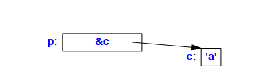
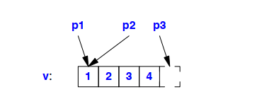
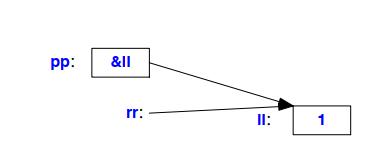

## Introduction
این فصل به مکانیزم‌های زبان پایه برای ارجاع به حافظه می‌پردازد. واضح است که می‌توانیم به یک شیء از طریق نام آن ارجاع دهیم، اما در C++ (برای بیشتر) اشیاء «هویت دارند». به این معنی که آنها در یک آدرس خاص در حافظه قرار دارند و یک شیء در صورتی که آدرس و نوع آن را بدانید، قابل دسترسی است. ساختارهای زبانی برای نگهداری و استفاده از آدرس‌ها، اشاره‌گرها و ارجاعات هستند.

## Pointers
برای یک نوع T، نوع T∗ نوع ‘‘اشاره‌گر به T’’ است. به این معنا که یک متغیر از نوع T∗ می‌تواند آدرس یک شیء از نوع T را نگه دارد. برای مثال:

```cpp
char c = 'a';
char* p = &c; // p آدرس c را نگه می‌دارد؛ & اپراتور آدرس‌دهی است
```

یا به صورت گرافیکی:


عملیات اساسی روی یک اشاره‌گر، dereferencing (ارجاع به شیء اشاره شده توسط اشاره‌گر) است. این عملیات همچنین به نام indirection (واژگانی معکوس) شناخته می‌شود. اپراتور dereference، اپراتور ∗ (یونری پیشوند) است. برای مثال:

```cpp
char c = 'a';
char* p = &c; // p آدرس c را نگه می‌دارد؛ & اپراتور آدرس‌دهی است
char c2 = *p; // c2 == 'a'; * اپراتور dereference است
```

شیء اشاره شده توسط p، c است و مقداری که در c ذخیره شده، 'a' است، بنابراین مقدار \*p که به c2 اختصاص داده می‌شود، 'a' است.

ممکن است برخی عملیات‌های حسابی بر روی اشاره‌گرها به عناصر آرایه انجام شود (§7.4). پیاده‌سازی اشاره‌گرها به گونه‌ای است که مستقیماً با مکانیزم‌های آدرس‌دهی ماشین روی سیستم هدف ارتباط دارد. بیشتر ماشین‌ها قادر به آدرس‌دهی به یک بایت هستند. آنهایی که نمی‌توانند، معمولاً سخت‌افزاری برای استخراج بایت‌ها از واژه‌ها دارند. از طرف دیگر، تعداد کمی از ماشین‌ها می‌توانند به طور مستقیم به یک بیت خاص آدرس‌دهی کنند. بنابراین، کوچکترین شیء که می‌تواند به طور مستقل تخصیص یابد و با استفاده از نوع پیش‌ساخته اشاره‌گر به آن اشاره شود، یک char است. توجه داشته باشید که یک bool حداقل به اندازه یک char فضا اشغال می‌کند (§6.2.8). برای ذخیره مقادیر کوچکتر به صورت فشرده‌تر، می‌توانید از عملیات‌های منطقی بیتی (§11.1.1)، فیلدهای بیتی در ساختارها (§8.2.7)، یا bitset (§34.2.2) استفاده کنید.

اپراتور ∗ که به معنای ‘‘اشاره‌گر به’’ است، به عنوان پسوندی برای نام نوع استفاده می‌شود. متأسفانه، اشاره‌گرها به آرایه‌ها و اشاره‌گرها به توابع نیاز به نگارش پیچیده‌تری دارند:

```cpp
int* pi; // اشاره‌گر به int
char** ppc; // اشاره‌گر به اشاره‌گر به char
int* ap[15]; // آرایه‌ای از 15 اشاره‌گر به int
int (*fp)(char*); // اشاره‌گر به تابعی که یک آرگومان char* می‌گیرد و int برمی‌گرداند
int* f(char*); // تابعی که یک آرگومان char* می‌گیرد و یک اشاره‌گر به int برمی‌گرداند
```

برای توضیح نحوه نوشتار اعلامیه‌ها به §6.3.1 و برای گرامر کامل به §iso.A مراجعه کنید. اشاره‌گرها به توابع می‌توانند مفید باشند و در §12.5 مورد بحث قرار گرفته‌اند. اشاره‌گرها به اعضای کلاس در §20.6 آورده شده‌اند.

## void∗
در کد سطح پایین، گاهی نیاز داریم که آدرس یک مکان حافظه را ذخیره کنیم یا به مکان دیگری منتقل کنیم بدون اینکه بدانیم در آن مکان چه نوع شیء ذخیره شده است. برای این کار از `void*` استفاده می‌شود. می‌توان `void*` را به عنوان ‘‘اشاره‌گر به شیء با نوع نامعلوم’’ خواند.

یک اشاره‌گر به هر نوع شیء می‌تواند به متغیری از نوع `void*` اختصاص داده شود، اما اشاره‌گر به تابع (§12.5) یا اشاره‌گر به اعضای کلاس (§20.6) نمی‌تواند. علاوه بر این، یک `void*` می‌تواند به یک `void*` دیگر اختصاص داده شود، می‌توان `void*` ها را برای برابری و نابرابری مقایسه کرد، و یک `void*` می‌تواند به طور صریح به نوع دیگری تبدیل شود. عملیات‌های دیگر بر روی `void*` غیرایمن خواهند بود زیرا کامپایلر نمی‌تواند نوع شیء اشاره شده را تشخیص دهد. به همین دلیل، عملیات‌های دیگر باعث بروز خطای زمان کامپایل می‌شوند. برای استفاده از یک `void*`، باید آن را به طور صریح به یک اشاره‌گر به نوع خاصی تبدیل کنیم. برای مثال:

```cpp
void f(int* pi)
{
    void* pv = pi; // ok: تبدیل ضمنی از int* به void*
    *pv; // خطا: نمی‌توان void* را dereference کرد
    ++pv; // خطا: نمی‌توان void* را افزایش داد (اندازه شیء اشاره شده ناشناخته است)
    int* pi2 = static_cast<int*>(pv); // تبدیل صریح به int*
    double* pd1 = pv; // خطا
    double* pd2 = pi; // خطا
    double* pd3 = static_cast<double*>(pv); // غیرایمن (§11.5.2)
}
```

به طور کلی، استفاده از یک اشاره‌گر که به نوعی تبدیل شده است (‘‘کست’’) به نوعی که با نوع شیء اشاره شده متفاوت است، ایمن نیست. برای مثال، ممکن است یک ماشین فرض کند که هر `double` روی یک مرز 8 بایتی اختصاص داده می‌شود. اگر چنین باشد، رفتار عجیب ممکن است رخ دهد اگر `pi` به یک `int` اشاره کند که به این شکل اختصاص داده نشده است. این نوع تبدیل صریح نوع به طور ذاتی غیرایمن و نازیبا است. به همین دلیل، نگارش مورد استفاده، `static_cast` (§11.5.2)، به گونه‌ای طراحی شده است که زشت باشد و به راحتی در کد شناسایی شود.

استفاده اصلی از `void*` برای ارسال اشاره‌گرها به توابعی است که اجازه ندارند فرضیاتی در مورد نوع شیء داشته باشند و برای بازگشت شیءهای بدون نوع از توابع. برای استفاده از چنین شیءهایی، باید از تبدیل صریح نوع استفاده کنیم.

توابعی که از اشاره‌گرهای `void*` استفاده می‌کنند معمولاً در پایین‌ترین سطح سیستم وجود دارند، جایی که منابع سخت‌افزاری واقعی دستکاری می‌شوند. به عنوان مثال:

```cpp
void* my_alloc(size_t n); // تخصیص n بایت از حافظه اختصاصی من
```

مواقعی که از `void*` ها در سطوح بالاتر سیستم استفاده می‌شود، باید با شک و تردید به آن‌ها نگاه کرد زیرا احتمالاً نشان‌دهنده اشتباهات طراحی هستند. وقتی که از `void*` برای بهینه‌سازی استفاده می‌شود، می‌توان آن را پشت یک رابط ایمن از نظر نوع (§27.3.1) پنهان کرد.

اشاره‌گرهای توابع (§12.5) و اشاره‌گرهای اعضای کلاس (§20.6) نمی‌توانند به `void*` ها اختصاص داده شوند.

## nullptr
مقدار ثابت `nullptr` نمایانگر اشاره‌گر تهی است، به این معنی که اشاره‌گری است که به هیچ شیء‌ای اشاره نمی‌کند. این مقدار می‌تواند به هر نوع اشاره‌گری اختصاص یابد، اما نمی‌تواند به انواع دیگر داده‌های پیش‌ساخته اختصاص یابد:

```cpp
int* pi = nullptr;
double* pd = nullptr;
int i = nullptr; // خطا: i یک اشاره‌گر نیست
```

فقط یک `nullptr` وجود دارد که می‌تواند برای هر نوع اشاره‌گری استفاده شود، به جای اینکه برای هر نوع اشاره‌گر، یک اشاره‌گر تهی متفاوت داشته باشیم.

قبل از معرفی `nullptr`، از صفر (0) به عنوان نشانه‌ای برای اشاره‌گر تهی استفاده می‌شد. برای مثال:

```cpp
int* x = 0; // x مقدار nullptr را می‌گیرد
```

هیچ شیئی با آدرس 0 اختصاص داده نمی‌شود و صفر (الگوی بیتی صفر) معمول‌ترین نمایش برای `nullptr` است. صفر (0) یک `int` است. با این حال، تبدیل‌های استاندارد (§10.5.2.3) اجازه می‌دهند که 0 به عنوان یک مقدار از نوع اشاره‌گر یا اشاره‌گر به عضو استفاده شود.

استفاده از یک ماکرو به نام `NULL` برای نمایش اشاره‌گر تهی متداول بوده است. برای مثال:

```cpp
int* p = NULL; // استفاده از ماکرو NULL
```

با این حال، تفاوت‌هایی در تعریف `NULL` در پیاده‌سازی‌های مختلف وجود دارد؛ برای مثال، `NULL` ممکن است 0 یا 0L باشد. در C، `NULL` معمولاً به صورت `(void*)0` تعریف می‌شود که در C++ غیرقانونی است (§7.2.1):

```cpp
int* p = NULL; // خطا: نمی‌توان یک void* را به int* اختصاص داد
```

استفاده از `nullptr` کد را خواناتر از گزینه‌های دیگر می‌کند و از سردرگمی‌های احتمالی جلوگیری می‌کند، به خصوص زمانی که یک تابع برای پذیرش هم اشاره‌گر و هم عدد (در صورت بارگذاری بیش از حد تابع) تعریف شده باشد (§12.3.1).

## Arrays
برای یک نوع T، نوع `T[size]` به معنای ‘‘آرایه‌ای با اندازه size از عناصر نوع T’’ است. عناصر آرایه از 0 تا `size-1` ایندکس می‌شوند. برای مثال:

```cpp
float v[3]; // یک آرایه از سه عدد اعشاری: v[0], v[1], v[2]
char* a[32]; // یک آرایه از 32 اشاره‌گر به char: a[0] .. a[31]
```

می‌توانید به آرایه‌ها از طریق اپراتور ساب‌اسکریپت (`[]`) یا از طریق اشاره‌گر (با استفاده از اپراتور `*` یا `[]`; §7.4) دسترسی پیدا کنید. برای مثال:

```cpp
void f()
{
    int aa[10];
    aa[6] = 9; // اختصاص مقدار به هفتمین عنصر آرایه aa
    int x = aa[99]; // رفتار غیرتعریف شده
}
```

دسترسی به آرایه خارج از محدوده آن، رفتار غیرتعریف شده‌ای دارد و معمولاً فاجعه‌آمیز است. به‌ویژه، بررسی محدوده در زمان اجرا معمولاً تضمین شده نیست و رایج نمی‌باشد.

تعداد عناصر آرایه، حد آرایه، باید یک عبارت ثابت باشد (§10.4). اگر به اندازه‌های متغیر نیاز دارید، از `vector` (§4.4.1, §31.4) استفاده کنید. برای مثال:

```cpp
void f(int n)
{
    int v1[n]; // خطا: اندازه آرایه باید یک عبارت ثابت باشد
    vector<int> v2(n); // درست: وکتور با n عنصر از نوع int
}
```

آرایه‌های چندبعدی به صورت آرایه‌هایی از آرایه‌ها نمایش داده می‌شوند (§7.4.2).

آرایه‌ها روش اصلی C++ برای نمایش یک دنباله از اشیاء در حافظه هستند. اگر چیزی که می‌خواهید یک دنباله ساده از اشیاء با طول ثابت از یک نوع داده خاص در حافظه باشد، آرایه بهترین راه‌حل است. برای هر نیاز دیگری، آرایه مشکلات جدی دارد.

آرایه می‌تواند به صورت ایستا، در پشته، و در حافظه آزاد (free store) تخصیص یابد (§6.4.2). برای مثال:

```cpp
int a1[10]; // 10 عدد int در حافظه ایستا
void f()
{
    int a2[20]; // 20 عدد int در پشته
    int* p = new int[40]; // 40 عدد int در حافظه آزاد
    // ...
}
```

آرایه‌های پیش‌ساخته C++ یک ابزار به‌طور ذاتی سطح پایین هستند که باید عمدتاً در پیاده‌سازی ساختارهای داده‌ای سطح بالاتر و با رفتار بهتر، مانند `vector` یا `array` از کتابخانه استاندارد، استفاده شوند. آرایه‌ها هیچ‌گونه عمل تخصیص ندارند و نام یک آرایه به طور ضمنی به یک اشاره‌گر به اولین عنصر آن تبدیل می‌شود (§7.4). به‌ویژه، باید از استفاده از آرایه‌ها در رابط‌ها (مثلاً به‌عنوان آرگومان‌های تابع؛ §7.4.3, §12.2.2) اجتناب کنید زیرا تبدیل ضمنی به اشاره‌گر منبع بسیاری از خطاهای رایج در کدهای C و کدهای C++ به سبک C است. اگر یک آرایه را در حافظه آزاد تخصیص دادید، مطمئن شوید که تنها یک‌بار از `delete[]` برای آن استفاده کنید و فقط پس از استفاده نهایی از آن (§11.2.2). این کار به راحتی و به‌طور قابل اعتماد از طریق کنترل طول عمر آرایه حافظه آزاد توسط یک ابزار مدیریت منابع (مثلاً `string` (§19.3, §36.3)، `vector` (§13.6, §34.2)، یا `unique_ptr` (§34.3.1)) انجام می‌شود. اگر آرایه را به صورت ایستا یا در پشته تخصیص دادید، مطمئن شوید که هرگز از `delete[]` استفاده نکنید. واضح است که برنامه‌نویسان C نمی‌توانند این توصیه‌ها را دنبال کنند چون C توانایی محصور کردن آرایه‌ها را ندارد، اما این توصیه‌ها در C++ به هیچ‌وجه اشتباه نیستند.

یکی از رایج‌ترین انواع آرایه‌ها، آرایه‌ای از `char` است که به صورت صفر-ترمیناتور (zero-terminated) ذخیره می‌شود. این نحوه ذخیره‌سازی رشته‌ها در C است، بنابراین معمولاً به این نوع آرایه‌ها ‘‘رشته‌های C-style’’ می‌گویند. ادبیات رشته‌ای در C++ از این سنت پیروی می‌کند (§7.3.2) و برخی از توابع کتابخانه استاندارد (مانند `strcpy()` و `strcmp()`؛ §43.4) به آن متکی هستند. اغلب، یک `char*` یا یک `const char*` فرض می‌شود که به یک دنباله از کاراکترها با انتهای صفر اشاره می‌کند.


## Array Initializers
یک آرایه می‌تواند با یک لیست از مقادیر مقداردهی اولیه شود. به عنوان مثال:

```cpp
int v1[] = { 1, 2, 3, 4 };
char v2[] = { 'a', 'b', 'c', 0 };
```

زمانی که یک آرایه بدون اندازه خاص اعلام می‌شود ولی با یک لیست مقداردهی اولیه، اندازه آن با شمارش تعداد عناصر لیست مقداردهی محاسبه می‌شود. در نتیجه، v1 و v2 به ترتیب از نوع `int[4]` و `char[4]` هستند. اگر اندازه‌ای به طور صریح مشخص شود، دادن عناصر اضافی در لیست مقداردهی اشتباه است. به عنوان مثال:

```cpp
char v3[2] = { 'a', 'b', 0 }; // خطا: مقداردهی اولیه بیش از حد
char v4[3] = { 'a', 'b', 0 }; // درست
```

اگر مقداردهی اولیه برای یک آرایه عناصری کمتر از حد مورد نیاز فراهم کند، برای بقیه عناصر از مقدار 0 استفاده می‌شود. به عنوان مثال:

```cpp
int v5[8] = { 1, 2, 3, 4 };
```

معادل است با:

```cpp
int v5[] = { 1, 2, 3, 4 , 0, 0, 0, 0 };
```

هیچ عملیات کپی داخلی برای آرایه‌ها وجود ندارد. شما نمی‌توانید یک آرایه را با آرایه دیگری مقداردهی اولیه کنید (حتی اگر نوع آن دقیقاً مشابه باشد) و هیچ عمل تخصیص برای آرایه‌ها وجود ندارد:

```cpp
int v6[8] = v5; // خطا: نمی‌توان یک آرایه را کپی کرد (نمی‌توان یک int* را به آرایه اختصاص داد)
v6 = v5; // خطا: هیچ تخصیص آرایه‌ای وجود ندارد
```

به همین ترتیب، نمی‌توانید آرایه‌ها را به صورت مقدار (به عنوان ورودی) ارسال کنید. به همین دلیل است که در §7.4 توضیح داده شده است.
زمانی که نیاز به تخصیص برای یک مجموعه از اشیاء دارید، از یک `vector`، یک آرایه یا یک `valarray` استفاده کنید.
یک آرایه از کاراکترها می‌تواند به راحتی با یک لیترال رشته‌ای مقداردهی اولیه شود (§7.3.2).

## String Literals
یک لیترال رشته‌ای یک توالی از کاراکترها است که درون نقل‌قول‌های دوتایی قرار گرفته است:

```cpp
"this is a string"
```

یک لیترال رشته‌ای یک کاراکتر بیشتر از آنچه که به نظر می‌آید دارد؛ این رشته با کاراکتر تهی '\0' خاتمه می‌یابد که مقدار آن 0 است. به عنوان مثال:

```cpp
sizeof("Bohr") == 5
```

نوع یک لیترال رشته‌ای «آرایه‌ای از تعداد مناسب کاراکتر ثابت» است، بنابراین "Bohr" از نوع `const char[5]` است.
در زبان C و در کدهای قدیمی C++، شما می‌توانستید یک لیترال رشته‌ای را به یک `char*` غیر ثابت اختصاص دهید:

```cpp
void f()
{
    char* p = "Plato"; // خطا، اما در کدهای پیش از استاندارد C++11 پذیرفته شده بود
    p[4] = 'e'; // خطا: اختصاص به ثابت
}
```

واضح است که پذیرش چنین تخصیصی ناامن است. این مسئله (و هنوز هم هست) منبعی از اشتباهات ظریف است، بنابراین لطفاً زیاد گله نکنید اگر برخی از کدهای قدیمی به دلیل این موضوع کامپایل نمی‌شوند. غیرقابل تغییر بودن لیترال‌های رشته‌ای نه تنها بدیهی است بلکه به پیاده‌سازی‌ها اجازه می‌دهد که بهینه‌سازی‌های قابل توجهی در نحوه ذخیره‌سازی و دسترسی به لیترال‌های رشته‌ای انجام دهند.
اگر بخواهیم رشته‌ای داشته باشیم که مطمئن باشیم می‌توانیم آن را تغییر دهیم، باید کاراکترها را در یک آرایه غیر ثابت قرار دهیم:

```cpp
void f()
{
    char p[] = "Zeno"; // p یک آرایه از 5 کاراکتر است
    p[0] = 'R'; // درست
}
```

یک لیترال رشته‌ای به صورت ایستا اختصاص می‌یابد به طوری که می‌توانیم آن را از یک تابع بازگردانیم. به عنوان مثال:

```cpp
const char* error_message(int i)
{
    // ...
    return "range error";
}
```

حافظه‌ای که "range error" را نگه می‌دارد پس از فراخوانی تابع `error_message()` از بین نمی‌رود.
اینکه دو لیترال رشته‌ای مشابه به صورت یک آرایه تخصیص داده شوند یا دو آرایه مجزا، وابسته به پیاده‌سازی است (§6.1). به عنوان مثال:

```cpp
const char* p = "Heraclitus";
const char* q = "Heraclitus";
void g()
{
    if (p == q) cout << "one!\n"; // نتیجه به پیاده‌سازی بستگی دارد
    // ...
}
```

توجه داشته باشید که عملگر `==` زمانی که به اشاره‌گرها اعمال می‌شود، آدرس‌ها (مقدارهای اشاره‌گر) را مقایسه می‌کند نه مقادیر اشاره‌شده.
رشته خالی به صورت یک جفت نقل‌قول دوتایی مجاور نوشته می‌شود، `""` و از نوع `const char[1]` است. تنها کاراکتر رشته خالی، کاراکتر خاتمه‌دهنده '\0' است.
قانون بک‌اسلش برای نمایش کاراکترهای غیرگرافیکی (§6.2.3.2) می‌تواند درون یک رشته نیز استفاده شود. این امکان را فراهم می‌کند که کاراکتر نقل‌قول دوتایی (") و کاراکتر فرار بک‌اسلش () را درون یک رشته نشان دهیم. رایج‌ترین چنین کاراکتری، کاراکتر newline (`'\n'`) است.
برای مثال:

```cpp
cout << "beep at end of message\a\n";
```

کاراکتر فرار `'\a'` همان کاراکتر ASCII BEL (که به عنوان alert نیز شناخته می‌شود) است که باعث پخش صدا می‌شود.
در یک رشته (غیرخام) نمی‌توان یک newline واقعی داشت:

```cpp
"this is not a string
but a syntax error"
```

رشته‌های طولانی می‌توانند با استفاده از فضای سفید شکسته شوند تا متن برنامه مرتب‌تر باشد. به عنوان مثال:

```cpp
char alpha[] = "abcdefghijklmnopqrstuvwxyz"
               "ABCDEFGHIJKLMNOPQRSTUVWXYZ";
```

کامپایلر رشته‌های مجاور را به هم متصل می‌کند، بنابراین متغیر `alpha` معادل این رشته‌ی واحد است:

```cpp
"abcdefghijklmnopqrstuvwxyzABCDEFGHIJKLMNOPQRSTUVWXYZ";
```

ممکن است کاراکتر تهی در یک رشته وجود داشته باشد، اما بیشتر برنامه‌ها مشکوک نخواهند شد که کاراکترهایی پس از آن وجود دارند. به عنوان مثال، رشته "Jens\000Munk" توسط توابع کتابخانه استاندارد مانند `strcpy()` و `strlen()` به عنوان "Jens" در نظر گرفته می‌شود؛ به §43.4 مراجعه کنید.

## Raw Character Strings
برای نمایش یک بک‌اسلش () یا یک نقل‌قول دوتایی (") در یک لیترال رشته‌ای، باید آن را با بک‌اسلش پیش از آن بنویسیم. این کار منطقی است و در بیشتر موارد بسیار ساده است. اما اگر نیاز به تعداد زیادی بک‌اسلش و نقل‌قول دوتایی در لیترال‌های رشته‌ای داشته باشیم، این تکنیک ساده به راحتی غیرقابل مدیریت می‌شود. به‌ویژه در عبارات منظم (regular expressions) که بک‌اسلش هم به‌عنوان یک کاراکتر فرار (escape character) و هم برای معرفی کاراکترهایی که کلاس‌های کاراکتری را نشان می‌دهند، استفاده می‌شود (§37.1.1). این یک کنوانسیون است که توسط بسیاری از زبان‌های برنامه‌نویسی به اشتراک گذاشته شده است، بنابراین نمی‌توانیم آن را تغییر دهیم. بنابراین، زمانی که شما عبارات منظم را برای استفاده با کتابخانه استاندارد regex (فصل 37) می‌نویسید، واقعیت این است که بک‌اسلش یک کاراکتر فرار است و این مسئله منبع قابل توجهی از اشتباهات می‌شود. به مثال زیر توجه کنید که چگونه الگوی نمایش دو کلمه جدا شده با بک‌اسلش () را بنویسیم:

```cpp
string s = "\\w\\\\w"; // امیدوارم که درست نوشته باشم
```

برای جلوگیری از ناامیدی و اشتباهات ناشی از این تداخل کنوانسیون‌ها، C++ لیترال‌های رشته‌ای خام (raw string literals) را فراهم می‌کند. یک لیترال رشته‌ای خام، یک لیترال رشته‌ای است که در آن بک‌اسلش فقط یک بک‌اسلش است (و نقل‌قول دوتایی فقط یک نقل‌قول دوتایی است)، بنابراین مثال ما به این صورت خواهد بود:

```cpp
string s = R"(\w\\w)"; // تقریباً مطمئنم که درست نوشتم
```

لیترال‌های رشته‌ای خام از نمایش `R"(ccc)"` برای یک توالی از کاراکترهای ccc استفاده می‌کنند. حرف R برای تمایز دادن لیترال‌های رشته‌ای خام از لیترال‌های رشته‌ای معمولی است. پرانتزها برای این هستند که امکان استفاده از نقل‌قول‌های دوتایی (بدون فرار) را فراهم کنند. به عنوان مثال:

```cpp
R"("quoted string")" // رشته "quoted string" است
```

پس چگونه می‌توانیم توالی کاراکتری `)"` را در یک لیترال رشته‌ای خام قرار دهیم؟ خوشبختانه این مشکل نادر است، اما "( و )" تنها جفت علامت‌گذاری پیش‌فرض است. ما می‌توانیم قبل از ( و بعد از ) علامت‌گذاری‌هایی اضافه کنیم. به عنوان مثال:

```cpp
R"∗∗∗("quoted string containing the usual terminator ("))")∗∗∗"
// "quoted string containing the usual terminator ("))"
```

توالی کاراکتری پس از ) باید دقیقاً مشابه توالی قبل از ( باشد. به این ترتیب می‌توانیم با الگوهای (تقریباً) پیچیده کنار بیاییم.
مگر اینکه با عبارات منظم کار کنید، لیترال‌های رشته‌ای خام احتمالاً فقط یک کنجکاوی هستند (و یک چیز دیگر که باید یاد بگیرید)، اما عبارات منظم مفید و گسترده‌استفاده هستند. به یک مثال دنیای واقعی توجه کنید:

```cpp
"('(?:[ˆ\\\\']|\\\\.)∗'|\"(?:[ˆ\\\\\"]|\\\\.)∗\")|" // آیا پنج بک‌اسلش درست است یا نه؟
```

با چنین مثال‌هایی، حتی کارشناسان هم به راحتی گیج می‌شوند، و لیترال‌های رشته‌ای خام خدمات قابل توجهی ارائه می‌دهند.
در مقایسه با لیترال‌های رشته‌ای غیرخام، یک لیترال رشته‌ای خام می‌تواند شامل یک خط جدید باشد. برای مثال:

```cpp
string counts {R"(1
22
333)"};
```

معادل است با:

```cpp
string x {"1\n22\n333"};
```

## Larger Character Sets
یک رشته با پیشوند L، مانند L"angst"، یک رشته از کاراکترهای وسیع (wide characters) است (§6.2.3). نوع آن `const wchar_t[]` است. به طور مشابه، یک رشته با پیشوند LR، مانند LR"(angst)"، یک رشته خام از کاراکترهای وسیع با نوع `const wchar_t[]` است (§7.3.2.1). چنین رشته‌ای با کاراکتر L'\0' خاتمه می‌یابد.
شش نوع از لیترال‌های کاراکتری که از یونیکد (Unicode) پشتیبانی می‌کنند وجود دارد (لیترال‌های یونیکد). این ممکن است زیاد به نظر برسد، اما سه نوع کدگذاری اصلی یونیکد وجود دارد: UTF-8، UTF-16 و UTF-32. برای هر یک از این سه گزینه، هم رشته‌های خام و هم رشته‌های «معمولی» پشتیبانی می‌شوند. تمام این سه کدگذاری UTF از تمام کاراکترهای یونیکد پشتیبانی می‌کنند، بنابراین استفاده از هرکدام بستگی به سیستم مورد نظر شما دارد.
در واقع، تقریباً تمام برنامه‌های اینترنتی (مانند مرورگرها و ایمیل‌ها) به یکی از این کدگذاری‌ها یا ترکیبی از آن‌ها وابسته هستند.
UTF-8 یک کدگذاری با عرض متغیر است: کاراکترهای رایج در 1 بایت قرار می‌گیرند، کاراکترهای کمتر استفاده‌شده (بر اساس برخی تخمین‌ها از میزان استفاده) در 2 بایت قرار می‌گیرند و کاراکترهای نادرتر در 3 یا 4 بایت قرار می‌گیرند. به طور خاص، کاراکترهای ASCII در 1 بایت با همان کدگذاری‌ها (مقدارهای عددی) در UTF-8 مانند ASCII قرار می‌گیرند. الفبای لاتین مختلف، یونانی، سیریلیک، عبری، عربی و دیگر زبان‌ها در 2 بایت قرار می‌گیرند.
یک رشته UTF-8 با '\0'، یک رشته UTF-16 با u'\0' و یک رشته UTF-32 با U'\0' خاتمه می‌یابد.
ما می‌توانیم یک رشته از کاراکترهای انگلیسی معمولی را به طرق مختلف نمایه‌سازی کنیم. به عنوان مثال، نام یک فایل که از بک‌اسلش به عنوان جداکننده استفاده می‌کند:

```cpp
"folder\\file" // رشته مجموعه کاراکتر پیاده‌سازی
R"(folder\file)" // رشته مجموعه کاراکتر خام پیاده‌سازی
u8"folder\\file" // رشته UTF-8
u8R"(folder\file)" // رشته خام UTF-8
u"folder\\file" // رشته UTF-16
uR"(folder\file)" // رشته خام UTF-16
U"folder\\file" // رشته UTF-32
UR"(folder\file)" // رشته خام UTF-32
```

اگر این رشته‌ها چاپ شوند، همه آن‌ها به یک شکل به نظر می‌رسند، اما به جز رشته‌های «معمولی» و UTF-8، نمایش داخلی آن‌ها احتمالاً متفاوت خواهد بود.
واضح است که هدف اصلی رشته‌های یونیکد، توانایی قرار دادن کاراکترهای یونیکد در آن‌ها است. به عنوان مثال:

```cpp
u8"The official vowels in Danish are: a, e, i, o, u, \u00E6, \u00F8, \u00E5 and y."
```

چاپ این رشته به درستی به شما می‌دهد:

```
The official vowels in Danish are: a, e, i, o, u, æ, ø, å and y.
```

عدد هگزادسیمال بعد از `\u` یک کد نقطه یونیکد (Unicode code point) است (§iso.2.14.3) \[Unicode, 1996]. چنین کد نقطه‌ای مستقل از کدگذاری استفاده‌شده است و در واقع در کدگذاری‌های مختلف نمایش‌های متفاوتی (به‌عنوان بیت‌هایی در بایت‌ها) خواهد داشت. به عنوان مثال، u'0430' (حرف کوچک سیریلیک «a») در UTF-8 مقدار هگزادسیمال 2 بایتی D0B0، در UTF-16 مقدار هگزادسیمال 2 بایتی 0403 و در UTF-32 مقدار هگزادسیمال 4 بایتی 00000403 را دارد. این مقادیر هگزادسیمال به نام نام‌های کاراکتری جهانی (universal character names) شناخته می‌شوند.
ترتیب و بزرگ/کوچک بودن پیشوندهای `u` و `R` اهمیت دارد: پیشوندهای `RU` و `Ur` رشته‌های معتبری نیستند.

## Pointers into Arrays
در زبان ++C، اشاره‌گرها و آرایه‌ها ارتباط نزدیکی با یکدیگر دارند. نام یک آرایه می‌تواند به عنوان اشاره‌گری به عنصر ابتدایی آن مورد استفاده قرار گیرد. برای مثال:

```cpp
int v[] = {1, 2, 3, 4};
int* p1 = v;       // اشاره‌گر به عنصر ابتدایی (تبدیل ضمنی)
int* p2 = &v[0];   // اشاره‌گر به عنصر ابتدایی
int* p3 = v + 4;   // اشاره‌گر به عنصری بعد از آخرین عنصر آرایه
```

یا به صورت نموداری:



گرفتن اشاره‌گر به عنصری که درست بعد از آخرین عنصر آرایه قرار دارد، عملی تضمین‌شده است و مشکلی ندارد. این موضوع برای بسیاری از الگوریتم‌ها اهمیت دارد (§4.5، §33.1). با این حال، از آنجا که چنین اشاره‌گری در واقع به هیچ عنصری از آرایه اشاره نمی‌کند، نباید برای خواندن یا نوشتن استفاده شود. گرفتن آدرس عنصری قبل از عنصر ابتدایی یا بعد از عنصر "یکی پس از آخرین" در آرایه، منجر به رفتاری تعریف‌نشده می‌شود و باید از آن اجتناب کرد. برای مثال:

```cpp
int* p4 = v - 1; // قبل از شروع آرایه، تعریف‌نشده: انجام ندهید
int* p5 = v + 7; // بعد از انتهای آرایه، تعریف‌نشده: انجام ندهید
```

تبدیل ضمنی نام آرایه به اشاره‌گر به عنصر ابتدایی، به طور گسترده در فراخوانی توابع در سبک زبان C استفاده می‌شود. برای مثال:

```cpp
extern "C" int strlen(const char*); // از <string.h>
void f()
{
    char v[] = "Annemarie";
    char* p = v;      // تبدیل ضمنی از char[] به char*
    strlen(p);
    strlen(v);        // تبدیل ضمنی از char[] به char*
    v = p;            // خطا: نمی‌توان به آرایه مقدار داد
}
```

در هر دو فراخوانی تابع `strlen()` مقدار یکسانی به تابع ارسال می‌شود. مشکل اینجاست که نمی‌توان از تبدیل ضمنی جلوگیری کرد. به عبارتی دیگر، راهی برای تعریف یک تابع به‌گونه‌ای که آرایه هنگام فراخوانی کپی شود وجود ندارد. خوشبختانه، هیچ‌گونه تبدیل ضمنی یا صریحی از یک اشاره‌گر به یک آرایه انجام نمی‌شود.

تبدیل ضمنی آرگومان آرایه به اشاره‌گر باعث می‌شود که اندازهٔ آرایه در تابع فراخوان‌شده از دست برود. با این حال، تابع فراخوان‌شده باید به طریقی اندازهٔ آرایه را تشخیص دهد تا بتواند عملی معنادار انجام دهد. مانند سایر توابع کتابخانه استاندارد C که اشاره‌گر به کاراکتر دریافت می‌کنند، تابع `strlen()` برای تعیین پایان رشته، به وجود صفر (0) تکیه دارد؛ تابع `strlen(p)` تعداد کاراکترها را تا قبل از کاراکتر صفر نهایی می‌شمارد.

این روش کاملاً سطح پایین است. اما انواع استانداردی مانند `vector` (§4.4.1, §13.6, §31.4)، `array` (§8.2.4, §34.2.1)، و `string` (§4.2) در کتابخانه استاندارد ++C چنین مشکلی ندارند. این انواع، اندازهٔ خود را از طریق تابع `size()` ارائه می‌دهند و نیازی به شمردن عناصر ندارند.

## Navigating Arrays
دستیابی کارآمد و ظریف به آرایه‌ها (و ساختارهای دادهٔ مشابه) کلید بسیاری از الگوریتم‌هاست (نگاه کنید به §4.5، فصل ۳۲). این دسترسی را می‌توان یا با داشتن یک اشاره‌گر به آرایه به‌همراه یک اندیس، یا با داشتن یک اشاره‌گر به خودِ عنصر به‌دست آورد. برای مثال:

```cpp
void fi(char v[])
{
    for (int i = 0; v[i] != 0; ++i)
        use(v[i]);
}

void fp(char v[])
{
    for (char* p = v; *p != 0; ++p)
        use(*p);
}
```

عملگر پیشوندی ‎`*`‎ یک اشاره‌گر را اِلغاش (dereference) می‌کند، بنابراین ‎`*p`‎ همان کاراکتری است که ‎`p`‎ به آن اشاره دارد؛ و ‎`++`‎ اشاره‌گر را افزایش می‌دهد تا به عنصر بعدی آرایه اشاره کند.
هیچ دلیل ذاتی­ای وجود ندارد که یک نسخه لزوماً سریع‌تر از دیگری باشد. با کامپایلرهای مدرن، برای هر دو مثال معمولاً کد یکسانی تولید می‌شود؛ پس برنامه‌نویس می‌تواند صرفاً بر اساس منطق و زیبایی‌شناسی یکی را برگزیند.

زیرنویسی (Subscripting) یک آرایهٔ توکار در زبان C++ بر پایهٔ عملگرهای ‎`+`‎ و ‎`*`‎ اشاره‌گر تعریف شده است. برای هر آرایهٔ توکار ‎`a`‎ و عدد صحیح ‎`j`‎ که در بازهٔ معتبر ‎`a`‎ باشد، رابطه‌های زیر برقرار است:

```cpp
a[j] == *(&a[0] + j) == *(a + j) == *(j + a) == j[a]
```

اغلب برای افراد تعجب‌آور است که ‎`a[j] == j[a]`‎؛ مثلاً ‎`3["Texas"] == "Texas"[3] == 'a'`‎. چنین «هوشمندی» جایی در کد تولیدی ندارد. این تساوی‌ها بسیار سطح‌پایین‌اند و برای کانتینرهای کتابخانهٔ استاندارد مانند ‎`array`‎ و ‎`vector`‎ برقرار نیستند.

نتیجهٔ به‌کار بردن عملگرهای حسابی ‎`+`‎، ‎`-`‎، ‎`++`‎ یا ‎`--`‎ روی اشاره‌گرها به نوعِ شیء اشاره‌شده بستگی دارد. وقتی عملگر حسابی روی اشاره‌گری ‎`p`‎ از نوع ‎`T*`‎ اعمال می‌شود، فرض بر این است که ‎`p`‎ به عنصری از یک آرایهٔ ‎`T`‎ اشاره می‌کند؛ ‎`p + 1`‎ به عنصر بعدی آن آرایه و ‎`p - 1`‎ به عنصر قبلی اشاره دارد. بنابراین مقدار عددی ‎`p + 1`‎ به اندازهٔ ‎`sizeof(T)`‎ بزرگ‌تر از مقدار عددی ‎`p`‎ خواهد بود. برای مثال:

```cpp
template<typename T>
int byte_diff(T* p, T* q)
{
    return reinterpret_cast<char*>(q) - reinterpret_cast<char*>(p);
}

void diff_test()
{
    int   vi[10];
    short vs[10];

    cout << vi << ' ' << &vi[1] << ' ' << &vi[1] - &vi[0] << ' '
         << byte_diff(&vi[0], &vi[1]) << '\n';

    cout << vs << ' ' << &vs[1] << ' ' << &vs[1] - &vs[0] << ' '
         << byte_diff(&vs[0], &vs[1]) << '\n';
}
```

خروجی روی سیستم من چنین بود:

```
0x7fffaef0 0x7fffaef4 1 4
0x7fffaedc 0x7fffaede 1 2
```

نمایش اشاره‌گرها در قالب شانزده‌هشتی (hex) پیش‌فرض انجام شده است. این نتایج نشان می‌دهد که روی این پیاده‌سازی ‎`sizeof(short) == 2`‎ و ‎`sizeof(int) == 4`‎ است.

تفریق دو اشاره‌گر تنها زمانی تعریف‌شده است که هر دو به عناصری از یک آرایه واحد اشاره کنند (هرچند زبان راه سریعی برای اطمینان از این شرط ندارد). در محاسبهٔ ‎`q - p`‎، نتیجه تعداد عناصر آرایه در بازهٔ ‎`[p:q)`‎ است (یک مقدار صحیح). می‌توان یک عدد صحیح را به اشاره‌گر افزود یا از آن کم کرد؛ در هر دو حالت نتیجه یک مقدار اشاره‌گر است. اگر این مقدار به عنصری از همان آرایهٔ اصلی (یا یکی بعد از آن) اشاره نکند، استفاده از آن مقدار نتیجه‌ای تعریف‌نشده خواهد داشت. برای نمونه:

```cpp
void f()
{
    int v1[10];
    int v2[10];

    int i1 = &v1[5] - &v1[3]; // i1 == 2
    int i2 = &v1[5] - &v2[3]; // نتیجه تعریف‌نشده

    int* p1 = v2 + 2;  // p1 == &v2[2]
    int* p2 = v2 - 2;  // *p2 تعریف‌نشده
}
```

حسابگری پیچیدهٔ اشاره‌گرها معمولاً غیرضروری و بهتر است از آن پرهیز شود. همچنین جمع کردن دو اشاره‌گر بی‌معناست و مجاز نیست.

آرایه‌ها «خودتوصیف» نیستند، زیرا تعداد عناصرشان لزوماً همراه آرایه ذخیره نمی‌شود. بنابراین برای پیمایش آرایه‌ای که فاقد پایانگر (نظیر رشته‌های C) است، باید تعداد عناصر را به‌نحوی فراهم کنیم. مثلاً:

```cpp
void fp(char v[], int size)
{
    for (int i = 0; i != size; ++i)
        use(v[i]);          // امیدواریم v حداقل size عنصر داشته باشد

    // for (int x : v)    // خطا: range-for برای اشاره‌گر کار نمی‌کند
    //     use(x);

    const int N = 7;
    char v2[N];
    for (int i = 0; i != N; ++i)
        use(v2[i]);

    for (int x : v2)        // range-for برای آرایه با اندازهٔ معلوم کار می‌کند
        use(x);
}
```

این مفهوم آرایه ذاتاً سطح‌پایین است. با به‌کارگیری کانتینر استاندارد ‎`array`‎ (§8.2.4، ‎§34.2.1) می‌توان بیشترِ مزایای آرایهٔ توکار را با حداقل معایب به‌دست آورد. برخی پیاده‌سازی‌های C++ امکان بررسی بازه (range checking) را برای آرایه‌ها به‌صورت اختیاری فراهم می‌کنند؛ ولی این بررسی می‌تواند هزینه‌بر باشد، ازاین‌رو معمولاً فقط در مرحلهٔ توسعه فعال می‌شود نه در کد نهایی. اگر از بررسی بازه برای دسترسی‌های تکی استفاده نمی‌کنید، بکوشید سیاست یکپارچه‌ای برای دسترسی به عناصر فقط در بازه‌های مشخص برقرار سازید. بهترین راه این است که آرایه‌ها را از طریق رابط یک نوع کانتینر سطح بالاتر، مانند ‎`vector`‎، دستکاری کنید؛ جایی که سردرگمی دربارهٔ بازهٔ عناصر دشوارتر است.

## Multidimensional Arrays
آرایه‌های چندبُعدی در ‎++C‎ به‌صورت «آرایه‌ای از آرایه‌ها» نمایش داده می‌شوند؛ مثلاً یک آرایهٔ ‎۳×۵‎ چنین اعلان می‌شود:

```cpp
int ma[3][5];   // سه آرایه که هر کدام پنج عدد int دارند
```

می‌توان ‎`ma`‎ را این‌گونه مقداردهی اولیه کرد:

```cpp
void init_ma()
{
    for (int i = 0; i != 3; ++i)
        for (int j = 0; j != 5; ++j)
            ma[i][j] = 10 * i + j;
}
```

یا به‌صورت تصویری:

```
ma: 00 01 02 03 04 10 11 12 13 14 20 21 22 23 24
```

در واقع ‎`ma`‎ صرفاً شامل ۱۵ عدد ‎int‎ پشتِ‌سر‌هم است که ما آن را طوری دسترسی می‌دهیم گویی سه آرایهٔ پنج‌تایی است. مشخصهٔ مهم این است که شیء واحدی به نام «ماتریس ‎`ma`‎» در حافظه وجود ندارد؛ تنها عناصر آن ذخیره می‌شوند. اندازه‌های ‎۳‎ و ‎۵‎ صرفاً در کد منبعِ کامپایلر حضور دارند. هنگام نوشتن برنامه، وظیفهٔ ماست که این ابعاد را به خاطر بسپاریم و هرجا لازم است آن‌ها را تأمین کنیم. مثلاً می‌توانیم ‎`ma`‎ را چنین چاپ کنیم:

```cpp
void print_ma()
{
    for (int i = 0; i != 3; ++i) {
        for (int j = 0; j != 5; ++j)
            cout << ma[i][j] << '\t';
        cout << '\n';
    }
}
```

نمادگذاری با ویرگول برای تعیین بُعد آرایه‌ها که در برخی زبان‌ها دیده می‌شود، در ‎++C‎ مجاز نیست؛ زیرا ویرگول ‎`,`‎ در این زبان عملگر توالی (sequencing operator) است (§10.3.2). خوشبختانه بیشتر خطاها را خودِ کامپایلر تشخیص می‌دهد، مثلاً:

```cpp
int bad[3,5];        // خطا: ویرگول در عبارت ثابت مجاز نیست
int good[3][5];      // سه آرایه با پنج عدد در هر کدام
int ouch = good[1,4]; // خطا: مقداردهی int با int*  (good[1,4] معادل good[4] است که int*‎ است)
int nice = good[1][4];
```

## Passing Arrays
آرایه‌ها را نمی‌توان مستقیماً به‌صورت **By Value** (توسط مقدار) به تابع پاس داد. در عوض، وقتی آرایه‌ای را به تابع می‌دهید، درواقع یک اشاره‌گر به اولین عنصر آرایه پاس می‌شود. مثلاً:

```cpp
void comp(double arg[10]) // arg در واقع یک double* است
{
    for (int i = 0; i != 10; ++i)
        arg[i] += 99;
}
```

```cpp
void f()
{
    double a1[10];
    double a2[5];
    double a3[100];
    comp(a1);
    comp(a2); // فاجعه!
    comp(a3); // فقط روی 10 عنصر اول عمل می‌کند
}
```

این کد ظاهراً منطقی به‌نظر می‌رسد، اما این‌طور نیست. این کد بدون خطا کامپایل می‌شود، اما وقتی `comp(a2)` فراخوانی می‌شود، خارج از محدوده‌ی آرایه‌ی `a2` روی حافظه می‌نویسد. همچنین اگر کسی فکر کند آرایه با مقدار پاس داده شده، ناامید می‌شود: تغییرات روی `arg[i]` مستقیم روی عناصر آرایهٔ اصلی اعمال می‌شود، نه روی یک کپی.

تابع `comp` را می‌توان این‌گونه هم نوشت:

```cpp
void comp(double* arg)
{
    for (int i = 0; i != 10; ++i)
        arg[i] += 99;
}
```

حالا دیوانگی این موضوع (امیدوارم) واضح‌تر شده باشد: وقتی آرایه‌ای به تابع پاس داده می‌شود، بعد اول آرایه صرفاً به‌صورت یک اشاره‌گر در نظر گرفته می‌شود. هر ابعادی که مشخص کرده‌اید عملاً نادیده گرفته می‌شود. بنابراین، اگر می‌خواهید دنباله‌ای از عناصر را پاس دهید بدون اینکه اطلاعات اندازه را از دست بدهید، نباید از آرایه‌های built-in استفاده کنید. در عوض می‌توانید آرایه را درون یک کلاس (مثل `std::array`) قرار دهید یا کلاسی بسازید که به‌عنوان یک handle عمل کند (مثل `std::string` یا `std::vector`).

اگر اصرار دارید مستقیماً از آرایه‌ها استفاده کنید، باید خودتان با این‌گونه باگ‌ها و ابهام‌ها سروکله بزنید، بدون اینکه مزیت چشم‌گیری به دست بیاورید.

برای مثال، فرض کنید بخواهید تابعی تعریف کنید که یک ماتریس دوبعدی را نمایش دهد. اگر ابعاد ماتریس در زمان کامپایل مشخص باشند، مشکلی وجود ندارد:

```cpp
void print_m35(int m[3][5])
{
    for (int i = 0; i != 3; i++) {
        for (int j = 0; j != 5; j++)
            cout << m[i][j] << '\t';
        cout << '\n';
    }
}
```

یک ماتریس که به‌صورت آرایهٔ چندبعدی نمایش داده می‌شود، به‌عنوان اشاره‌گر پاس می‌شود (نه کپی). بعد اول آرایه در یافتن مکان یک عنصر اهمیتی ندارد؛ صرفاً بیان می‌کند چند عنصر (اینجا 3) از نوع مناسب (اینجا `int[5]`) وجود دارد. مثلاً اگر به چینش حافظه‌ی `m` نگاه کنید، می‌بینید با دانستن فقط بعد دوم (5) می‌توان عنصر `m[i][5]` را برای هر i پیدا کرد.

به همین دلیل، بعد اول می‌تواند به‌عنوان آرگومان پاس شود:

```cpp
void print_mi5(int m[][5], int dim1)
{
    for (int i = 0; i != dim1; i++) {
        for (int j = 0; j != 5; j++)
            cout << m[i][j] << '\t';
        cout << '\n';
    }
}
```

وقتی هر دو بعد را باید پاس دهید، راه‌حل «واضح» کار نمی‌کند:

```cpp
void print_mij(int m[][], int dim1, int dim2) // این همان‌طور که انتظار دارید عمل نمی‌کند
{
    for (int i = 0; i != dim1; i++) {
        for (int j = 0; j != dim2; j++)
            cout << m[i][j] << '\t'; // شگفت‌انگیز!
        cout << '\n';
    }
}
```

خوشبختانه، اعلان آرگومان `m[][]` غیرقانونی است، چون باید بعد دوم مشخص باشد تا بتوان مکان عناصر را پیدا کرد. درواقع، عبارت `m[i][j]` به‌درستی به‌صورت `*( *(m+i) + j )` تفسیر می‌شود، اگرچه احتمالاً چیزی نیست که برنامه‌نویس انتظار داشته.

راه‌حل درست این است:

```cpp
void print_mij(int* m, int dim1, int dim2)
{
    for (int i = 0; i != dim1; i++) {
        for (int j = 0; j != dim2; j++)
            cout << m[i * dim2 + j] << '\t'; // نامشخص و مبهم
        cout << '\n';
    }
}
```

عبارتی که برای دسترسی به عناصر در `print_mij()` استفاده شده دقیقاً همان است که کامپایلر هنگام دانستن بعد دوم تولید می‌کند.

برای فراخوانی این تابع باید ماتریس را به‌عنوان اشاره‌گر عادی پاس دهید:

```cpp
int test()
{
    int v[3][5] = {
        {0,1,2,3,4},
        {10,11,12,13,14},
        {20,21,22,23,24}
    };
    print_m35(v);
    print_mi5(v, 3);
    print_mij(&v[0][0], 3, 5);
}
```

توجه کنید که در آخرین فراخوانی از `&v[0][0]` استفاده شده؛ `v[0]` هم معادل است و می‌شود استفاده کرد، اما خود `v` باعث خطای نوع می‌شود.

این نوع کدهای ظریف و شلوغ بهتر است مخفی شوند. اگر مجبورید مستقیماً با آرایه‌های چندبعدی کار کنید، پیشنهاد می‌شود کد وابسته به این ساختار را در یک واحد مجزا کپسوله کنید تا کار برنامه‌نویس بعدی ساده‌تر شود. تعریف یک نوع آرایهٔ چندبعدی با عملگر ساب‌اسکریپت مناسب، اغلب باعث می‌شود کاربران لازم نباشد درگیر نحوهٔ ذخیره‌سازی داده‌ها شوند.

نوع استاندارد `vector` این مشکلات را ندارد.

## Pointers and const
زبان C++ دو معنای مرتبط برای «ثابت» ارائه می‌دهد:

* **constexpr**: ارزیابی در زمان کامپایل (§2.2.3، §10.4).
* **const**: غیرقابل‌تغییر در این حوزه (§2.2.3).

به طور کلی، نقش `constexpr` فراهم کردن و تضمین ارزیابی در زمان کامپایل است، در حالی که نقش اصلی `const` مشخص کردن غیرقابل‌تغییر بودن در رابط‌هاست. این بخش عمدتاً بر نقش دوم — یعنی تعیین رابط‌ها — تمرکز دارد.

بسیاری از اشیاء پس از مقداردهی اولیه تغییری نمی‌کنند:

* ثابت‌های نمادین (symbolic constants) نسبت به استفاده مستقیم از مقادیر عددی در کد، نگهداری کد را آسان‌تر می‌کنند.
* بسیاری از اشاره‌گرها معمولاً فقط برای خواندن استفاده می‌شوند و هرگز از طریق آن‌ها نوشته نمی‌شود.
* بیشتر پارامترهای تابع فقط خوانده می‌شوند و به آن‌ها داده نوشته نمی‌شود.

برای بیان این غیرقابل‌تغییر بودن پس از مقداردهی اولیه، می‌توانیم با افزودن `const` به تعریف یک شیء، آن را ثابت اعلام کنیم. به عنوان مثال:

```cpp
const int model = 90;        // model یک ثابت است
const int v[] = { 1, 2, 3, 4 }; // هر v[i] یک ثابت است
const int x;                 // خطا: مقداردهی اولیه لازم است
```

از آن‌جا که یک شیء `const` نمی‌تواند به آن مقدار اختصاص داده شود، حتماً باید مقداردهی اولیه شود.

اعلام چیزی به‌عنوان `const` تضمین می‌کند که مقدار آن در حوزه (scope) تغییر نخواهد کرد:

```cpp
void f()
{
    model = 200; // خطا
    v[2] = 3;    // خطا
}
```

توجه داشته باشید که `const` یک نوع را تغییر می‌دهد؛ یعنی راه‌های استفاده از شیء را محدود می‌کند، نه چگونگی تخصیص آن را. برای مثال:

```cpp
void g(const X* p)
{
    // نمی‌توان *p را در اینجا تغییر داد
}

void h()
{
    X val;      // val را می‌توان تغییر داد
    g(&val);
    // ...
}
```

هنگام استفاده از یک اشاره‌گر، دو شیء درگیر هستند: خودِ اشاره‌گر و شیء‌ای که اشاره‌گر به آن اشاره می‌کند. «پیش‌وند» `const` در اعلان یک اشاره‌گر، شیء اشاره‌شونده را ثابت می‌کند، نه خودِ اشاره‌گر. برای ثابت کردن خود اشاره‌گر، به‌جای `*` ساده از `* const` استفاده می‌کنیم. برای مثال:

```cpp
void f1(char* p)
{
    char s[] = "Gorm";
    const char* pc = s;   // اشاره‌گر به ثابت
    pc[3] = 'g';          // خطا: pc به ثابت اشاره می‌کند
    pc = p;               // OK

    char *const cp = s;   // اشاره‌گر ثابت
    cp[3] = 'a';          // OK
    cp = p;               // خطا: cp ثابت است

    const char *const cpc = s; // اشاره‌گر ثابت به ثابت
    cpc[3] = 'a';          // خطا: cpc به ثابت اشاره می‌کند
    cpc = p;               // خطا: cpc ثابت است
}
```

عملگر اعلام‌کننده‌ای که اشاره‌گر را ثابت می‌کند `* const` است. عملگر `const*` وجود ندارد، بنابراین `const` پیش از `*` بخشی از نوع پایه در نظر گرفته می‌شود. مثلاً:

```cpp
char *const cp;    // اشاره‌گر ثابت به char
char const* pc;    // اشاره‌گر به char ثابت
const char* pc2;   // معادل pointer to const char
```

برخی افراد برای خواندن این اعلان‌ها از راست به چپ کمک می‌گیرند: «cp یک اشاره‌گر ثابت به char است» و «pc2 یک اشاره‌گر به char const است».

یک شیء که هنگام دسترسی از طریق یک اشاره‌گر ثابت است، ممکن است از راه‌های دیگر قابل تغییر باشد. این خصوصاً برای آرگومان‌های تابع مفید است. با اعلام یک آرگومان اشاره‌گر به‌صورت `const`، تابع نمی‌تواند شیء اشاره‌شونده را تغییر دهد. برای مثال:

```cpp
const char* strchr(const char* p, char c); // جست‌وجوی c در p بدون اجازه تغییر
char*       strchr(char*       p, char c); // جست‌وجوی c در p با اجازه تغییر
```

نسخه اول برای رشته‌هایی به‌کار می‌رود که عناصرشان نباید تغییر یابد و اشاره‌گری به `const char` برمی‌گرداند. نسخه دوم برای رشته‌های قابل تغییر است.

می‌توانید نشانی یک متغیر غیرثابت را به یک اشاره‌گر به ثابت اختصاص دهید، چون آسیبی نمی‌رساند. اما نشانی یک ثابت را نمی‌توان به یک اشاره‌گر بدون محدودیت تخصیص داد، چون امکان تغییر آن را فراهم می‌کند. برای مثال:

```cpp
void f4()
{
    int       a = 1;
    const int c = 2;

    const int* p1 = &c; // OK
    const int* p2 = &a; // OK
    int*       p3 = &c; // خطا: تخصیص int* با const int*

    *p3 = 7;            // تلاش برای تغییر c
}
```

از طریق تبدیل نوع صریح (§16.2.9، §11.5) می‌توان محدودیت‌های اشاره‌گر به ثابت را برداشت، اما معمولاً این کار ناپسند است.

## Pointers and Ownership
منابع (Resource) چیزهایی هستند که باید آن‌ها را «دریافت» (acquire) و بعداً «آزاد» (release) کرد (§5.2). برای مثال، حافظه‌ای که با `new` گرفته می‌شود و با `delete` آزاد می‌شود (§11.2)، و فایل‌هایی که با `fopen()` باز و با `fclose()` بسته می‌شوند (§43.2)، منابعی‌اند که مستقیم‌ترین دستهٔ آن‌ها یک اشاره‌گر است. این موضوع می‌تواند گیج‌کننده باشد، چون اشاره‌گرها به‌راحتی در برنامه دست‌به‌دست می‌شوند و در سیستم نوع C++ هیچ تفاوتی بین اشاره‌گری که صاحب یک منبع است و اشاره‌گری که نیست وجود ندارد. مثلاً:

```cpp
void confused(int* p)
{
    // آیا باید delete p را اجرا کنیم؟
}

int global{7};

void f()
{
    int* pn = new int{7};
    int  i  {7};
    int* q  = &i;

    confused(pn);
    confused(q);
    confused(&global);
}
```

اگر `confused()` داخلش `delete p` را اجرا کند، برنامه در دو فراخوانی دوم و سوم شدیداً خراب خواهد شد، زیرا نباید اشیایی را که با `new` اختصاص نیافته‌اند حذف کرد (§11.2). از سوی دیگر، اگر `confused()` اصلاً `delete p` را اجرا نکند، برنامه دچار نشت حافظه (memory leak) خواهد شد (§11.2.1). در این مثال، طبیعی است که تابع `f()` مسئول مدیریت طول عمر (lifetime) شیئی باشد که در حافظه آزاد (free store) ایجاد کرده، اما در برنامه‌های بزرگ‌تر ردیابی اینکه چه چیزی باید `delete` شود به یک استراتژی ساده و منظم نیاز دارد.

به‌طور معمول، بهتر است اشاره‌گری که مالک (owns) یک منبع است را بلافاصله در یک کلاس «دستهٔ منابع» (resource-handle class) قرار دهیم؛ مانند `vector`، `string` یا `unique_ptr`. این‌گونه می‌توانیم فرض کنیم هر اشاره‌گری که داخل چنین دسته‌ای قرار ندارد، مالک نیست و نباید با `delete` آزاد شود. فصل ۱۳ به‌طور مفصل‌تر به مدیریت منابع می‌پردازد.

## References
یک **اشاره‌گر (pointer)** به ما اجازه می‌دهد مقدار زیادی داده را با هزینهٔ پایین انتقال دهیم: به جای کپی کردن داده، فقط آدرس آن را به صورت مقدار یک اشاره‌گر ارسال می‌کنیم. نوع اشاره‌گر تعیین می‌کند که چه عملیاتی را می‌توان از طریق آن روی داده انجام داد. استفاده از اشاره‌گر با استفاده از نام یک شیء تفاوت‌هایی دارد:

* از نحو (syntax) متفاوتی استفاده می‌کنیم؛ به عنوان مثال، از `*p` به جای `obj` و از `p->m` به جای `obj.m` استفاده می‌کنیم.
* می‌توانیم کاری کنیم که یک اشاره‌گر در زمان‌های مختلف به اشیای مختلف اشاره کند.
* باید هنگام استفاده از اشاره‌گرها بیشتر احتیاط کنیم تا هنگام استفاده مستقیم از یک شیء؛ چراکه یک اشاره‌گر ممکن است `nullptr` باشد یا به شیئی اشاره کند که آن چیزی نیست که انتظار داشتیم.

این تفاوت‌ها می‌توانند آزاردهنده باشند؛ مثلاً بعضی برنامه‌نویسان `f(&x)` را زشت‌تر از `f(x)` می‌دانند. بدتر اینکه مدیریت متغیرهای اشاره‌گر با مقادیر مختلف و محافظت از کد در برابر احتمال `nullptr` بودن می‌تواند بار سنگینی باشد. در نهایت، زمانی که می‌خواهیم یک عملگر را **overload** کنیم، می‌خواهیم بنویسیم `x + y` نه `&x + &y`.

مکانیزم زبانی که به این مشکلات پاسخ می‌دهد، **ارجاع (reference)** نام دارد. مانند اشاره‌گر، یک ارجاع نیز یک نام جایگزین (alias) برای یک شیء است، معمولاً به صورت نگهداری آدرس ماشین آن شیء پیاده‌سازی می‌شود، و برخلاف اشاره‌گر، سربار عملکردی ندارد. با این حال، تفاوت‌هایی با اشاره‌گر دارد:

* به ارجاع با همان نحوی که به نام یک شیء دسترسی پیدا می‌کنیم، دسترسی داریم.
* یک ارجاع همیشه به شیئی که هنگام مقداردهی اولیه به آن اختصاص داده شده، ارجاع دارد.
* چیزی به نام «ارجاع تهی (null reference)» وجود ندارد، بنابراین می‌توان فرض کرد که یک ارجاع همیشه به یک شیء اشاره می‌کند.

ارجاع‌ها **نام جایگزین (alias)** برای اشیاء هستند. کاربرد اصلی ارجاع‌ها برای مشخص کردن **آرگومان‌ها و مقادیر بازگشتی توابع** به‌طور کلی، و برای **عملگرهای overload شده** (فصل ۱۸) به طور خاص است. برای مثال:

```cpp
template<class T>
class vector {
    T* elem;
    // ...
public:
    T& operator[](int i) { return elem[i]; }               // بازگرداندن ارجاع به عنصر
    const T& operator[](int i) const { return elem[i]; }   // بازگرداندن ارجاع به عنصر ثابت
    void push_back(const T& a);                            // دریافت عنصر به صورت ارجاع ثابت
    // ...
};
```

```cpp
void f(const vector<double>& v) {
    double d1 = v  ارجاع داده شده، به d1
    v 
    v.push_back(d1);      // ارسال ارجاع d1 به تابع push_back برای استفاده
}
```

ایدهٔ ارسال آرگومان‌های تابع به‌صورت **ارجاعی (by reference)** به قدمت زبان‌های برنامه‌نویسی سطح بالا بازمی‌گردد (اولین نسخهٔ Fortran نیز از این روش استفاده می‌کرد).

برای بازتاب تفاوت‌های بین **lvalue/rvalue** و **const/non-const**، سه نوع ارجاع وجود دارد:

* **ارجاع به lvalue**: برای ارجاع به اشیائی که می‌خواهیم مقدارشان را تغییر دهیم.
* **ارجاع ثابت (const reference)**: برای ارجاع به اشیائی که نمی‌خواهیم مقدارشان تغییر کند (مثلاً یک مقدار ثابت).
* **ارجاع به rvalue**: برای ارجاع به اشیائی که پس از استفاده، نیازی به حفظ مقدار آن‌ها نداریم (مثلاً یک مقدار موقتی).

مجموع این‌ها را **ارجاع‌ها (references)** می‌نامند. دو نوع اول هر دو به عنوان **ارجاع به lvalue** شناخته می‌شوند.

## Lvalue References
در اینجا ترجمهٔ دقیق و روان متن شما به فارسی آمده است:

---

در یک نام نوع (type name)، نماد `X&` به معنای «ارجاع به X» است. این برای ارجاع به lvalueها استفاده می‌شود، بنابراین معمولاً به آن **ارجاع به lvalue** گفته می‌شود. برای مثال:

```cpp
void f() {
    int var = 1;
    int& r {var}; // r و var اکنون به یک عدد صحیح (int) اشاره دارند
    int x = r;    // مقدار x برابر 1 می‌شود
    r = 2;        // مقدار var برابر 2 می‌شود
}
```

برای اطمینان از اینکه یک ارجاع واقعاً نامی برای چیزی (یعنی وابسته به یک شیء) باشد، باید **هنگام تعریف آن را مقداردهی اولیه کنیم**. برای مثال:

```cpp
int var = 1;
int& r1 {var};   // درست: r1 مقداردهی اولیه شده است
int& r2;         // خطا: مقداردهی اولیه انجام نشده
extern int& r3;  // درست: r3 در جای دیگری مقداردهی اولیه می‌شود
```

**مقداردهی اولیه یک ارجاع** کاملاً متفاوت از **عملگر انتساب (assignment)** است. با وجود شباهت‌های ظاهری، هیچ عملگری واقعاً روی خود ارجاع اعمال نمی‌شود. برای مثال:

```cpp
void g() {
    int var = 0;
    int& rr {var};
    ++rr;            // var برابر 1 می‌شود (نه rr)
    int* pp = &rr;   // pp به var اشاره می‌کند
}
```

در این مثال، عبارت `++rr`، خود ارجاع `rr` را افزایش نمی‌دهد؛ بلکه عملگر `++` روی عدد صحیحی که `rr` به آن ارجاع می‌دهد اعمال می‌شود، یعنی روی `var`. بنابراین، **مقدار ارجاع (یعنی شیئی که به آن اشاره می‌کند) پس از مقداردهی اولیه قابل تغییر نیست**؛ ارجاع همیشه به همان شیء اولیه اشاره می‌کند.

برای به‌دست آوردن اشاره‌گر (pointer) به شیئی که یک ارجاع مانند `rr` به آن اشاره می‌کند، می‌توانیم از `&rr` استفاده کنیم. بنابراین، نمی‌توان یک اشاره‌گر به ارجاع داشت. همچنین، نمی‌توان **آرایه‌ای از ارجاع‌ها** تعریف کرد. از این منظر، **ارجاع یک شیء نیست**.

**پیاده‌سازی واضح یک ارجاع** به‌صورت یک **اشاره‌گر ثابت** است که در هر بار استفاده از آن، **dereference** می‌شود. بد نیست به ارجاع‌ها به‌عنوان اشاره‌گرهای ثابت فکر کنیم، **به شرطی که فراموش نکنیم ارجاع برخلاف اشاره‌گر، یک شیء قابل تغییر یا جابجایی نیست**.

در برخی موارد، **کامپایلر می‌تواند ارجاع را به‌طور کامل حذف کند (optimize away)** به‌گونه‌ای که هیچ شیئی برای آن ارجاع در زمان اجرا وجود نداشته باشد.




**مقداردهی اولیه یک ارجاع زمانی ساده است که مقداردهنده یک lvalue باشد** (یعنی شیئی که می‌توان آدرس آن را گرفت؛ نگاه کنید به §6.4). مقداردهنده برای یک ارجاع معمولی از نوع `T&` باید یک lvalue از نوع `T` باشد.

اما مقداردهنده برای یک `const T&` لزوماً نباید یک lvalue یا حتی از نوع `T` باشد. در این موارد:

1. ابتدا، در صورت لزوم، تبدیل نوع ضمنی (implicit conversion) به `T` اعمال می‌شود (نگاه کنید به §10.5).
2. سپس، مقدار حاصل در یک متغیر موقتی از نوع `T` قرار می‌گیرد.
3. در نهایت، این متغیر موقتی به‌عنوان مقداردهنده برای ارجاع استفاده می‌شود.

مثلاً:

```cpp
double& dr = 1; // خطا: نیاز به lvalue است
const double& cdr {1}; // مجاز است
```

تفسیر این مقداردهی می‌تواند به شکل زیر باشد:

```cpp
double temp = double{1}; // ابتدا یک مقدار موقتی با مقدار مناسب ساخته می‌شود
const double& cdr {temp}; // سپس این مقداردهنده برای cdr استفاده می‌شود
```

یک مقدار موقتی که برای مقداردهی اولیه ارجاع ساخته می‌شود تا پایان محدوده (scope) ارجاع باقی می‌ماند.

ارجاع به متغیر و ارجاع به ثابت‌ها از هم جدا شده‌اند، زیرا ایجاد یک مقدار موقتی برای یک متغیر می‌تواند بسیار مستعد خطا باشد؛ مثلاً، اگر مقداری به متغیر تخصیص داده شود، در واقع به مقدار موقتی که به‌زودی از بین خواهد رفت، تخصیص داده شده است. این مشکل در مورد ارجاع به ثابت وجود ندارد، و این نوع ارجاع معمولاً برای پارامترهای تابع مهم است (§18.2.4).

ارجاع می‌تواند برای تعیین پارامتر تابع استفاده شود تا تابع بتواند مقدار شیء ارسال‌شده را تغییر دهد. برای مثال:

```cpp
void increment(int& aa)
{
    ++aa;
}

void f()
{
    int x = 1;
    increment(x); // x برابر با 2 می‌شود
}
```

معنای ارسال آرگومان‌ها همانند مقداردهی اولیه تعریف شده است، بنابراین وقتی تابع `increment` فراخوانی می‌شود، آرگومان `aa` درواقع نام دیگری برای `x` می‌شود.

برای خوانایی بیشتر برنامه، معمولاً بهتر است از توابعی که آرگومان‌هایشان را تغییر می‌دهند، اجتناب شود. در عوض، می‌توان مقدار را به‌طور صریح از تابع بازگرداند:

```cpp
int next(int p) { return p+1; }

void g()
{
    int x = 1;
    increment(x); // x برابر با 2 می‌شود
    x = next(x); // x برابر با 3 می‌شود
}
```

یادداشت: `increment(x)` به خواننده نشان نمی‌دهد که مقدار `x` تغییر می‌کند، اما `x = next(x)` به‌وضوح این موضوع را نشان می‌دهد. بنابراین، استفاده از ارجاع‌های معمولی در پارامترهای توابع باید محدود به جاهایی باشد که نام تابع به‌وضوح نشان می‌دهد که آرگومان تغییر خواهد کرد.

ارجاع‌ها همچنین می‌توانند به‌عنوان نوع بازگشتی تابع استفاده شوند. این کاربرد بیشتر برای توابعی است که بتوانند هم در سمت چپ و هم در سمت راست عملگر `=` استفاده شوند. کلاس `Map` مثالی خوب در این زمینه است:

```cpp
template<class K, class V>
class Map { // یک کلاس map ساده
public:
    V& operator[](const K& v); // مقدار مرتبط با کلید v را بازمی‌گرداند
    pair<K,V>* begin() { return &elem[0]; }
    pair<K,V>* end() { return &elem[0]+elem.size(); }
private:
    vector<pair<K,V>> elem; // زوج‌های {کلید، مقدار}
};
```

کلاس استاندارد `map` در کتابخانه استاندارد C++ معمولاً با استفاده از درخت red-black پیاده‌سازی می‌شود (§4.4.3, §31.4.3)، اما برای ساده‌سازی مثال، در اینجا از جستجوی خطی برای یافتن کلید استفاده شده است:

```cpp
template<class K, class V>
V& Map<K,V>::operator[](const K& k)
{
    for (auto& x : elem)
        if (k == x.first)
            return x.second;
    elem.push_back({k,V{}}); // افزودن جفت در انتهای بردار
    return elem.back().second; // بازگشت مقدار پیش‌فرض عنصر جدید
}
```

آرگومان `k` را با ارجاع ارسال کرده‌ام، چون ممکن است نوعی باشد که کپی‌کردن از آن پرهزینه است. همچنین مقدار بازگشتی را نیز با ارجاع بازمی‌گردانم، چون ممکن است این مقدار هم پرهزینه باشد. از ارجاع `const` برای `k` استفاده شده چون نمی‌خواهیم آن را تغییر دهیم و شاید بخواهیم یک مقدار موقتی یا ثابت به تابع بدهیم. اما مقدار بازگشتی را با ارجاع غیر `const` بازمی‌گردانم، چون کاربر `Map` احتمالاً می‌خواهد مقدار یافته‌شده را تغییر دهد. برای مثال:

```cpp
int main() // شمارش تعداد تکرار هر کلمه در ورودی
{
    Map<string,int> buf;
    for (string s; cin>>s;) ++buf[s];
    for (const auto& x : buf)
        cout << x.first << ": " << x.second << '\n';
}
```

در هر دور از حلقه، یک کلمه از جریان ورودی `cin` خوانده می‌شود و شمارندهٔ متناظر با آن به‌روزرسانی می‌شود. در پایان، جدول نهایی کلمات مختلف همراه با تعداد وقوع هرکدام چاپ می‌شود. مثلاً، با ورودی زیر:

```
aa bb bb aa aa bb aa aa
```

برنامه خروجی زیر را تولید می‌کند:

```
aa: 5
bb: 3
```

حلقهٔ `range-for` در اینجا کار می‌کند چون کلاس `Map` توابع `begin()` و `end()` را تعریف کرده است؛ درست مانند آنچه در `map` کتابخانه استاندارد اتفاق می‌افتد.

## Rvalue References
ایدهٔ اصلی داشتن بیش از یک نوع ارجاع (reference) در زبان C++ این است که بتوان از اشیاء در کاربردهای مختلف استفاده کرد:

* **ارجاع به lvalue غیر‌ثابت (non-const lvalue reference):** به شیئی ارجاع می‌دهد که می‌توان در آن نوشت.
* **ارجاع به lvalue ثابت (const lvalue reference):** به مقدار ثابتی ارجاع می‌دهد که از دید کاربر قابل تغییر نیست.
* **ارجاع به rvalue:** به یک شیء موقتی ارجاع می‌دهد که کاربر می‌تواند (و معمولاً خواهد) آن را تغییر دهد، با این فرض که دیگر از آن شیء استفاده نخواهد شد.

ما می‌خواهیم بدانیم که آیا یک reference به یک مقدار موقتی (temporary) اشاره دارد یا نه، زیرا اگر این‌طور باشد، گاهی می‌توانیم عملیات کپی پرهزینه را به یک **عملیات انتقال (move)** ارزان تبدیل کنیم. به‌عنوان مثال، شیئی مثل `string` یا `list` که با یک توصیف‌گر کوچک، حجم بزرگی از اطلاعات را نمایش می‌دهد، می‌تواند به‌راحتی منتقل شود، به شرطی که مطمئن باشیم منبع دیگر استفاده نخواهد شد.

مثال کلاسیک برای این موضوع، برگرداندن یک مقدار از تابع است؛ جایی که کامپایلر می‌داند متغیر محلی برگردانده‌شده دیگر استفاده نخواهد شد.

ارجاع به rvalue می‌تواند به یک rvalue متصل شود ولی به lvalue نه — در این مورد، این ارجاع دقیقاً برعکس ارجاع lvalue است:

```cpp
string var {"Cambridge"};
string f();

string& r1 {var};        // OK: r1 به var (یک lvalue) متصل می‌شود
string& r2 {f()};         // خطا: f() یک rvalue است
string& r3 {"Princeton"}; // خطا: نمی‌توان به مقدار موقتی متصل شد

string&& rr1 {f()};       // OK: rr1 به مقدار موقتی f() متصل می‌شود
string&& rr2 {var};       // خطا: var یک lvalue است
string&& rr3 {"Oxford"};  // OK: rr3 به مقدار موقتی "Oxford" متصل می‌شود

const string& cr1 {"Harvard"}; // OK: ایجاد مقدار موقتی و اتصال آن به cr1
```

عملگر `&&` به معنی "ارجاع به rvalue" است. استفاده از ارجاع rvalue به صورت `const` معمول نیست، زیرا مزایای آن زمانی بروز می‌کنند که بتوانیم مقدار را **تغییر دهیم**.

هرچند هم ارجاع lvalue ثابت و هم ارجاع rvalue می‌توانند به rvalue متصل شوند، هدف استفاده از آن‌ها متفاوت است:

* **ارجاع rvalue** برای انجام **خواندن مخرب (destructive read)** به‌منظور بهینه‌سازی به‌کار می‌رود.
* **ارجاع lvalue ثابت** برای جلوگیری از تغییر یک آرگومان استفاده می‌شود.

شیئی که توسط ارجاع rvalue مشخص شده، دقیقاً مانند یک متغیر معمولی یا ارجاع lvalue استفاده می‌شود:

```cpp
string f(string&& s) {
    if (s.size())
        s[0] = toupper(s[0]);
    return s;
}
```

گاهی برنامه‌نویس می‌داند که دیگر از یک شیء استفاده نخواهد شد، حتی اگر کامپایلر نداند. مثلاً در تابع `swap` قدیمی:

```cpp
template<class T>
void swap(T& a, T& b) {
    T tmp {a}; // یک کپی از a ساخته می‌شود
    a = b;     // یک کپی از b
    b = tmp;   // یک کپی از tmp
}
```

اگر نوع `T` مثل `string` یا `vector` باشد، این `swap()` بسیار پرهزینه می‌شود. در حالی که اصلاً نمی‌خواستیم هیچ کپی‌ای صورت بگیرد، فقط می‌خواستیم مقادیر را **جا‌به‌جا** کنیم.

می‌توانیم به کامپایلر بفهمانیم که "انتقال" مجاز است:

```cpp
template<class T>
void swap(T& a, T& b) {
    T tmp {static_cast<T&&>(a)};
    a = static_cast<T&&>(b);
    b = static_cast<T&&>(tmp);
}
```

در اینجا `static_cast<T&&>(x)` به شیء `x` به‌صورت rvalue نگاه می‌کند، که باعث می‌شود در صورت وجود، **سازندهٔ move** یا **عملیات انتساب move** به‌کار برود. مثلاً:

```cpp
template<class T> class vector {
    vector(const vector& r);  // سازندهٔ کپی
    vector(vector&& r);       // سازندهٔ انتقال
};

vector<string> s;
vector<string> s2 {s};          // s یک lvalue است، از سازندهٔ کپی استفاده می‌شود
vector<string> s3 {s + "tail"}; // s+"tail" یک rvalue است، از سازندهٔ move استفاده می‌شود
```

برای ساده‌سازی استفاده از `static_cast`، استاندارد C++ تابع `move()` را معرفی کرده:

```cpp
template<class T>
void swap(T& a, T& b) {
    T tmp {move(a)};
    a = move(b);
    b = move(tmp);
}
```

توجه داشته باشید که `move(x)` واقعاً مقدار x را منتقل نمی‌کند، فقط آن را به شکل rvalue تفسیر می‌کند. شاید بهتر بود نام آن `rval()` باشد، ولی `move()` به‌عنوان نام پذیرفته‌شده تثبیت شده است.

این نسخه از `swap()` «تقریباً کامل» است، چون فقط روی lvalue‌ها کار می‌کند. اگر بخواهیم یک مقدار را با یک مقدار موقتی جایگزین کنیم، کار نمی‌کند:

```cpp
void f(vector<int>& v) {
    swap(v, vector<int>{1,2,3}); // این نسخه را پوشش نمی‌دهد
}
```

برای حل این موضوع، می‌توان دو نسخهٔ overload شده اضافه کرد:

```cpp
template<class T> void swap(T&& a, T& b);
template<class T> void swap(T& a, T&& b);
```

در مثال بالا، نسخهٔ دوم اجرا می‌شود و مشکل حل می‌شود.

کتابخانهٔ استاندارد C++ رویکرد متفاوتی دارد. برای کلاس‌هایی مثل `vector` و `string`، توابعی مثل `shrink_to_fit()` و `clear()` را تعریف کرده که همین کار را انجام می‌دهند:

```cpp
void f(string& s, vector<int>& v) {
    s.shrink_to_fit();         // ظرفیت را برابر اندازه کن
    swap(s, string{s});        // با نسخهٔ کوچکتر جایگزین کن

    v.clear();                 // خالی‌سازی
    swap(v, vector<int>{});    // جایگزینی با بردار خالی
    v = {};                    // روش دیگر برای خالی کردن
}
```

همچنین از ارجاع‌های rvalue می‌توان برای **ارسال کامل (perfect forwarding)** نیز استفاده کرد.

تمام کلاس‌های container در کتابخانه استاندارد، **سازندهٔ move** و **انتساب move** دارند. همچنین، توابعی مانند `insert()` و `push_back()` نیز نسخه‌هایی دارند که از rvalue reference استفاده می‌کنند.

